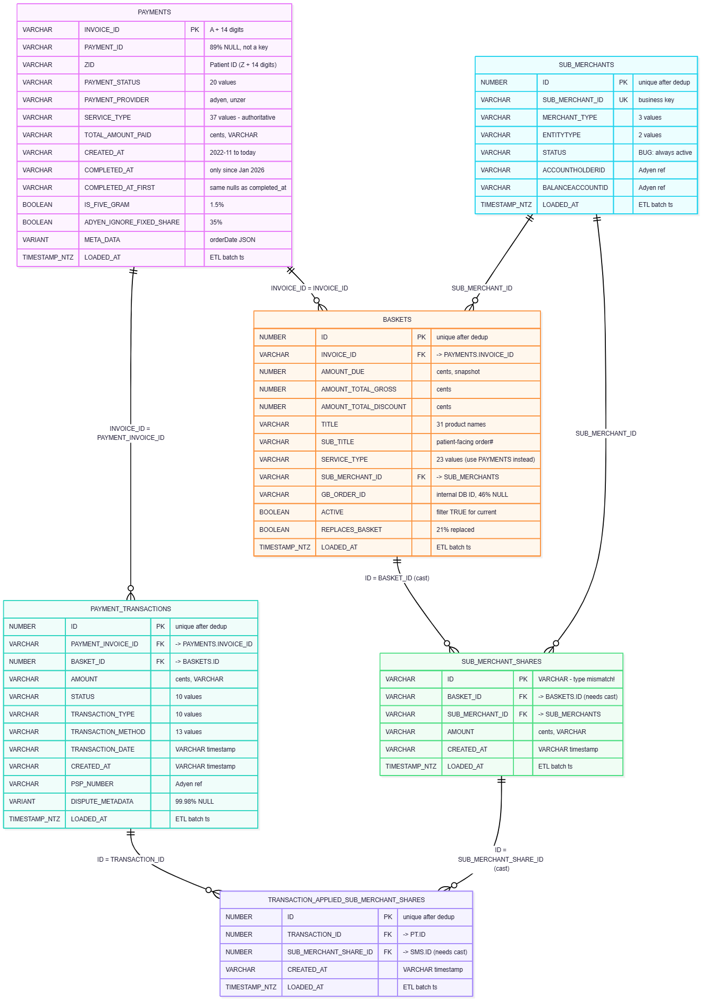

# Bloomwell Payment System — Complete Data Profiling Report

* **Source:** 
`BRONZE.PAYMENT_SYSTEM` (dbt-bloomwell-warehouse / payment_systems)
* **Status:** Bronze data in place; existing dbt project ~40% tested, largely inactive, will be replaced
* **Context:** Actual payments from patients and for prescriptions and medications as well as their split across Bloomwell, pharmacies and doctors.  

*profiled on: 2026-06-10, 100% AI generated, sanity check pending, be critical*

---

## Entity Relationship & Join Path

```text
PAYMENTS (2.6M, PK: INVOICE_ID)
  └── PAYMENT_TRANSACTIONS (3M) — via PAYMENT_INVOICE_ID = INVOICE_ID
        └── TASS (5.5M) — via TRANSACTION_ID = PT.ID
              └── SUB_MERCHANT_SHARES (14M) — via SUB_MERCHANT_SHARE_ID = SMS.ID
                    └── BASKETS (3M) — via BASKET_ID = BASKETS.ID

SUB_MERCHANTS (100 actual entities) — dimension, referenced by SUB_MERCHANT_ID
```

**NOTE:** 
TRANSACTION_APPLIED_SUB_MERCHANT_SHARES (TASS) is the key join table. Use it to filter payment_transactions to relevant rows. Contains cancelled rows — must filter.

---

## Cross-Cutting Findings

|Finding|Impact|Action|
|---|---|---|
|**All tables have Bronze duplicates (4-12%)**|PKs not unique in raw data|Dedup in silver: `QUALIFY ROW_NUMBER() OVER (PARTITION BY {pk} ORDER BY LOADED_AT DESC) = 1`|
|**All amounts are in CENTS**||Divide by 100 in gold for EUR *or* convert to number(12,2) in staging|
|**All timestamps stored as VARCHAR**||`TRY_TO_TIMESTAMP()` in staging|
|**completed_at only populated since Jan 2026**|71% NULL|`COALESCE(completed_at, created_at)` as fallback|
|**PSP_STATUS is unreliable**|Confirmed by Asif|Drop entirely|
|**SUB_MERCHANTS.STATUS always "active"**|Known bug|Do not filter on it|
|**REVERSE_TRANSFERS always TRUE**|Dead column|Drop|
|**ADYEN_NO_PAYMENT_JUST_SHARE always FALSE**|Dead column|Drop|
|**PRESCRIPTION_CREATED always FALSE**|Dead column|Drop|
|**TELEPHONE_CONSULTATION always FALSE**|Dead column|Drop|
|**"null" stored as string in TRANSACTION_METHOD**|32% of rows|Treat as NULL in silver|

---

# Physical Relationship Diagram



---


## Table 1: PAYMENTS

**What is this** Core payment record. Parent entity representing one payment request per patient order. Groups all transactions, baskets, and shares. The `service_type` lives HERE (not on baskets).

|Dimension|Value|
|---|---|
|**Row count**|2,646,327|
|**Distinct INVOICE_ID**|2,324,448 (~12% Bronze duplicates)|
|**Grain (after dedup)**|1 row = 1 payment request (invoice-level)|
|**PK**|`INVOICE_ID` (VARCHAR, pattern: `A` + 14 digits)|
|**NOT a PK**|`PAYMENT_ID` — 89% NULL, only 300K distinct|
|**Date range**|2022-11-16 → 2026-06-10 (**3.5 years**)|
|**Providers**|adyen (80.5%), unzer (19.5%)|

### Null Rates

|Column|Null Count|Null %|Notes|
|---|---|---|---|
|PAYMENT_ID|2,343,410|**88.6%**|NOT a usable key|
|INVOICE_ID|0|0%|**Confirmed PK**|
|ZID|0|0%|Patient ID, pattern: `Z` + 14 digits|
|PAYMENT_STATUS|0|0%||
|TOTAL_AMOUNT_PAID|662,755|**25.0%**|1 in 4 has no amount|
|CREATED_AT|0|0%||
|COMPLETED_AT|1,885,029|**71.2%**|Only populated since Jan 2026|
|COMPLETED_AT_FIRST|1,885,029|**71.2%**|Same as COMPLETED_AT|
|VOUCHER_CODE|2,458,278|92.9%|Rarely used|
|SERVICE_TYPE|0|0%|Always populated|
|PAYMENT_PROVIDER|0|0%||
|META_DATA|712|0%|Contains `{"orderDate":"YYYY-MM-DD"}`|

### completed_at Analysis

|Metric|Value|
|---|---|
|Total NULL completed_at|1,885,029 (71%)|
|Of which: amount = 0 (0EUR specials)|883,491 (47% of nulls)|
|Remaining unexplained NULLs|~1M (pre-Jan-2026 historical records)|
|completed_at ≠ completed_at_first|602,877 (23% of all payments)|

**Interpretation:** `completed_at` was introduced Jan 2026. Pre-2026 payments never get it populated. 23% of payments had their completion date adjusted after initial completion — relevant for SCD decisions.

### PAYMENT_STATUS Distribution (20 values)

|Status|Count|%|Category|
|---|---|---|---|
|**completed**|2,152,886|81.3%|Success|
|pending|227,517|8.6%|In progress|
|cancelled|170,330|6.4%|Cancelled|
|admin_completed|30,860|1.2%|Manual success|
|duplicate|21,731|0.8%|Flagged dups|
|debt_collection|12,448|0.5%|Debt|
|admin_canceled|8,949|0.3%|Manual cancel|
|refunded|6,075|0.2%||
|refund_failed|4,376|||
|admin_debt_collection_done|4,151|||
|debt_collection_done|2,794|||
|canceled|1,136||**Spelling variant of "cancelled"**|
|waiting|776|||
|chargeback|673|||
|refund_pending|574|||
|admin_chargeback|551|||
|admin_waiting|438|||
|admin_debt_collection|58|||
|create|2|||
|debt_collection_uncollectible|2|||

**Suggested grouping for silver:**

- **Success:** completed, admin_completed
- **Pending:** pending, waiting, admin_waiting, create
- **Cancelled:** cancelled, canceled, admin_canceled
- **Refund:** refunded, refund_pending, refund_failed
- **Debt:** debt_collection, debt_collection_done, admin_debt_collection, admin_debt_collection_done, debt_collection_uncollectible
- **Dispute:** chargeback, admin_chargeback
- **Other:** duplicate

### SERVICE_TYPE Distribution (37 values, top 10)

|SERVICE_TYPE|Count|%|Translation|
|---|---|---|---|
|pharmacy_order_special|1,113,259|42.1%|Special pharmacy order|
|prescription_order_special|989,403|37.4%|Special Rx order|
|prescription_order|133,328|5.0%|Standard Rx|
|pharmacy_order|91,345|3.5%|Standard pharmacy|
|vss_private|69,112|2.6%|Video consultation (private)|
|vss|63,374|2.4%|Video consultation|
|folge_rezept|56,610|2.1%|Follow-up prescription|
|prescription_order_first|49,075|1.9%|First Rx order|
|patient_pass|17,750|0.7%|Patient ID card|
|oeg_private|14,768|0.6%|Online first consult (private)|

**79.5% pharmacy/prescription orders.** Many versioned duplicates (`_old`, `_v2`, `_new`, `_new2`) — silver layer needs a `service_category` mapping.

### Boolean Flags

|Flag|TRUE %|Action|
|---|---|---|
|IS_FIVE_GRAM|1.5% (39,565)|Discuss: drop?|
|ADYEN_IGNORE_FIXED_SHARE|34.9% (924,387)|Discuss: relevance?|
|ADYEN_NO_PAYMENT_JUST_SHARE|**0%**|**Drop — always FALSE**|
|REVERSE_TRANSFERS|**100%**|**Drop — always TRUE**|

### Amounts (EUR)

|Metric|EUR|
|---|---|
|Min|-762.25|
|Max|2,159.70|
|Avg|**58.32**|

**Note:** Business rule for negative amounts? Refunds?

### PREFERRED_METHOD

|Method|Count|%|
|---|---|---|
|(not set)|1,779,314|67.2%|
|online|836,891|31.6%|
|cash|30,122|1.1%|

**Discuss:** Relevance? Drop field?

---

## Table 2: BASKETS

**What is this** 
Virtual bucket holding the products of an order. Only ONE active basket per order (after dedup + filtering active). Inactive baskets contain products of a previous but changed order.  `amount_due` is a snapshot at basket creation.  `sub_title` contains the patient-facing order number.

|Dimension|Value|
|---|---|
|**Row count**|3,086,449|
|**Distinct ID**|2,956,291 (~4% Bronze duplicates)|
|**Grain (after dedup)**|1 row = 1 basket per order|
|**PK**|`ID` (NUMBER)|
|**FK**|`INVOICE_ID` → PAYMENTS.INVOICE_ID|
|**Date range**|2023-05-26 → 2026-06-10 (3 years)|
|**Active baskets**|2,435,489 (79%)|
|**Replaced/inactive**|650,960 (21%)|

### Null Rates

|Column|Null %|Notes|
|---|---|---|
|ID, INVOICE_ID, amounts, CREATED_AT, TITLE, SUB_TITLE|0%|Core fields fully populated|
|GB_ORDER_ID|**46.1%** (1.4M)|Rezeptanfrage + some pharmacy orders have no gb_order|
|SERVICE_TYPE|**16.7%** (515K)|NULL together with SUB_MERCHANT_ID|
|SUB_MERCHANT_ID|**16.7%** (515K)|Unassigned baskets (Rezeptanfrage)|

### TITLE Distribution (31 values, top 7)

|TITLE|Count|%|Translation|
|---|---|---|---|
|Pharmacy Order|1,665,208|54.0%||
|Rezeptanfrage|1,155,835|37.5%|Prescription request|
|Videosprechstunde|139,515|4.5%|Video consultation|
|Folgerezept|54,939|1.8%|Follow-up Rx|
|Patientenausweis|24,295|0.8%|Patient pass|
|Erstgespräch Online|22,304|0.7%|First consultation online|
|Erstgespräch am Standort|10,173|0.3%|First consultation on-site|

### Sub_merchant_id Pattern on Baskets

|Category|Count|%|
|---|---|---|
|Pharmacy (long ID)|1,665,208|64.7%|
|Doctor (4-digit)|906,212|35.2%|
|(NULL — unassigned)|515,029|—|

No Bloomwell (0) entries on baskets — platform doesn't appear as basket sub_merchant.

### Boolean Flags

|Flag|TRUE %|Notes|
|---|---|---|
|ACTIVE|78.9%|Filter to TRUE for current state|
|REPLACES_BASKET|21.1%|Old baskets that were replaced|
|APPOINTMENT_NOSHOW|0.04%|Rare|
|CANCELLATION_FEE|0.04%|Rare|
|PRESCRIPTION_CREATED|**0%**|**Drop — always FALSE**|
|TELEPHONE_CONSULTATION|**0%**|**Drop — always FALSE**|

**Key insight:** 
* `ACTIVE=FALSE` count (650,960) ≈ `REPLACES_BASKET=TRUE` count (650,939). 
* Replaced baskets are marked inactive.  
**Dedup strategy:** 
* Filter `ACTIVE=TRUE`, then dedup on ID by LOADED_AT.

### Amounts (EUR)

|Metric|AMOUNT_DUE|AMOUNT_TOTAL_GROSS|
|---|---|---|
|Min|0.00|0.00|
|Max|8,234.80|8,234.80|
|Avg|**72.10**|**83.78**|
Average discount: ~11.68 EUR per basket.

### Sample SUB_TITLE Pattern

- Pharmacy Order: `1949072199880114176/A-LWPGYFFBIY` (GB_ORDER_ID / patient-facing code)
- Rezeptanfrage: `"Rezeptanfrage"` (no order reference)

---

## Table 3: PAYMENT_TRANSACTIONS

**What is this?** Individual payment transaction attempts against Adyen/Unzer PSP. One payment can have multiple transactions: installments, method changes (old cancelled → new opened), refunds, chargebacks.

|Dimension|Value|
|---|---|
|**Row count**|3,046,695|
|**Distinct ID**|2,710,244 (~11% Bronze duplicates)|
|**Grain (after dedup)**|1 row = 1 transaction attempt|
|**PK**|`ID` (NUMBER) — unique after dedup|
|**FK**|`PAYMENT_INVOICE_ID` → PAYMENTS.INVOICE_ID|
|**Date range**|2025-07-22 → 2026-06-10 (~11 months)|
|**Loading**|Started 2026-04-24, latest today. Batch snapshots.|

### Null Rates

|Column|Null %|Interpretation|
|---|---|---|
|ID, INVOICE_ID, AMOUNT, STATUS, CREATED_AT, TXN_DATE, BASKET_ID|0%|Core columns fully populated|
|REFUND_AMOUNT|0%|Field exists for all (probably "0" not NULL)|
|PSP_NUMBER|0.006%|Negligible|
|DISPUTE_METADATA|**99.98%**|Only 617 rows have dispute data|
|TRANSFER_ID|**99.9%**|Only 3,779 rows (internal_transfer method)|
|TRANSACTION_ID|**99.4%**|Only 17,422 rows — NOT a useful identifier|

### STATUS Distribution (10 values)

|STATUS|Count|%|Notes|
|---|---|---|---|
|**completed**|1,676,714|55.0%|Success|
|**replaced**|616,879|20.2%|Method change → old txn replaced|
|**cancelled**|323,184|10.6%||
|**initiated**|258,884|8.5%|In progress|
|**failed**|98,188|3.2%||
|**pending_capture**|70,791|2.3%|Authorized, not yet captured|
|**pending**|2,052|0.07%||
|competed|1||**Typo for "completed"**|
|refused|1|||
|refunded|1|||

### TRANSACTION_TYPE Distribution (10 values)

|TRANSACTION_TYPE|Count|%|
|---|---|---|
|**payment**|3,014,553|98.9%|
|refund|15,214|0.5%|
|cost_coverage|5,533|0.18%|
|partial_refund|5,277|0.17%|
|monthly_billing|4,727|0.16%|
|manual_refund|773||
|chargeback|483||
|dispute|109||
|chargeback_reversed|25||
|initiated|1||

### TRANSACTION_METHOD Distribution 

> 13 values + "null" string

|TRANSACTION_METHOD|Count|%|Notes|
|---|---|---|---|
|"null" (string)|983,166|32.3%|**Not SQL NULL — literal "null" text**|
|no_payment_required|818,047|26.8%|0 EUR orders|
|klarna|370,064|12.1%||
|apple_pay|242,262|7.9%||
|credit_card|214,038|7.0%||
|klarna_paynow|177,913|5.8%||
|paybybank|100,924|3.3%||
|google_pay|53,251|1.7%||
|klarna_account|47,940|1.6%||
|cash|25,417|0.8%||
|bank_transfer|9,707|0.3%||
|internal_transfer|3,779|0.1%||
|chargeback|186|||
|paybank|1||**Typo for paybybank**|

### Amounts (EUR, after /100)

|Metric|EUR|
|---|---|
|Min|-762.25 (refunds as negative)|
|Max|2,159.70|
|Avg|58.32|
|Median|(not captured)|

### Multiple Transactions per Payment

Top examples: up to **2,031 transactions for a single payment** — extreme values are Bronze duplication artifacts. After dedup, expect 1-5 txns per payment (installments, retries, method changes).

### Anomalies

- `ID` has **duplicates** — Bronze snapshot loading
- `TRANSACTION_ID` (VARCHAR) is 99.4% NULL and only 15K distinct — NOT a per-row identifier. Likely an Adyen batch reference.
- "competed" typo (1 row)
- "paybank" typo (1 row)
- "null" as literal string in TRANSACTION_METHOD (983K rows)

---


## Table 4: SUB_MERCHANTS

**What is this** 
Dimension table: doctors, pharmacies, and Bloomwell itself. Adyen marketplace sub-accounts.

|Dimension|Value|
|---|---|
|**Row count**|420|
|**Distinct ID / SUB_MERCHANT_ID**|100 (heavy Bronze duplication: 4.2x)|
|**Grain (after dedup)**|1 row = 1 registered merchant entity|
|**PK**|`ID` or `SUB_MERCHANT_ID` (both 100 distinct, 1:1 mapping)|
|**STATUS**|**Always "active" — KNOWN BUG**|
|**MERCHANT_TYPE**|3 distinct values|
|**ENTITYTYPE**|2 distinct values|

### Sub_merchant_id Patterns (Confirmed)

|Pattern|Entity|Count (in baskets)|
|---|---|---|
|`0`|Bloomwell|(only in SMS, not baskets)|
|4-digit number|Doctors|906K baskets|
|Long string (18-19 chars)|Pharmacies|1.6M baskets|

### Key Facts

- Only **100 actual merchants** after dedup (pharmacies + doctors + Bloomwell)
- 97 of them appear in BASKETS data
- STATUS is useless (always "active" — confirmed bug)

---

## Table 5: SUB_MERCHANT_SHARES

**What is this**
Revenue split when patient pays. One row per share recipient per basket. Not every basket has all three recipients (Bloomwell/doctor/pharmacy). This is the MONEY SPLIT definition, not the transaction execution record.

| Dimension           | Value                                              |
| ------------------- | -------------------------------------------------- |
| **Row count**       | 13,955,240                                         |
| **Grain**           | 1 row = 1 share allocation (basket × recipient)    |
| **PK**              | `ID` (VARCHAR — type mismatch with TASS)           |
| **FK**              | `BASKET_ID` → BASKETS.ID (VARCHAR→NUMBER mismatch) |
| **Type mismatches** | ID is VARCHAR; TASS references it as NUMBER        |

---

## Table 6: TRANSACTION_APPLIED_SUB_MERCHANT_SHARES (TASS)

**What is this?** KEY JOIN TABLE. Links payment_transactions ↔ sub_merchant_shares. Records which shares were actually applied to which transaction. Contains BOTH cancelled and non-cancelled entries — must filter. Use this to filter payment_transactions down to relevant rows.

|Dimension|Value|
|---|---|
|**Row count**|5,496,053|
|**Grain**|1 row = 1 share applied to 1 transaction|
|**PK**|`ID` (NUMBER) or composite (TRANSACTION_ID + SUB_MERCHANT_SHARE_ID)|
|**FK**|`TRANSACTION_ID` → PT.ID; `SUB_MERCHANT_SHARE_ID` → SMS.ID|
|**Critical**|Contains cancelled rows — duplicates on composite key indicate cancel+re-apply pairs|

---

## Type Mismatches Requiring Casts in Silver

| Join                                | Left (type) | Right (type) | Fix                            |
| ----------------------------------- | ----------- | ------------ | ------------------------------ |
| SMS.BASKET_ID → BASKETS.ID          | VARCHAR     | NUMBER       | `TRY_TO_NUMBER(SMS.BASKET_ID)` |
| TASS.SUB_MERCHANT_SHARE_ID → SMS.ID | NUMBER      | VARCHAR      | `TRY_TO_NUMBER(SMS.ID)`        |
| All timestamps                      | VARCHAR     | → TIMESTAMP  | `TRY_TO_TIMESTAMP()`           |
| All amounts (PT, PAYMENTS, SMS)     | VARCHAR     | → NUMBER     | `TRY_TO_NUMBER() / 100.0`      |

---

## Dead Columns (Drop in Silver)

| Table                | Column                      | Reason                      |
| -------------------- | --------------------------- | --------------------------- |
| PAYMENT_TRANSACTIONS | PSP_STATUS                  | Confirmed unreliable (Asif) |
| PAYMENT_TRANSACTIONS | TRANSACTION_ID              | 99.4% NULL, not useful      |
| PAYMENT_TRANSACTIONS | TRANSFER_ID                 | 99.9% NULL                  |
| PAYMENT_TRANSACTIONS | DISPUTE_METADATA            | 99.98% NULL                 |
| PAYMENTS             | PAYMENT_ID                  | 89% NULL, not a key         |
| PAYMENTS             | REVERSE_TRANSFERS           | Always TRUE                 |
| PAYMENTS             | ADYEN_NO_PAYMENT_JUST_SHARE | Always FALSE                |
| BASKETS              | PRESCRIPTION_CREATED        | Always FALSE                |
| BASKETS              | TELEPHONE_CONSULTATION      | Always FALSE                |
| SUB_MERCHANTS        | STATUS                      | Always "active" (bug)       |

---

## Data Quality Issues Found

|Issue|Table|Detail|
|---|---|---|
|**Bronze duplicates (4-12%)**|ALL|Snapshot loading creates repeated rows|
|**"competed" typo**|PT|1 row — should be "completed"|
|**"paybank" typo**|PT|1 row — should be "paybybank"|
|**"null" as string**|PT.TRANSACTION_METHOD|983K rows have literal "null" text|
|**"cancelled" vs "canceled"**|PAYMENTS|Two spellings of same status|
|**completed_at unpopulated pre-2026**|PAYMENTS|Feature introduced Jan 2026|
|**TOTAL_AMOUNT_PAID 25% NULL**|PAYMENTS|Correlate with pending/special statuses|
|**ACTIVE=FALSE not always REPLACES=TRUE**|BASKETS|Some inactive baskets were deactivated, not replaced|

---
<br>

# Consumer side requirements

## Power BI Reports Currently Consuming This Data

|Workspace|Report|
|---|---|
|Bloomwell|Pair Finance|
|Bloomwell|Ärzteabrechnung (doctor billing)|
|Main Lists & KPIs|Pharmacy Shares (central)|
|Individual Pharmacy Reports|~20 reports (confirm with Keerti)|
|Algea Care|Duplicate Payments|

## Keerti`s useage

**Stored Procedure / Gold Table**  

- `BLOOMWELL_GOLD.ADYEN_PAYOUT_REPORT_PHARMACY.MRT_ALL_PHARMACIES`
    - Built by `SP_LOAD_MRT_ALL_PHARMACIES`
    - Sources:
        - `BLOOMWELL_BRONZE.A_LZ_PAYMENT_SYSTEM.BASKETS`
            - `invoice_id`, `sub_merchant_id`, `sub_title`, `gb_order_id`, `active`, `replaces_basket`

  
  
**Pharmacy Payout Views**  

- `BLOOMWELL_GOLD.ADYEN_PAYOUT_REPORT_PHARMACY.PAYOUT_REPORT`
    - Sources:
        - `BLOOMWELL_BRONZE.A_LZ_PAYMENT_SYSTEM.BASKETS`
            - `invoice_id`, `sub_merchant_id`, `sub_title`, `active`
- `BLOOMWELL_GOLD.ADYEN_PAYOUT_REPORT_PHARMACY.PHARMACY_ABRECHNUNG`
    - Sources:
        - `BLOOMWELL_BRONZE.A_LZ_PAYMENT_SYSTEM.BASKETS`
            - `invoice_id`, `sub_merchant_id`, `sub_title`, `gb_order_id`, `active`
        - `BLOOMWELL_SILVER.PAYMENT_SYSTEM.DIM_PAYMENT_STATUS`
            - `invoice_id`, `payment_status`, `is_current`
- `BLOOMWELL_GOLD.ADYEN_PAYOUT_REPORT_PHARMACY.PHARMACY_SWEEP_SUMMARY`
    - Sources:
        - `BLOOMWELL_BRONZE.A_LZ_PAYMENT_SYSTEM.BASKETS`
            - `invoice_id`, `sub_merchant_id`, `active`, `replaces_basket`

  
  
**Finance Views**  

- `BLOOMWELL_GOLD.ADYEN_PAYOUT_REPORT_FINANCE.BLOOMWELL_PAYMENTS_PART1`
    - Sources:
        - `BLOOMWELL_BRONZE.A_LZ_PAYMENT_SYSTEM.BASKETS`
            - `invoice_id`, `sub_merchant_id`, `active`
- `BLOOMWELL_GOLD.ADYEN_PAYOUT_REPORT_FINANCE.BLOOMWELL_PAYMENTS_PART2`
    - Sources:
        - `BLOOMWELL_BRONZE.A_LZ_PAYMENT_SYSTEM.BASKETS`
            - `invoice_id`, `sub_merchant_id`, `active`
---


## Open Questions for Payments Developers

1. **Bronze dedup strategy:** Is it safe to take latest LOADED_AT per PK? Or are there legitimate historical snapshots we need to preserve?
2. **TASS cancelled rows:** How to identify? Duplicate (txn_id, share_id) pairs? Or another signal?
3. **PAYMENT_ID:** What is this field? A session grouping? Why 89% NULL?
4. **2,031 txns per payment (max):** Is this purely Bronze duplication or can a payment legitimately have hundreds of transactions?
5. **"null" string in TRANSACTION_METHOD:** Should this be treated as NULL or does it have meaning?
6. **TRANSACTION_ID** (VARCHAR) in PT — is this an Adyen batch reference?
7. **`cost_coverage`** as a transaction_type — is this the same feature Keerti is building?
8. **ADYEN_IGNORE_FIXED_SHARE** at 35% — what triggers this?
9. Explain the **relation** between payments and baskets and transactions

---

## Open Modeling Decisions List

*First impression, needs discussion, refinement*

1. **Grain of `fct_payment`** — one row per payment? per transaction? per share?
2. **SCD handling** — 23% of payments have adjusted completion dates. `completed_at_first` gives original, `completed_at` gives latest.
3. **Status grouping** — 20 payment statuses + 10 transaction statuses → define silver enums
4. **Service type mapping** — 37 raw values with versioning → define `service_category`
5. **Deduplication logic** — confirm: latest LOADED_AT per PK, or more nuanced?
6. **BASKETS active filter** — always filter `ACTIVE=TRUE` in silver? Or keep history?
7. **`cost_coverage` column** — coming from Keerti, ETA?
8. **Tagging structure** for dbt models (Asif + Thorsten to align)

---

## Staging/Silver Layer Transformation Checklist

*First impression, needs discussion, refinement*

1. **Dedup all tables**: `QUALIFY ROW_NUMBER() OVER (PARTITION BY {pk} ORDER BY LOADED_AT DESC) = 1`
2. **Cast timestamps**: `TRY_TO_TIMESTAMP(CREATED_AT)` → TIMESTAMP_NTZ
3. **Gold: Cast amounts to EUR**: `TRY_TO_NUMBER(AMOUNT) / 100.0` → DECIMAL(12,2)
4. **Normalize FK types**: `TRY_TO_NUMBER(SMS.ID)`, `TRY_TO_NUMBER(SMS.BASKET_ID)`
5. **Add effective_completed_at**: `COALESCE(TRY_TO_TIMESTAMP(COMPLETED_AT), TRY_TO_TIMESTAMP(CREATED_AT))`
6. **Add service_category**: Map 37 service_types → 6-8 categories
7. **Add merchant_category**: Derive from SUB_MERCHANT_ID length (0/4-digit/long)
8. **Add payment_status_group**: Map 20 statuses → 7 groups
9. **Filter BASKETS**: `WHERE ACTIVE = TRUE`
10. **Filter TASS**: Remove cancelled rows (define logic with devs)
11. **Handle "null" strings**: `NULLIF(TRANSACTION_METHOD, 'null')`
12. **Fix typos**: Map "competed"→"completed", "paybank"→"paybybank", "canceled"→"cancelled"
13. **Drop dead columns**: PSP_STATUS, TRANSACTION_ID, REVERSE_TRANSFERS, ADYEN_NO_PAYMENT_JUST_SHARE, PRESCRIPTION_CREATED, TELEPHONE_CONSULTATION, SUB_MERCHANTS.STATUS
