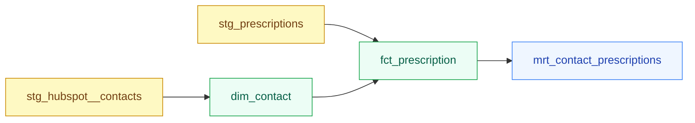

# Module 11 — Selectors, Tags, and Running Subsets

**Tier:** 🟡 Working Effectively · **Duration:** 45 min · **Prerequisites:** Module 10

> **Why this module exists:** Every `dbt run` you've done so far rebuilds the entire project. That's fine for a 5-model training repo, but in production it takes 8+ minutes and reruns models that haven't changed. This module gives you surgical control: run only what you need, skip what you don't, and recover from partial failures without touching good models.

---

## Agenda

| Time | Duration | Topic | Learning Goal | Mode | Participant Activity | Materials | Trainer Notes | Checkpoint |
|---|---|---|---|---|---|---|---|---|
| 00:00 | 5 min | Recap Module 10 | Confirm snapshot understanding | Q&A | Answer from memory | — | Ask all 4 prep questions cold. Probe `dbt_valid_to = NULL` specifically — it tests whether they understand the "current record" concept from SCD2. | All 4 answered |
| 00:05 | 10 min | Selection syntax: `--select`, `--exclude`, graph operators | Know every selection method and graph operator | Present | Annotate examples | This doc | Start with the cost/time framing — 8 min vs. 12 sec. That motivates everything that follows. | "What does `+fct_prescription` select?" |
| 00:15 | 5 min | Tags in `dbt_project.yml` and model config | Know how to assign and use tags | Present + live demo | Check `dbt_project.yml` | VS Code | Show the existing tags in the exercise project. Then show the tag:daily command. | "How would you run only daily-tagged models?" |
| 00:20 | 5 min | `dbt build` vs `dbt run` vs `dbt test` + `result:error` | Know which command to use in which context | Present | Fill in comparison table | This doc | This is fast — the table makes it mechanical. Spend the most time on `result:error` because it's new. | "What does dbt build do that dbt run doesn't?" |
| 00:25 | 15 min | Exercise: write the right selection command | Apply every selector type to real scenarios | Practice | Solo exercise | Exercise below | Circulate. Most common confusion: direction of `+` operator (prefix = upstream, suffix = downstream). The depth-limiting `1+model` form trips up participants who haven't seen it before. | All 5 scenarios + bonus attempted |
| 00:40 | 5 min | Debrief + prep questions for Module 12 | Consolidate and preview CI/CD | Debrief | Verbal | — | Ask: "In a CI pipeline, which command would you run on a PR — `dbt run` or `dbt build`?" → `dbt build`, because it runs tests too. That question bridges directly to Module 12. | — |

---

## Content

### Part A — Why Selection Matters

Without selection syntax, every `dbt run` rebuilds every model. In the exercise project with 13 models, that's fast. In production with 18 models across three layers, it looks like this:

| Scope | Command | Models run | Time |
|---|---|---|---|
| Full project | `dbt run` | 18 models | ~8 min |
| One fact model | `dbt run --select fct_deal` | 1 model | ~12 sec |
| Silver layer only | `dbt run --select silver.*` | 7 models | ~90 sec |
| One model + upstream | `dbt run --select +fct_prescription` | 4 models | ~45 sec |

Rebuilding the whole project because `fct_deal` changed is wasteful. Rebuilding only what's affected is precise and fast.

---

### Part B — The Selection Syntax

#### By model name

Run a single model:

```bash
dbt run --select dim_contact
dbt build --select fct_prescription
```

#### By directory or layer

Run all models in a folder using the `.*` wildcard:

```bash
dbt run --select staging.*    # all models in models/staging/
dbt run --select silver.*     # all models in models/silver/
dbt run --select gold.*       # all models in models/gold/
```

These paths match the folder names under `models/`. The `.*` means "this directory and all its subdirectories".

#### By tag

```bash
dbt run --select tag:daily    # fct_deal and fct_prescription
dbt run --select tag:weekly   # gold marts
dbt run --select tag:silver   # all Silver models
```

Tags must exist in `dbt_project.yml` or model config before you can select by them.

#### By source

Run all models that read directly from a given source:

```bash
dbt run --select source:hubspot    # all models sourcing from the hubspot source
```

This selects models that use `{{ source('hubspot', ...) }}` — useful for rerunning the staging layer after a source data fix.

#### By result state

Rerun only models that failed in the last run:

```bash
dbt run --select result:error --state ./target
```

The `--state ./target` flag tells dbt where to find the manifest from the previous run. dbt compares the current manifest against that state and selects only errored nodes.

#### Exclusion

Combine `--select` with `--exclude` to subtract a subset:

```bash
dbt run --select silver.* --exclude fct_prescription
dbt build --select tag:daily --exclude dim_contact
```

`--exclude` accepts the same syntax as `--select`. It runs after selection — dbt selects first, then removes the excluded nodes.

---

### Part C — Graph Operators

Graph operators let you walk up or down the dependency graph from a starting model.

```
+model       → model AND all its upstream dependencies
model+       → model AND all its downstream dependents
+model+      → model AND all ancestors AND all descendants
1+model      → model AND only 1 level upstream (depth-limited)
model+2      → model AND only 2 levels downstream
```

**Memory aid:** the `+` is always on the side where the graph extends. Prefix `+model` → extends toward parents (upstream). Suffix `model+` → extends toward children (downstream).

#### The exercise project DAG (subset)



#### How the operators apply to this DAG

| Command | Models selected | Why |
|---|---|---|
| `dbt run --select fct_prescription` | `fct_prescription` only | No operator — exact match |
| `dbt run --select +fct_prescription` | `stg_hubspot__contacts`, `stg_prescriptions`, `dim_contact`, `fct_prescription` | All upstream ancestors |
| `dbt run --select fct_prescription+` | `fct_prescription`, `mrt_contact_prescriptions` | All downstream dependents |
| `dbt run --select +fct_prescription+` | All 5 models | Full ancestry + descendants |
| `dbt run --select 1+fct_prescription` | `dim_contact`, `stg_prescriptions`, `fct_prescription` | Only 1 level up |

#### When to use each

- `+model` — rebuild a model and ensure its inputs are fresh first. Use before deploying a changed Silver model.
- `model+` — see what a change to `dim_contact` would cascade into. Useful for impact analysis.
- `+model+` — full neighborhood rebuild. Use after source schema changes.
- `1+model` — rebuild a model with only its direct parents. Avoids pulling in the full upstream chain when you know the deeper layers are already fresh. In a large project, `+fct_prescription` might match 20 upstream models. If you know only the direct staging parent is stale, use `1+fct_prescription` to limit to one level up — faster and cheaper.

---

### Part D — Tags

Tags categorize models. You assign them in `dbt_project.yml` for whole folders, or in individual model config for targeted labeling.

#### Folder-level tags in `dbt_project.yml`

```yaml
models:
  analytics:
    staging:
      +tags: ['staging']
    silver:
      +tags: ['silver']
      facts:
        +tags: ['daily']      # fct_deal and fct_prescription are in facts/
    gold:
      +tags: ['gold', 'weekly']
```

The `+` prefix means the config cascades down to all models in that folder. A model in `silver/facts/` gets both the `silver` tag and the `daily` tag.

#### Model-level tags in config

Add tags to individual models in `schema.yml`:

```yaml
models:
  - name: fct_deal
    config:
      tags: ['daily', 'finance']
```

Or inline in the model SQL:

```sql
{{ config(tags=['daily', 'finance']) }}
```

Tags stack — a model can have multiple tags and be selected by any of them.

#### Using tags in practice

The most common production use case is scheduling. Your orchestrator (Airflow, dbt Cloud, GitHub Actions) runs:

```bash
# Nightly at 02:00
dbt build --select tag:daily

# Weekly on Sunday
dbt build --select tag:weekly
```

This avoids hardcoding model names into your scheduler. When you add a new daily fact model, you tag it — the schedule picks it up automatically.

Once models are tagged, your orchestrator (Airflow, GitHub Actions cron) can select by tag instead of model names. When you add a new `fct_*` model and tag it `daily`, the scheduler picks it up automatically — no changes to the scheduling configuration needed.

---

### Part E — `dbt build` vs `dbt run` vs `dbt test`

| Command | What it does | When to use |
|---|---|---|
| `dbt run` | Compiles and runs models only. No tests. | Development iteration — you want to see transformed data quickly without waiting for tests. |
| `dbt test` | Runs tests only. No models. | After `dbt run`, to validate data quality. Or to retest after a data fix without rerunning models. |
| `dbt build` | Runs models + tests + seeds + snapshots in dependency order. Tests run immediately after each model. | CI pipelines, production runs, and any time you want the full picture. **Our standard.** |

`dbt build` is the right default for production and CI. If `fct_prescription` has a `not_null` test and the model populates a NULL, `dbt build` fails immediately after that model runs — before the downstream mart runs on bad data.

**Example:** `fct_prescription` has a `not_null` test. If `dbt run` succeeds but the model produces NULL keys, `dbt run` won't catch it. `dbt build` runs the test immediately after the model — the pipeline stops before `mrt_contact_prescriptions` runs on corrupt data.

#### `result:error` — recovering from partial failures

When a `dbt build` fails partway through, some models succeeded and some failed. You don't want to rerun the successful ones from scratch.

Why not just re-run `dbt build --select silver.*`? Because 7 models already succeeded. Running them again wastes 3 minutes. `result:error` skips the clean models and runs only the failed ones.

```bash
# First, a run that partially fails
dbt build --select silver.*

# Then, rerun only the models that errored
dbt run --select result:error --state ./target
```

`./target` is the folder where dbt writes the `manifest.json` and `run_results.json` from the previous run. dbt uses these files to know which nodes errored.

This is especially useful in CI pipelines: on a retry, skip the models that passed and focus only on the failures.

---

## Exercise (15 min)

> **Scenario:** You're working in the exercise project. Write the exact `dbt` command for each scenario below. Assume you are running from the project root.

### Scenario 1 — Rebuild only the Silver fact models and their tests

> "The Silver fact tables need a clean rebuild after a source schema change. Run only the Silver facts with their tests."

<details>
<summary>Answer</summary>

```bash
dbt build --select silver.facts.*
```

Or, using the tag:

```bash
dbt build --select tag:daily
```

Both select `fct_deal` and `fct_prescription`. The `dbt build` ensures tests run immediately after each model.

</details>

### Scenario 2 — Run `fct_prescription` and everything it depends on

> "Something is wrong with `fct_prescription`. You want to rebuild it from scratch, including all the models it reads from."

<details>
<summary>Answer</summary>

```bash
dbt run --select +fct_prescription
```

This selects `stg_hubspot__contacts`, `stg_prescriptions`, `dim_contact`, and `fct_prescription` — the full upstream chain.

</details>

### Scenario 3 — Run `mrt_deals_funnel` and all models downstream of it

> "You want to see what `mrt_deals_funnel` produces and whether anything reads from it. Run it and everything that depends on it."

<details>
<summary>Answer</summary>

```bash
dbt run --select mrt_deals_funnel+
```

`mrt_deals_funnel` is in the Gold layer. In this project it has no downstream dependents, so this command runs just the one model. In a larger project it would include any reports or downstream marts referencing it.

</details>

### Scenario 4 — Run all daily-tagged models but skip Gold marts

> "The nightly job should rebuild Silver facts but not the Gold marts (which run separately on Sunday). Write the command."

<details>
<summary>Answer</summary>

```bash
dbt build --select tag:daily --exclude tag:weekly
```

Or, since Gold marts have the `weekly` tag and the daily-tagged models are Silver facts:

```bash
dbt build --select tag:daily --exclude gold.*
```

Both produce the same result: `fct_deal` and `fct_prescription` run with their tests; Gold marts are skipped.

</details>

### Scenario 5 — After a partial failure, rerun only the models that errored

> "Last night's `dbt build` failed on 3 models. The other 15 ran cleanly. Rerun only the failures."

<details>
<summary>Answer</summary>

```bash
dbt run --select result:error --state ./target
```

`./target` contains the `run_results.json` from the failed run. dbt reads it to identify which nodes have status `error` and selects only those.

</details>

### Bonus — Add a tag and write the selection command

1. Open `dbt_project.yml` and add a `finance` tag to `fct_deal` and `mrt_deals_funnel`.
2. Write a command to run only finance-tagged models with all their tests.

> **Note on tag placement:** You can add this tag in `dbt_project.yml` (folder-level, using `+tags: [finance]`) or in each model's `schema.yml` config block. Both approaches work — `dbt_project.yml` is better when you want to tag an entire folder.

<details>
<summary>Answer</summary>

**`dbt_project.yml` — option A: model-level tags**

```yaml
models:
  analytics:
    silver:
      facts:
        fct_deal:
          +tags: ['daily', 'finance']
    gold:
      mrt_deals_funnel:
        +tags: ['weekly', 'finance']
```

Or add tags in each model's `schema.yml`:

```yaml
# models/silver/schema.yml
models:
  - name: fct_deal
    config:
      tags: ['daily', 'finance']
```

**Selection command:**

```bash
dbt build --select tag:finance
```

This runs `fct_deal` and `mrt_deals_funnel` plus their tests.

</details>

---

## Reference Material

- [dbt node selection docs](https://docs.getdbt.com/reference/node-selection/syntax)
- [dbt graph operators](https://docs.getdbt.com/reference/node-selection/graph-operators)
- [dbt tags](https://docs.getdbt.com/reference/resource-configs/tags)
- [dbt build command](https://docs.getdbt.com/reference/commands/build)
- [Defer and state](https://docs.getdbt.com/reference/node-selection/defer)

---

## Prep Questions for Module 12

1. What is the difference between `dbt run` and `dbt build` in a CI pipeline context?
2. If a PR changes `dim_contact`, which downstream models might be affected and how would you find out?
3. What is a "slim CI" run — running only the models changed in a PR — and why would you want it?
4. What does `--defer` do, and why would a CI job use it instead of rebuilding every model from scratch?
