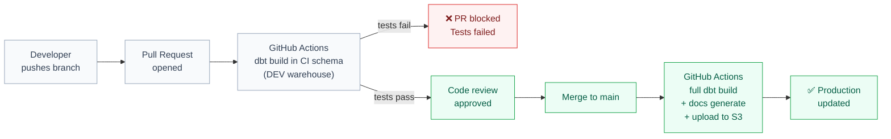
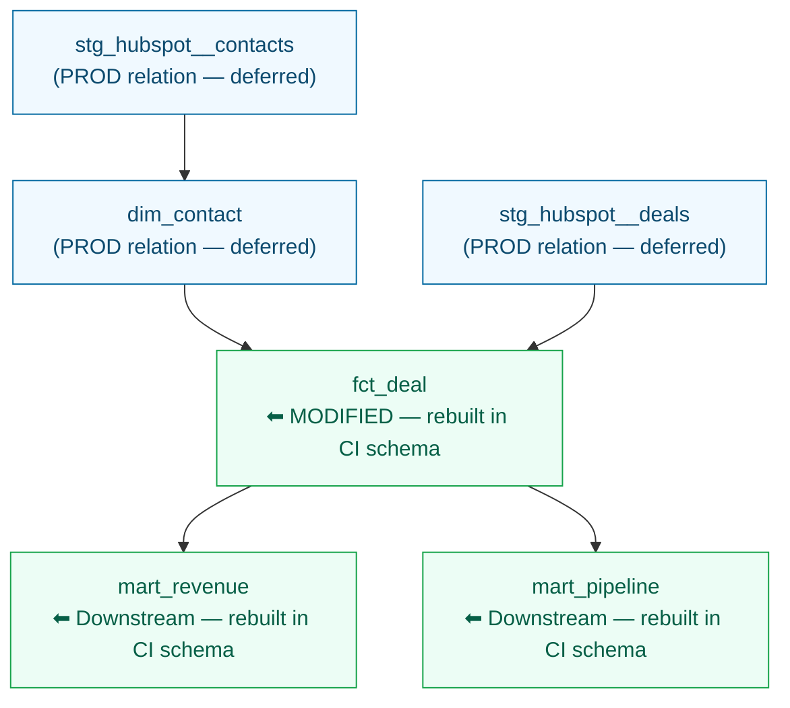

# Module 12 — CI/CD and Slim CI

**Tier:** 🟡 Working Effectively · **Duration:** 90 min · **Prerequisites:** Module 11

> **Why this module exists:** Every model you merge reaches production. Without CI, a broken Silver model or a missing `grain` comment ships silently, breaks a Power BI report, and wakes someone up at 3am. This module explains how the CI/CD pipeline protects production, why Slim CI matters for cost, and how the GitHub Actions workflow you already use every day actually works.

---

## Agenda

| Time | Duration | Topic | Learning Goal | Mode | Participant Activity | Materials | Trainer Notes | Checkpoint |
|---|---|---|---|---|---|---|---|---|
| 00:00 | 10 min | Recap Module 11 | Confirm advanced model selection mental model | Q&A | Answer from memory | — | Ask all 4 prep questions cold. Probe `dbt build --select +fct_deal` specifically — it leads directly into the CI `--select` discussion. | All 4 correct |
| 00:10 | 10 min | What CI/CD means in dbt | Understand the full dev → PR → CI → merge → PROD loop | Present | Annotate diagram | This doc | Walk the Mermaid diagram. Make the core point explicit: broken models never reach production because CI intercepts them first. | "Where does dbt build run on a PR — in PROD or in a separate CI schema?" |
| 00:20 | 15 min | PR workflow | Know exactly what runs on PR open vs. on merge to main | Present + live demo | Compare the two trigger blocks | GitHub Actions file | Show the actual workflow file in GitHub. Point out the `on: pull_request` vs `on: push` triggers. | "Name two commands that run on merge but not on PR open." |
| 00:35 | 15 min | Slim CI | Understand `state:modified+`, `manifest.json`, and `--defer` | Present | Sketch the dependency graph | Whiteboard | Use numbers: 18 models × 3 min = 54 min full run vs. 2 modified models + 4 downstream = 6 models × 3 min = 18 min. Cost argument makes it concrete. | "What does `state:modified+` select?" |
| 00:50 | 15 min | GitHub Actions walkthrough | Read and understand a real `.github/workflows/dbt_ci.yml` | Live demo | Follow along, annotate | YAML file | Walk line by line. Cover triggers, secrets, steps. Show what the GitHub Actions UI looks like when a test fails. | "Which step downloads the prod manifest?" |
| 01:05 | 5 min | Env vars and targets | Know how `profiles.yml` uses env vars and what `target` means | Present | — | This doc | Brief. One key point: CI uses a separate target with a CI-specific schema so it never writes to PROD. | "What is the name of the CI target in `profiles.yml`?" |
| 01:10 | 5 min | Documentation quality gate | Know what makes a PR fail for documentation reasons | Present | — | This doc | Emphasise: this is the one enforcement that catches models before they reach production review. | "Name two things that will fail a PR review." |
| 01:15 | 25 min | Exercise | Debug a broken CI config; write a correct `--select` command; explain `--defer` | Practice | Solo + pair-check | Exercise below | Circulate. Most common mistake on Task 1: fixing the `--state` path but missing the hardcoded secret. | Exercise complete, 3 bugs identified |
| 01:40 | 10 min | Debrief + prep questions | Consolidate and preview Module 13 | Debrief | Verbal | Whiteboard | Ask: "If CI costs $40/month today and your project doubles in model count, what does that do to CI cost without Slim CI?" Then introduce Module 13 prep questions. | — |

---

## Content

### Part A — What CI/CD Means in dbt

CI/CD is not just "automated tests." It is a set of gates that prevent broken or undocumented code from reaching production.

**The full workflow:**



The CI schema (`SILVER_CI`, `GOLD_CI`) is separate from your dev schema and from PROD. CI builds models there, runs tests against them, and discards the schema after the run. Nothing from CI pollutes production data.

**The guarantee:** If CI passes, the models compiled correctly and every test you've written passed against real data. The reviewer's job is to check logic and documentation — not catch broken SQL.

---

### Part B — PR Workflow

#### On PR open or push to a PR branch

```bash
dbt build --select state:modified+ --defer --state ./prod-artifacts
```

- Builds only models whose SQL changed plus their downstream dependents
- Uses production data for unmodified upstream models (`--defer`)
- Runs all tests for the selected models
- If any test fails, the GitHub Actions job exits non-zero and the PR is blocked

#### On merge to main

```bash
dbt build                          # full project build against PROD
dbt docs generate                  # regenerate docs from PROD manifest
aws s3 sync ./target/docs s3://bloomwell-dbt-docs/  # publish
```

The merge pipeline runs the full project — not slim — because it is updating production. It also regenerates and publishes the dbt docs site so the team always has an up-to-date lineage graph.

#### The CI schema

CI builds into a dedicated schema, not your dev schema and not PROD. The workflow sets:

```yaml
env:
  DBT_TARGET: ci
  DBT_SCHEMA: DBT_CI_${{ github.run_id }}
```

This gives every CI run its own isolated schema. Two PRs can run in parallel without interfering. The schema is deleted after the run.

> **Why unique schemas matter for parallel PRs:** Each CI run uses a unique schema name (`DBT_CI_<run-id>`) so parallel PRs don't overwrite each other's tables or corrupt test results. Without unique schemas, two concurrent PRs would both write to `DBT_CI` — and one PR's tests would run against the other PR's data.

---

### Part C — Slim CI: The Problem Without It

#### The cost of running everything on every PR

Imagine your project has 18 models. Each model takes an average of 3 minutes to build in Snowflake. A full `dbt build` takes:

```
18 models × 3 min = 54 minutes per PR run
```

Your team opens 10 PRs per week. That is 540 minutes of Snowflake compute per week — just for CI. Most of that compute rebuilds models that did not change.

#### What `manifest.json` is

Every `dbt build` produces a `manifest.json` in `./target/`. This file contains:
- The full model graph (which models depend on which)
- A hash of each model's compiled SQL

You store the production `manifest.json` in S3 after each successful merge. CI downloads it before running `dbt build`. dbt compares the current SQL hashes against the production hashes to determine what changed.

> **Note on what gets hashed:** dbt hashes the *compiled* SQL after all variables and macros are resolved — not the raw `.sql` file. If you change a variable that affects a model's compiled output, the model is marked as modified even if the raw SQL looks the same.

> **First CI run — no production manifest yet:** On a project's first CI run, there is no production manifest yet. For the first deployment: run a full `dbt build` without `--select state:modified+`. After it completes and uploads the manifest to S3, every subsequent PR can use Slim CI.

#### `state:modified+` explained

```bash
dbt build --select state:modified+ --defer --state ./prod-artifacts
```

| Part | Meaning |
|---|---|
| `state:modified` | Models whose compiled SQL hash differs from the production manifest |
| `+` (trailing) | All downstream dependents of modified models |
| `--state ./prod-artifacts` | Path to the directory containing the production `manifest.json` |
| `--defer` | For models not in the selection set, use the production relation instead of rebuilding |

**Example:** You change `fct_deal.sql`. It has two downstream Gold models: `mart_revenue` and `mart_pipeline`. The selection becomes `fct_deal + mart_revenue + mart_pipeline` — 3 models instead of 18. CI time drops from 54 minutes to roughly 9 minutes.

```
18 models × 3 min = 54 min  ← without Slim CI
 3 models × 3 min =  9 min  ← with Slim CI (one fact change)
```

#### What `--defer` does

Without `--defer`, CI would need to rebuild every upstream model that `fct_deal` depends on — staging models, dimension models — just to have data to test against. With `--defer`, CI skips rebuilding unchanged models and reads directly from the production relations instead.

> **When `--defer` fails:** If an upstream model exists in your branch but was deleted from production, `--defer` will error — dbt can't find the deferred PROD relation. This is intentional: the error tells you that your branch depends on something that no longer exists in production.



Blue = deferred (reads from PROD). Green = rebuilt in CI schema.

---

### Part D — GitHub Actions Workflow

This is the actual workflow file for the project. Walk through it section by section.

```yaml
# .github/workflows/dbt_ci.yml

name: dbt CI/CD

on:
  pull_request:
    branches: [main]
  push:
    branches: [main]

env:
  DBT_PROFILES_DIR: .

jobs:
  # ── Job 1: runs on every PR ──────────────────────────────────────────────
  slim_ci:
    name: Slim CI — changed models only
    runs-on: ubuntu-latest
    if: github.event_name == 'pull_request'

    env:
      DBT_TARGET: ci
      SNOWFLAKE_ACCOUNT:   ${{ secrets.SNOWFLAKE_ACCOUNT }}
      SNOWFLAKE_USER:      ${{ secrets.SNOWFLAKE_USER }}
      SNOWFLAKE_PASSWORD:  ${{ secrets.SNOWFLAKE_PASSWORD }}
      SNOWFLAKE_DATABASE:  ${{ secrets.SNOWFLAKE_DATABASE }}
      SNOWFLAKE_WAREHOUSE: ${{ secrets.SNOWFLAKE_WAREHOUSE }}
      SNOWFLAKE_ROLE:      ${{ secrets.SNOWFLAKE_ROLE }}
      DBT_SCHEMA:          DBT_CI_${{ github.run_id }}

    steps:
      - name: Checkout
        uses: actions/checkout@v4

      - name: Set up Python
        uses: actions/setup-python@v5
        with:
          python-version: '3.11'

      - name: Install dbt
        run: pip install dbt-snowflake==1.8.4

      - name: Download production manifest
        run: |
          mkdir -p ./prod-artifacts
          aws s3 cp s3://bloomwell-dbt-artifacts/prod/manifest.json ./prod-artifacts/manifest.json
        env:
          AWS_ACCESS_KEY_ID:     ${{ secrets.AWS_ACCESS_KEY_ID }}
          AWS_SECRET_ACCESS_KEY: ${{ secrets.AWS_SECRET_ACCESS_KEY }}
          AWS_REGION:            eu-central-1

      - name: dbt deps
        run: dbt deps

      - name: dbt build — slim CI
        run: |
          dbt build \
            --select state:modified+ \
            --defer \
            --state ./prod-artifacts \
            --target ci

      - name: Drop CI schema
        if: always()
        run: |
          dbt run-operation drop_schema \
            --args "{'schema': '$DBT_SCHEMA'}" \
            --target ci

  # ── Job 2: runs on merge to main ─────────────────────────────────────────
  deploy:
    name: Deploy to production
    runs-on: ubuntu-latest
    if: github.event_name == 'push' && github.ref == 'refs/heads/main'

    env:
      DBT_TARGET: prod
      SNOWFLAKE_ACCOUNT:   ${{ secrets.SNOWFLAKE_ACCOUNT }}
      SNOWFLAKE_USER:      ${{ secrets.SNOWFLAKE_USER }}
      SNOWFLAKE_PASSWORD:  ${{ secrets.SNOWFLAKE_PASSWORD }}
      SNOWFLAKE_DATABASE:  ${{ secrets.SNOWFLAKE_DATABASE }}
      SNOWFLAKE_WAREHOUSE: ${{ secrets.SNOWFLAKE_WAREHOUSE }}
      SNOWFLAKE_ROLE:      ${{ secrets.SNOWFLAKE_ROLE }}

    steps:
      - name: Checkout
        uses: actions/checkout@v4

      - name: Set up Python
        uses: actions/setup-python@v5
        with:
          python-version: '3.11'

      - name: Install dbt
        run: pip install dbt-snowflake==1.8.4

      - name: dbt deps
        run: dbt deps

      - name: dbt build — full production run
        run: dbt build --target prod

      - name: Generate dbt docs
        run: dbt docs generate --target prod

      - name: Upload manifest to S3 (for next Slim CI run)
        run: |
          aws s3 cp ./target/manifest.json \
            s3://bloomwell-dbt-artifacts/prod/manifest.json
        env:
          AWS_ACCESS_KEY_ID:     ${{ secrets.AWS_ACCESS_KEY_ID }}
          AWS_SECRET_ACCESS_KEY: ${{ secrets.AWS_SECRET_ACCESS_KEY }}
          AWS_REGION:            eu-central-1

      - name: Publish dbt docs to S3
        run: |
          aws s3 sync ./target/ \
            s3://bloomwell-dbt-docs/ \
            --include "*.html" --include "*.json" --include "*.js"
        env:
          AWS_ACCESS_KEY_ID:     ${{ secrets.AWS_ACCESS_KEY_ID }}
          AWS_SECRET_ACCESS_KEY: ${{ secrets.AWS_SECRET_ACCESS_KEY }}
          AWS_REGION:            eu-central-1
```

#### What each section does

| Section | What it does |
|---|---|
| `on: pull_request` | Triggers `slim_ci` job on every PR push |
| `on: push` to main | Triggers `deploy` job after merge |
| `if: github.event_name == 'pull_request'` | Ensures `slim_ci` only runs on PRs, not on merge |
| `secrets.*` | Reads Snowflake credentials from GitHub repository secrets — never hardcoded |

> **How secrets injection works:** GitHub Actions replaces `${{ secrets.* }}` with the actual secret value at runtime, before the shell command runs. The YAML file always contains the placeholder — secrets are never written to the repository. If a secret is missing from repository settings, the Actions job fails with a clear error.
| `DBT_SCHEMA: DBT_CI_${{ github.run_id }}` | Unique schema per run — parallel PRs don't collide |
| Download production manifest | Fetches `manifest.json` from S3 so `state:modified+` can compare against it |
| `dbt build --select state:modified+` | Slim CI — only changed models and their downstream dependents |
| `Drop CI schema` | Cleans up after CI — `if: always()` ensures it runs even if the build fails |

> **Why `if: always()` on the cleanup step:** The `if: always()` flag ensures the schema cleanup step runs even if `dbt build` failed. Without it, a failed CI run would leave behind the throwaway schema, consuming Snowflake storage and potentially confusing future runs.
| `dbt build` (deploy job) | Full production run — all models |
| Upload manifest | Saves the new `manifest.json` to S3 for the next PR's Slim CI to compare against |
| Publish docs | Uploads updated lineage and documentation to the S3 static site |

---

### Part E — Environment Variables and Targets

#### `profiles.yml` with env vars

```yaml
# profiles.yml (committed to repo — no secrets in this file)
analytics:
  target: dev
  outputs:

    dev:
      type: snowflake
      account:   "{{ env_var('SNOWFLAKE_ACCOUNT') }}"
      user:      "{{ env_var('SNOWFLAKE_USER') }}"
      password:  "{{ env_var('SNOWFLAKE_PASSWORD') }}"
      database:  "{{ env_var('SNOWFLAKE_DATABASE') }}"
      warehouse: "{{ env_var('SNOWFLAKE_WAREHOUSE') }}"
      role:      "{{ env_var('SNOWFLAKE_ROLE') }}"
      schema:    "TESTING__{{ env_var('DBT_DEVELOPER_NAME', 'dev') }}"

    ci:
      type: snowflake
      account:   "{{ env_var('SNOWFLAKE_ACCOUNT') }}"
      user:      "{{ env_var('SNOWFLAKE_USER') }}"
      password:  "{{ env_var('SNOWFLAKE_PASSWORD') }}"
      database:  "{{ env_var('SNOWFLAKE_DATABASE') }}"
      warehouse: "{{ env_var('SNOWFLAKE_WAREHOUSE') }}"
      role:      "{{ env_var('SNOWFLAKE_ROLE') }}"
      schema:    "{{ env_var('DBT_SCHEMA', 'DBT_CI') }}"

    prod:
      type: snowflake
      account:   "{{ env_var('SNOWFLAKE_ACCOUNT') }}"
      user:      "{{ env_var('SNOWFLAKE_USER') }}"
      password:  "{{ env_var('SNOWFLAKE_PASSWORD') }}"
      database:  "{{ env_var('SNOWFLAKE_DATABASE') }}"
      warehouse: "{{ env_var('SNOWFLAKE_WAREHOUSE') }}"
      role:      "{{ env_var('SNOWFLAKE_ROLE') }}"
      schema:    PUBLIC
```

#### Three targets, three schemas

| Target | Who uses it | Schema |
|---|---|---|
| `dev` | Developer on their machine | `TESTING__<your-name>` |
| `ci` | GitHub Actions on PR | `DBT_CI_<run-id>` (unique per run, discarded after) |
| `prod` | GitHub Actions on merge to main | `PUBLIC` (the real schema) |

**The key point:** CI never writes to `PUBLIC`. It writes to a throwaway schema named after the run ID. Tests run against data in that schema. When CI finishes, the schema is dropped. Production is never touched.

#### Never hardcode credentials

The `profiles.yml` file is committed to the repository. It must never contain actual passwords. Every credential goes through `env_var()`. Local developers set these in a `.env` file (git-ignored). CI reads them from GitHub repository secrets.

---

### Part F — Documentation Quality Gate

#### What makes a PR fail

CI enforces documentation requirements as part of the pre-merge review. A PR is blocked if:

1. **A Silver or Gold model is missing a `description`** in `schema.yml`
2. **A model is missing a `grain` comment** at the top of the SQL file
3. **A `_key` column (surrogate or foreign key) has no `description`** in `schema.yml`

These checks are run via the `dbt-sql-reviewer` skill during code review. They are not yet automated in GitHub Actions — the reviewer runs the skill before approving.

#### Why documentation is a gate, not a suggestion

Documentation degrades in the same way code does — incrementally. One model ships without a description. Two more follow. After six months, half the lineage graph is undocumented. New team members can't tell what `fct_deal` means without reading 400 lines of SQL.

The gate is effective because it is applied at the only moment that creates leverage: before the PR is approved.

#### What the dbt-sql-reviewer skill checks

The skill reviews every modified SQL and YAML file in the PR for:
- `description` field present and non-empty for every model and column
- `grain:` comment in the SQL (for Silver and Gold models)
- Column-level docs on all `_key` columns
- Correct materialization for the layer
- `on_schema_change: sync_all_columns` for incremental models

Any failed check becomes a review comment. The PR cannot be approved until all checks pass.

---

## Live Demo Script

**Goal:** Walk through the GitHub Actions workflow file, trigger a test failure, and show what the developer sees.

1. Open the `.github/workflows/dbt_ci.yml` file in GitHub. Walk each section: `on:` triggers, `env:` block, each step.
2. Point out the `secrets.*` references. Show the GitHub repository → Settings → Secrets page (read-only). Note: the values are never visible — only that a secret named `SNOWFLAKE_PASSWORD` exists.
3. Open a PR for a branch that changes `fct_deal.sql`. Show the GitHub Actions UI as the `slim_ci` job runs.
4. Show the `dbt build --select state:modified+ --defer --state ./prod-artifacts` command in the log.
5. Now break a test: add a row to a source that violates a `not_null` test. Push. Show the red X on the PR and the test failure output in the Actions log.
6. Show the "Checks" tab on the PR — GitHub blocks the merge button when the CI job fails.
7. Fix the issue, push again, show the green checkmark, and show the merge button become available.

---

## Exercise (25 min)

### Task 1 — Fix the broken CI config

The workflow file below has **three bugs**. Identify each one, explain why it is a problem, and write the fix.

```yaml
name: dbt CI

on:
  pull_request:
    branches: [main]

jobs:
  slim_ci:
    runs-on: ubuntu-latest

    env:
      DBT_TARGET: ci
      SNOWFLAKE_ACCOUNT:   ${{ secrets.SNOWFLAKE_ACCOUNT }}
      SNOWFLAKE_USER:      ${{ secrets.SNOWFLAKE_USER }}
      SNOWFLAKE_PASSWORD:  "Snowflake_Prod_2024_v3"
      SNOWFLAKE_DATABASE:  ${{ secrets.SNOWFLAKE_DATABASE }}
      SNOWFLAKE_WAREHOUSE: ${{ secrets.SNOWFLAKE_WAREHOUSE }}
      SNOWFLAKE_ROLE:      ${{ secrets.SNOWFLAKE_ROLE }}
      DBT_SCHEMA:          DBT_CI_${{ github.run_id }}

    steps:
      - name: Checkout
        uses: actions/checkout@v4

      - name: Set up Python
        uses: actions/setup-python@v5
        with:
          python-version: '3.11'

      - name: Install dbt
        run: pip install dbt-snowflake==1.8.4

      - name: Download production manifest
        run: |
          mkdir -p ./prod-artifacts
          aws s3 cp s3://bloomwell-dbt-artifacts/prod/manifest.json ./prod-artifacts/manifest.json
        env:
          AWS_ACCESS_KEY_ID:     ${{ secrets.AWS_ACCESS_KEY_ID }}
          AWS_SECRET_ACCESS_KEY: ${{ secrets.AWS_SECRET_ACCESS_KEY }}
          AWS_REGION:            eu-central-1

      - name: dbt deps
        run: dbt deps

      - name: dbt build — slim CI
        run: |
          dbt run \
            --select state:modified+ \
            --defer \
            --state ./target \
            --target ci
```

<details>
<summary>The three bugs and fixes</summary>

**Bug 1 — Hardcoded password**

```yaml
SNOWFLAKE_PASSWORD:  "Snowflake_Prod_2024_v3"
```

Why it matters: The YAML file is committed to the repository. Anyone with read access to the repo — including external contributors — can see this password in plaintext. GitHub also scans for secrets and will flag this.

Fix:
```yaml
SNOWFLAKE_PASSWORD:  ${{ secrets.SNOWFLAKE_PASSWORD }}
```

**Bug 2 — `dbt run` instead of `dbt build`**

```yaml
dbt run \
```

Why it matters: `dbt run` builds models but does not run tests. The entire purpose of CI is to catch test failures before merge. Using `dbt run` means CI can pass while every `not_null` and `unique` test in the project is failing silently.

Fix:
```yaml
dbt build \
```

**Bug 3 — Wrong `--state` path**

```yaml
--state ./target \
```

Why it matters: `./target` is the local build output directory for the *current* run — it starts empty. `state:modified+` compares the current SQL against the manifest at `--state`. If `--state` points to an empty or non-existent directory, dbt either errors or treats all models as modified (defeating Slim CI). The production manifest was explicitly downloaded to `./prod-artifacts`.

Fix:
```yaml
--state ./prod-artifacts \
```

</details>

### Task 2 — Write the CI `--select` command

You are opening a PR that modifies only `fct_deal.sql`. The model graph looks like this:

```
stg_hubspot__deals → fct_deal → mart_revenue
                              → mart_pipeline_summary
```

Write the exact `dbt build` command you would use in CI. You want to:
- Build only the changed model and its downstream dependents
- Use production data for upstream staging models (do not rebuild them)
- Compare against the production manifest stored at `./prod-artifacts`

<details>
<summary>Answer</summary>

```bash
dbt build \
  --select state:modified+ \
  --defer \
  --state ./prod-artifacts \
  --target ci
```

`state:modified+` selects `fct_deal` (the modified model) plus `mart_revenue` and `mart_pipeline_summary` (downstream dependents). `--defer` means `stg_hubspot__deals` is not rebuilt — CI reads it directly from the production relation.

</details>

### Task 3 — Explain `--defer`

Answer each question in exactly one sentence:
1. In one sentence: what does `--defer` do when dbt encounters an unmodified upstream model?
2. In one sentence: why does this matter for CI compute cost?
3. In one sentence: what would happen without `--defer` if only one Gold mart changed?

<details>
<summary>Answer</summary>

`--defer` tells dbt to use the production relation for any model not in the current selection set. Instead of rebuilding `stg_hubspot__deals` and `dim_contact` from scratch to test a change in `fct_deal`, CI reads those models directly from production.

Without `--defer`, a change to a Gold model would force CI to rebuild every upstream model in its lineage — staging views, dimension tables, and intermediate models — just to have input data. On a typical project this could mean 12–15 models built unnecessarily on every PR. With `--defer`, only the changed model and its downstream dependents are rebuilt: typically 1–4 models.

</details>

---

## Reference Material

- [dbt Slim CI docs](https://docs.getdbt.com/docs/deploy/slim-ci)
- [dbt `state:` selector](https://docs.getdbt.com/reference/node-selection/methods#the-state-method)
- [dbt `--defer` flag](https://docs.getdbt.com/reference/commands/run#deferring-to-a-previous-run-state)
- [GitHub Actions: using secrets](https://docs.github.com/en/actions/security-guides/using-secrets-in-github-actions)
- [dbt `profiles.yml` with env vars](https://docs.getdbt.com/docs/core/connect-data-platform/connection-profiles#using-environment-variables)
- Internal: `dbt-sql-reviewer` skill — runs the documentation quality gate before PR approval

---

## Prep Questions for Module 13

Module 13 covers Advanced Testing Patterns — custom generic tests, `dbt-expectations`, severity levels, and store_failures.

1. What is the difference between a `not_null` test and a `relationships` test in dbt?
2. Where in your project do you define a generic test that can be reused across multiple models?
3. What does `severity: warn` do differently from the default `severity: error`?
4. If a test fails in production during a scheduled run, how does dbt report that failure — and how would you investigate it?

---

## Tier 2 Complete: Working Effectively

You've completed the Working Effectively tier. You can now:

- Build dbt projects with models, seeds, macros, and snapshots
- Use the selection syntax to run exactly what you need, nothing more
- Implement SCD2 history tracking via snapshots or custom macros
- Protect production with a CI/CD pipeline that blocks broken code at the PR gate
- Reduce CI cost with Slim CI so every PR doesn't run your entire project

Tier 3 — Production and Advanced Patterns — covers advanced testing, complex incremental strategies, the scd2_merge macro deep dive, and data governance with model contracts.
