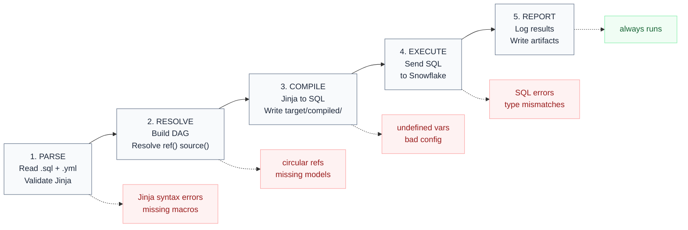

# Module 02 — Project Setup, Repo Structure & Execution Sequence

**Tier:** 🟢 Beginner · **Duration:** 60 min · **Prerequisites:** Module 01

> **Change from original plan:** The execution sequence (parse → compile → execute → report) was previously a standalone 60-minute module. It is absorbed here as a 15-minute block at the end of setup, where it belongs conceptually. Running `dbt run` is impossible to understand without knowing what it actually does.

---

## Agenda

| Time | Duration | Topic | Learning Goal | Mode | Participant Activity | Materials | Trainer Notes | Checkpoint |
|---|---|---|---|---|---|---|---|---|
| 00:00 | 10 min | Recap Module 01 | Confirm mental model before introducing new content | Q&A | Answer from memory, no notes | — | Ask all 4 prep questions cold. Stop and revisit any wrong answer before continuing. | All 4 correct |
| 00:10 | 15 min | `profiles.yml` anatomy | Understand how dbt connects to Snowflake | Present + live file | Read along in their own clone | `profiles.yml` from repo | Walk: `target`, `outputs`, `account`, `role`, `warehouse`, `schema`. Explain dev vs. prod target split. Key point: dev schema = `TESTING.dev_{name}` — never writes to Silver or Gold. | "What schema does your dev target write to?" |
| 00:25 | 15 min | `dbt_project.yml` deep-dive | Know what the project config controls | Present + live file | Annotate own copy | `dbt_project.yml` | Cover: `name`, `model-paths`, `+materialized` per layer, `+tags`. Show how Silver inherits `materialized: table` from config. | "Where is the default materialization for Gold models set?" |
| 00:40 | 10 min | CLI command reference | Know the core commands and when to use each | Present | Write down command table | This doc | Don't demo all commands — just walk the table. They'll use them hands-on in Module 06. | "What command runs models AND tests together?" |
| 00:50 | 10 min | The execution sequence | Understand what happens when you run `dbt run` | Present | Annotate diagram | Whiteboard | Five phases: Parse → Resolve → Compile → Execute → Report. Which phase produces which error type. One diagram, no more. | "At which phase does a Jinja syntax error appear?" |
| 01:00 | — | Session close + prep questions | — | — | — | — | No exercise this session — hands-on begins in Module 03 when they write their first Jinja. | — |

---

## Content

### Part A — `profiles.yml`: How dbt Connects to Snowflake

`profiles.yml` is NOT stored in the dbt project repo. It lives in `~/.dbt/profiles.yml` on your machine. It contains credentials — never commit it to git.

```yaml
analytics:
  target: dev          # which output to use by default
  outputs:
    dev:
      type: snowflake
      account: abc123.eu-west-1
      user: jane@company.com
      authenticator: externalbrowser   # SSO login
      role: TRANSFORMER_DEV
      warehouse: COMPUTE_WH_DEV
      database: SILVER_DEV
      schema: TESTING__dev_jane        # your personal dev schema
      threads: 4

    prod:
      type: snowflake
      account: abc123.eu-west-1
      user: dbt_prod@company.com
      authenticator: snowflake
      role: TRANSFORMER_PROD
      warehouse: COMPUTE_WH_PROD
      database: SILVER
      schema: PUBLIC                   # prod target; your orchestrator uses this
      threads: 8
```

**Critical rule:** Your dev target schema is `TESTING.dev_{yourname}`. You can break anything there. You cannot write to `SILVER` or `GOLD` from your laptop — that's the orchestrator's job.

**Test your connection:**
```bash
dbt debug   # checks profiles.yml, project config, Snowflake connectivity
```
If this passes, you're ready to run models.

---

### Part B — `dbt_project.yml`: The Project Config

```yaml
name: analytics
version: "1.0.0"
profile: analytics         # must match the key in profiles.yml

model-paths: ["models"]
test-paths: ["tests"]
macro-paths: ["macros"]
seed-paths: ["seeds"]

models:
  analytics:
    staging:
      +materialized: view    # all staging models default to view
      +tags: ["staging"]

    silver:
      +materialized: table   # Silver defaults to table
      +tags: ["silver"]
      +persist_docs:
        relation: true
        columns: true        # writes dbt descriptions to Snowflake column comments

    gold:
      +materialized: table
      +tags: ["gold"]
      +persist_docs:
        relation: true
        columns: true
```

The `+` prefix means the config applies to all models in that folder and subfolders. Individual models can override it with a `{{ config() }}` block at the top of the SQL file.

**Why `models: analytics:` — the project namespace**

The `analytics:` key under `models:` is the project name namespace. It must match `name: analytics` at the top of the file. Its purpose is to scope your config to *your* models only — not to models from installed packages.

If you install a package like `dbt_utils`, it brings its own models into the project. Without the namespace, any config you write under `models:` would apply to package models too. With it, package models are isolated under their own namespace:

```yaml
models:
  analytics:          # your models — configs apply here only
    silver:
      +materialized: table

  dbt_utils:          # an installed package — separate namespace
    +materialized: view
```

**Can you skip it?** Technically yes — dbt will still work. But if you ever install a package, your configs could bleed into its models unexpectedly. The convention is to always include it.

**Key decisions encoded in this file:**
- Staging is always a view — never a table
- Silver and Gold persist docs to Snowflake so Power BI and Cortex AI can read column descriptions
- Tags enable selective runs: `dbt build --select tag:silver`

---

### Part C — Core CLI Commands

| Command | What it does | When to use |
|---|---|---|
| `dbt debug` | Validates connection and config | First thing after cloning the repo |
| `dbt compile` | Renders Jinja → raw SQL without running | Inspecting what SQL dbt will execute |
| `dbt run` | Executes models (no tests) | Never in CI; use `dbt build` |
| `dbt test` | Runs tests only | Debugging a specific failing test |
| `dbt build` | Runs models + tests together | **Always in CI; preferred locally too** |
| `dbt docs generate` | Builds documentation site | Before `dbt docs serve` |
| `dbt docs serve` | Serves docs locally at localhost:8080 | Browsing the DAG and model docs |
| `dbt ls` | Lists all models matching a selector | Checking what a selector targets |
| `dbt run --select dim_patient+` | Runs `dim_patient` and all downstream models | Targeted rebuild after a change |

**The most important distinction:** `dbt run` does NOT run tests. Use `dbt build`.

---

### Part D — The Execution Sequence

When you run `dbt run` or `dbt build`, five phases execute in order:

```
1. PARSE        Read all .sql and .yml files, validate Jinja syntax
                  ↳ Fails here: Jinja syntax errors, missing macro definitions

2. RESOLVE      Build the DAG — resolve all {{ ref() }} and {{ source() }} calls
                  ↳ Fails here: circular references, missing models

3. COMPILE      Render Jinja → raw SQL, write to target/compiled/
                  ↳ Fails here: undefined variables, bad config blocks

4. EXECUTE      Send compiled SQL to Snowflake
                  ↳ Fails here: SQL errors, permission errors, data type mismatches

5. REPORT       Log results, write artifacts (manifest.json, run_results.json)
                  ↳ Always runs; even failed runs produce a report
```



**Why this matters:** When you get an error, the phase tells you where to look.

- `Compilation Error` → your Jinja is wrong → check the template, not the SQL
- `Database Error` → Snowflake rejected the SQL → check `target/compiled/` to see the actual SQL that ran
- `Dependency Error` → a `ref()` points to a model that doesn't exist → check spelling and file path

**The compiled SQL lives here:**
```
target/
  compiled/
    analytics/
      models/
        silver/
          dim_patient.sql    ← this is what dbt actually sent to Snowflake
```
Always inspect `target/compiled/` when debugging a failing model.

---

## Reference Material

- [dbt profiles.yml docs](https://docs.getdbt.com/docs/core/connect-data-platform/profiles.yml)
- [dbt_project.yml reference](https://docs.getdbt.com/reference/dbt_project.yml)
- [dbt CLI commands](https://docs.getdbt.com/reference/dbt-commands)

### Other project files you'll encounter in the repo

These don't need deep coverage now, but you'll see them in the project:

- **`packages.yml`** — declares external dbt packages (e.g. `dbt_utils`). Run `dbt deps` to install them into `dbt_packages/`. We use `dbt_utils` for surrogate key generation.
- **`seeds/`** — CSV files for small, static lookup tables that don't exist in a source system (e.g. a list of excluded test accounts, or a country-code mapping). Run `dbt seed` to load them. Not the right place for data that changes frequently.
- **`analyses/`** — SQL files that use `ref()` and `source()` for lineage tracking, but are never materialised. Useful for audit queries during a migration (e.g. "does our new Silver model match the old stored procedure?") without polluting the production model set.

---

## Prep Questions for Module 03

1. Where does `profiles.yml` live — inside the repo or outside it? Why?
2. What does `dbt build` do that `dbt run` does not?
3. At which execution phase does a Jinja syntax error appear?
4. Where can you find the compiled SQL that dbt sent to Snowflake?
