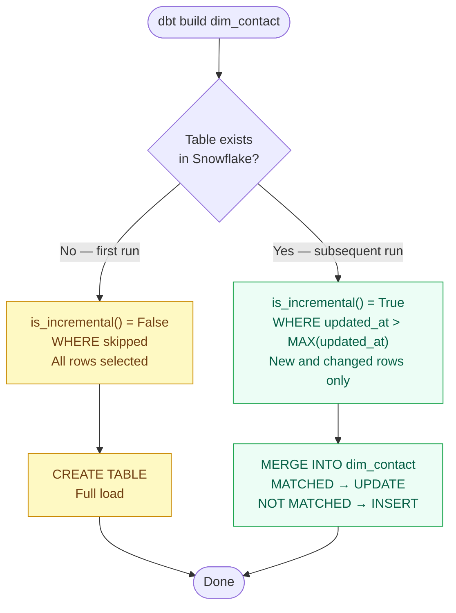

# Module 04 — Materializations

**Tier:** 🟢 Beginner · **Duration:** 90 min · **Prerequisites:** Module 03

> **Why this module exists:** Materialization strategy is one of the most consequential decisions in a dbt project — it drives cost, performance, freshness, and pipeline reliability. In this project, Bronze is append-only, Silver uses merge incremental, and Gold uses table. Without understanding why, you'll make expensive mistakes. This module gives a complete treatment before Sources (Module 05) and Testing (Module 06), because testing strategy depends on knowing what you're materialising.

---

## Agenda

| Time | Duration | Topic | Learning Goal | Mode | Participant Activity | Materials | Trainer Notes | Checkpoint |
|---|---|---|---|---|---|---|---|---|
| 00:00 | 10 min | Recap Module 03 | Confirm Jinja mental model | Q&A | Answer from memory | — | Ask all 4 prep questions. Probe: "what does `{{ this }}` refer to?" — it's directly relevant to incremental today. | All 4 correct |
| 00:10 | 10 min | The four materializations | Know that dbt has four and when each is appropriate | Present | Annotate table | This doc | One-sentence summary of each. Don't go deep yet — depth comes next. | "Name the four materializations" |
| 00:20 | 15 min | `view` and `table` | Understand the simplest two and their trade-offs | Present + live demo | Compare compiled SQL | VS Code | Show the DDL dbt generates for each. Key insight: `table` drops and recreates on every run — not suitable for large Bronze tables. | "Why would you never use `table` for Bronze?" |
| 00:35 | 20 min | `incremental` — the critical one | Understand merge incremental, `unique_key`, and `is_incremental()` | Present + live code | Follow along in editor | This doc | This is the most used and most misunderstood materialization. Walk through a real Silver model. Show what the merge SQL looks like in `target/compiled/`. | "What does `is_incremental()` return on a first run vs. subsequent runs?" |
| 00:55 | 10 min | `ephemeral` — when and why | Know what ephemeral is and the one case it's useful | Present | Listen | This doc | Brief. Key point: ephemeral becomes a CTE in whatever calls it — no table created. Useful for intermediate staging steps. Rarely used. | "Does an ephemeral model create a table in Snowflake?" |
| 01:05 | 5 min | Materialization rules | Know the mandatory choices per layer | Present | Write down rules | This doc | These are not suggestions. CI enforces them. Read through the table together. | "What materialization is forbidden for staging models?" |
| 01:10 | 25 min | Exercise: read, diagnose, fix | Identify wrong materializations and fix them | Practice | Solo exercise | Exercise below | Circulate. Most common confusion: thinking `append` is a valid materialization keyword (it's not — `incremental` with `on_schema_change` + strategy controls this). | Exercise complete, all three models corrected |
| 01:35 | 10 min | Debrief + prep questions | Consolidate | Debrief | Verbal | Whiteboard | Ask: "if a Gold model takes 45 minutes to rebuild, what's the first question you'd ask?" — answer: should it be incremental? | — |

---

## Content

### Part A — The Four Materializations

| Materialization | What dbt creates | Rebuilt on every run? | Use case |
|---|---|---|---|
| `view` | `CREATE OR REPLACE VIEW` | ✅ Yes (view definition only — no data copied) | Staging, lightweight transforms |
| `table` | `DROP + CREATE TABLE AS SELECT` | ✅ Yes (full rebuild) | Small-medium Gold marts, reference tables |
| `incremental` | `MERGE INTO` or `INSERT` | ❌ No — only new/changed rows | Large Silver facts, append-heavy Bronze staging |
| `ephemeral` | Nothing (becomes a CTE) | N/A — no object created | Intermediate CTEs you don't want as tables |

---

### Part B — `view` and `table`

#### view

```sql
-- dbt compiles this to:
CREATE OR REPLACE VIEW SILVER_DEV.TESTING__dev_jane.stg_hubspot__contacts AS
SELECT
    contact_id,
    email,
    created_at
FROM BRONZE.HUBSPOT.contacts
```

**Pro:** Always reflects the latest source data. Zero storage cost.
**Con:** Recomputes on every query. Slow for complex transforms or large tables.

By convention, staging models are always views. They're cheap wrappers that rename columns and cast types — no business logic, no storage needed.

#### table

```sql
-- dbt compiles this to:
DROP TABLE IF EXISTS SILVER.PUBLIC.dim_pipeline;
CREATE TABLE SILVER.PUBLIC.dim_pipeline AS
SELECT ...
```

**Pro:** Fast to query. No recomputation at query time.
**Con:** Full rebuild on every `dbt run`. Expensive for large tables.

By convention, Gold marts use `table` because they're small aggregates. Silver dimensions use `table` unless they're SCD2, which uses incremental with a merge key.

---

### Part C — `incremental`: The One That Matters Most

Here's the core idea: incremental models don't rebuild from scratch on every run. They process only new or changed rows. That's why large Silver facts use this materialization — rebuilding millions of rows nightly from scratch would be slow and expensive.

```sql
{{ config(
    materialized  = 'incremental',
    unique_key    = 'contact_key',
    on_schema_change = 'sync_all_columns'
) }}

SELECT
    contact_key,
    hubspot_contact_id,
    email,
    updated_at
FROM {{ ref('stg_hubspot__contacts') }}


    WHERE updated_at > (SELECT MAX(updated_at) FROM {{ this }})

```

#### What happens on first run

`is_incremental()` returns `False`. The `WHERE` clause is skipped. dbt creates the table from a full `SELECT`.

#### What happens on subsequent runs

`is_incremental()` returns `True`. The `WHERE` clause applies — only rows newer than the table's current `MAX(updated_at)` are selected. dbt executes a `MERGE INTO` using `unique_key` as the match condition.



#### The compiled MERGE statement (what Snowflake receives)

```sql
MERGE INTO SILVER.PUBLIC.dim_contact AS DBT_INTERNAL_DEST
USING (
    SELECT contact_key, hubspot_contact_id, email, updated_at
    FROM SILVER_DEV.TESTING__dev_jane.stg_hubspot__contacts
    WHERE updated_at > (SELECT MAX(updated_at) FROM SILVER.PUBLIC.dim_contact)
) AS DBT_INTERNAL_SOURCE
ON DBT_INTERNAL_DEST.contact_key = DBT_INTERNAL_SOURCE.contact_key

WHEN MATCHED THEN UPDATE SET
    hubspot_contact_id = DBT_INTERNAL_SOURCE.hubspot_contact_id,
    email = DBT_INTERNAL_SOURCE.email,
    updated_at = DBT_INTERNAL_SOURCE.updated_at

WHEN NOT MATCHED THEN INSERT (contact_key, hubspot_contact_id, email, updated_at)
VALUES (...)
```

This is why `unique_key` is required for incremental with merge strategy — without it, dbt can't know which rows to update vs. insert.

#### `on_schema_change` options

| Value | Behaviour |
|---|---|
| `ignore` (default) | New columns in SELECT are silently ignored — they won't appear in the table |
| `fail` | dbt errors if SELECT has columns the table doesn't have |
| `sync_all_columns` | Adds new columns, removes deleted ones — **our standard** |
| `append_new_columns` | Adds new columns only, never removes |

Always use `sync_all_columns`. The `ignore` default is a silent data bug waiting to happen — you'll add a column, run dbt, see no error, and wonder why the column's missing from Snowflake.

#### Forcing a full refresh

Sometimes an incremental model's data gets corrupted, or you change logic that affects historical rows. To rebuild from scratch:

```bash
dbt run --select dim_contact --full-refresh
```

This ignores `is_incremental()` and does a full table rebuild. Use it after:
- Logic changes that affect historical rows
- Source data corrections
- Schema migrations

---

### Part D — `ephemeral`

```sql
{{ config(materialized='ephemeral') }}

SELECT
    contact_id,
    LOWER(email) AS email_clean
FROM {{ source('hubspot', 'contacts') }}
```

An ephemeral model creates no object in Snowflake. When another model references it via `{{ ref() }}`, dbt inlines it as a CTE.

**When to use:** Intermediate transformations that are used by exactly one downstream model and don't need to be queried directly.

**When NOT to use:** When multiple models reference the same ephemeral model. It gets inlined as a CTE in each one, repeating the computation. Use a view or table instead.

**In practice:** Ephemeral is rarely used. Prefer views for intermediate staging steps — they're queryable for debugging.

---

### Snowflake-specific: dynamic tables

Snowflake has a native alternative to incremental models called **dynamic tables**. Instead of writing `is_incremental()` logic yourself, you configure dbt to let Snowflake manage the refresh:

```yaml
models:
  - name: fct_daily_revenue
    config:
      materialized: dynamic_table
```

Snowflake handles the incremental refresh automatically — you write a plain `SELECT`, no `` needed. The trade-off: less control over exactly when data refreshes and no `--full-refresh` override.

**Not used in this project today.** The standard is `incremental` with `merge` strategy. Mention this only if asked — it's a sign that Snowflake is absorbing some of what dbt does manually.

---

### Part E — Mandatory Materialization Rules

| Layer | Required materialization | Reason |
|---|---|---|
| Bronze | Append-only via Lambda (dbt doesn't own Bronze) | Bronze is managed by the ingestion layer |
| Staging | `view` or `ephemeral` | No business logic, no storage needed |
| Silver — dimensions | `table` (or `incremental` for SCD2) | Rebuilt nightly; medium size |
| Silver — facts (large) | `incremental` with `merge` strategy | Too large to full-refresh every run |
| Gold | `table` | Small aggregates; consumers need consistent reads |

**CI enforcement:** Staging models configured as `table` will fail the pre-merge review. This is checked manually via `dbt-sql-reviewer` skill until automated.

---

## Exercise (25 min)

> **Project context:** `stg_hubspot__contacts.sql` exists from Module 03. This session fixes a broken pre-built model and adds two more staging models, completing two thirds of the staging layer.

### Task 1 — Fix `stg_hubspot__pipeline_stages.sql`

Open `models/staging/hubspot/stg_hubspot__pipeline_stages.sql`. There's one configuration problem. Find it, fix it with a one-line change, and explain in one sentence why that materialisation is wrong for staging.

After fixing the config, make sure the model selects all five columns from the source (`pipeline_stage_id`, `stage_name`, `is_closed`, `pipeline_id`, `_ingested_at`), renaming `_ingested_at` → `ingested_at`.

<details>
<summary>The bug and fix</summary>

The model has `materialized='table'`. Staging models are always views — they're a lightweight alias over Bronze with no storage cost. The fix:

```sql
{{ config(materialized='view') }}

SELECT
    pipeline_stage_id,
    stage_name,
    is_closed,
    pipeline_id,
    _ingested_at AS ingested_at
FROM {{ source('hubspot', 'pipeline_stages') }}
```

</details>

### Task 2 — Write `stg_hubspot__deals.sql`

Create `models/staging/hubspot/stg_hubspot__deals.sql`.

The Bronze source (`BRONZE.HUBSPOT.deals`) has: `deal_id`, `deal_name`, `pipeline_id`, `close_date`, `_ingested_at`.

Requirements: view materialization; source via `{{ source('hubspot', 'deals') }}`; select all five columns; rename `close_date` → `expected_close_date` and `_ingested_at` → `ingested_at`.

<details>
<summary>Expected model</summary>

```sql
{{ config(materialized='view') }}

SELECT
    deal_id,
    deal_name,
    pipeline_id,
    close_date   AS expected_close_date,
    _ingested_at AS ingested_at
FROM {{ source('hubspot', 'deals') }}
```

</details>

### Task 3 — Run all staging models

```bash
dbt run --select staging.*
```

Three models should show `OK`. Verify all three exist as views in your dev schema in Snowflake.

### Bonus — Find the two bugs

The model below has two problems. Identify both without running the code.

```sql
{{ config(
    materialized     = 'incremental',
    unique_key       = 'contact_key',
    on_schema_change = 'ignore'
) }}

SELECT contact_key, email, updated_at
FROM {{ ref('stg_hubspot__contacts') }}

{{ if is_incremental() }}
    WHERE updated_at > (SELECT MAX(updated_at) FROM {{ this }})
{{ endif }}
```

<details>
<summary>The two bugs</summary>

1. `on_schema_change = 'ignore'` silently drops new columns from the target table. Use `'sync_all_columns'`.
2. `{{ if }}` / `{{ endif }}` are expression delimiters and render their content as literal text in the compiled SQL. Control flow requires statement delimiters: `` / ``.

</details>

---

## Reference Material

- [dbt materializations docs](https://docs.getdbt.com/docs/build/materializations)
- [dbt incremental models](https://docs.getdbt.com/docs/build/incremental-models)
- [dbt `on_schema_change`](https://docs.getdbt.com/docs/build/incremental-models#what-if-the-columns-of-my-incremental-model-change)
- Internal: `dbt-sql-reviewer` skill — checks materialization compliance pre-merge

---

## Prep Questions for Module 05

1. What SQL statement does dbt generate for a `table` materialization?
2. What does `is_incremental()` return on the first run of an incremental model?
3. What is the mandatory `on_schema_change` setting for incremental models?
4. Why would you never use `materialized='table'` for a staging model?
