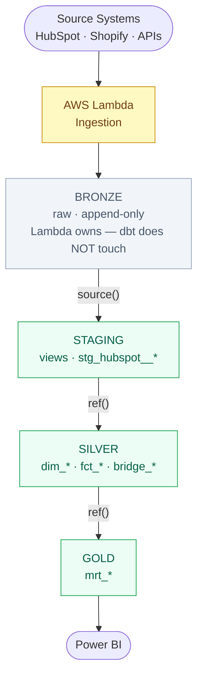

# Module 05 — Sources and the Medallion Architecture

**Tier:** 🟢 Beginner · **Duration:** 90 min · **Prerequisites:** Module 04

> **Change from original plan:** This module was previously 60 minutes. Expanded to 90 minutes because the medallion architecture discussion reliably generates significant questions from newcomers, and source freshness was previously being rushed. Both topics now have adequate time.

---

## Agenda

| Time | Duration | Topic | Learning Goal | Mode | Participant Activity | Materials | Trainer Notes | Checkpoint |
|---|---|---|---|---|---|---|---|---|
| 00:00 | 10 min | Recap Module 04 | Confirm materialization mental model | Q&A | Answer from memory | — | Ask all 4 prep questions. "What SQL does a table materialization generate?" — expect DROP + CREATE TABLE AS SELECT | All 4 correct |
| 00:10 | 20 min | The Bloomwell medallion architecture | Know what each layer owns, who writes to it, and why | Present + diagram | Annotate layer diagram | Whiteboard | Draw it by hand, not from a slide. Emphasise: dbt does NOT own Bronze. Lambda does. dbt starts at Staging. | "Who writes to the Bronze layer?" |
| 00:30 | 15 min | `sources.yml` — declaring sources | Understand how dbt knows about Bronze tables | Present + live file | Follow along in editor | `sources.yml` from repo | Write a minimal `sources.yml` live. Key point: without this declaration, `{{ source() }}` fails — dbt doesn't auto-discover tables. | "What happens if you call `{{ source() }}` without a `sources.yml` declaration?" |
| 00:45 | 10 min | `{{ source() }}` vs hardcoding | Know why `source()` is mandatory and hardcoding is forbidden | Present + live compile | Compare compiled outputs | VS Code + `dbt compile` | Run `dbt compile` on a model using `source()` and one using a hardcoded name. Show the DAG difference in `dbt docs serve`. | "Name two things you lose when you hardcode a table name instead of using source()" |
| 00:55 | 15 min | Source freshness | Know how to declare and check freshness | Present + live demo | Follow along | This doc | Run `dbt source freshness` live. Show the output. Explain where this fits in Airflow: freshness check before models run. | "What does dbt do if a source is stale and freshness is set to `error`?" |
| 01:10 | 25 min | Exercise: write a staging model from scratch | Write a staging model that correctly references a source | Practice | Solo exercise | Exercise below | Circulate. Most common mistakes: missing `sources.yml` declaration, hardcoded table reference, wrong Jinja delimiter. | Exercise complete, `dbt compile` succeeds |
| 01:35 | 10 min | Debrief + prep questions | Consolidate | Debrief | Verbal | — | Ask: "if Bronze data stops arriving from HubSpot, how does dbt know?" — answer: source freshness check. | — |

---

## Content

### Part A — The Bloomwell Medallion Architecture



```
┌─────────────────────────────────────────────────────────────────┐
│                         DATA SOURCES                            │
│          HubSpot · Shopify · External APIs                      │
└────────────────────────────┬────────────────────────────────────┘
                             │ AWS Lambda (ingestion)
                             ▼
┌─────────────────────────────────────────────────────────────────┐
│  BRONZE  (BRONZE.{source_system}.*)                             │
│  Raw data. Append-only. Never modified after write.             │
│  Owner: Lambda / ingestion layer. dbt does NOT touch Bronze.    │
│  Examples: BRONZE.HUBSPOT.contacts, BRONZE.HUBSPOT.deals        │
└────────────────────────────┬────────────────────────────────────┘
                             │ dbt — Staging models (views)
                             ▼
┌─────────────────────────────────────────────────────────────────┐
│  STAGING  (STAGING.{purpose}.*)                                 │
│  Thin views. Rename columns, cast types, no business logic.     │
│  Materialization: view only. One-to-one with Bronze tables.     │
│  Examples: hubspot__contacts, hubspot__deals                    │
└────────────────────────────┬────────────────────────────────────┘
                             │ dbt — Silver models
                             ▼
┌─────────────────────────────────────────────────────────────────┐
│  SILVER  (SILVER.{subject_area}.*)                              │
│  Cleaned, modelled, tested. Dimensions and facts (Kimball).     │
│  Materialization: table or incremental. SCD2 where needed.      │
│  Examples: dim_patient, fct_prescription, dim_pipeline          │
└────────────────────────────┬────────────────────────────────────┘
                             │ dbt — Gold models
                             ▼
┌─────────────────────────────────────────────────────────────────┐
│  GOLD  (GOLD.{use_case}.*)                                      │
│  Business-ready aggregates. Serve Power BI directly.            │
│  Materialization: table. Prefixed mrt_.                         │
│  Examples: mrt_monthly_prescription_volume, mrt_cs_tickets      │
└────────────────────────────┬────────────────────────────────────┘
                             │ Power BI
                             ▼
                     Business dashboards
```

**Layer ownership rules — non-negotiable:**

| Layer | Written by | Read by | dbt owns? |
|---|---|---|---|
| Bronze | Lambda / ingestion | dbt Staging | ❌ No |
| Staging | dbt | dbt Silver | ✅ Yes |
| Silver | dbt | dbt Gold, ad hoc analysis | ✅ Yes |
| Gold | dbt | Power BI, business users | ✅ Yes |

**The critical rule:** dbt references Bronze as a **source**, not a `ref()`. Bronze tables are never built by dbt.

---

### Part B — Declaring Sources in `sources.yml`

Before you can use `{{ source('hubspot', 'contacts') }}` in a model, you must declare the source.

```yaml
# models/staging/sources.yml
version: 2

sources:
  - name: hubspot                                    # the source alias used in {{ source() }}
    database: BLOOMWELL                              # Snowflake database
    schema: BRONZE.HUBSPOT                           # Snowflake schema
    description: "HubSpot CRM data ingested via AWS Lambda."

    tables:
      - name: contacts
        description: "One row per HubSpot contact. Append-only, deduplication happens in staging."
        loaded_at_field: _ingested_at                # column dbt uses for freshness checks

      - name: deals
        description: "HubSpot deal records including pipeline stage history."
        loaded_at_field: _ingested_at

      - name: pipeline_stages
        description: "Static lookup: pipeline stage definitions."
        # no loaded_at_field — static table, no freshness check needed
```

**What dbt does with this:**
- Registers `BLOOMWELL.BRONZE.HUBSPOT.contacts` as a DAG node
- Enables `{{ source('hubspot', 'contacts') }}` to resolve correctly
- Enables `dbt source freshness` to check the `_ingested_at` column
- Shows the source in the DAG visualisation in `dbt docs serve`

---

### Part C — `{{ source() }}` vs Hardcoding

**Hardcoded — never do this:**
```sql
SELECT *
FROM BLOOMWELL.BRONZE.HUBSPOT.contacts
```

**With `source()` — always do this:**
```sql
SELECT *
FROM {{ source('hubspot', 'contacts') }}
```

Both produce the same SQL in the dev environment — but they're not equivalent. Here's what you lose with hardcoding:

| | `source()` | Hardcoded |
|---|---|---|
| Shows in DAG | ✅ Yes | ❌ No |
| Freshness check works | ✅ Yes | ❌ No |
| Schema changes in one place | ✅ Yes — update `sources.yml` | ❌ No — update every model |
| Environment-aware | ✅ Resolves based on `profiles.yml` | ❌ Always points to prod |
| Detects if table deleted | ✅ dbt warns | ❌ Fails silently at runtime |

---

### Part D — Source Freshness

Source freshness checks whether Bronze data is up to date before dbt models run.

**Declare freshness in `sources.yml`:**

```yaml
sources:
  - name: hubspot
    database: BLOOMWELL
    schema: BRONZE.HUBSPOT

    freshness:                           # applies to all tables unless overridden
      warn_after:  {count: 6,  period: hour}
      error_after: {count: 24, period: hour}

    tables:
      - name: contacts
        loaded_at_field: _ingested_at    # dbt queries MAX(_ingested_at) to check age

      - name: pipeline_stages
        freshness: null                  # static table — opt out of freshness check
```

**Run a freshness check:**
```bash
dbt source freshness
```

Output:
```
Found 1 source, 2 tables.
contacts: 3 hours 42 minutes ago — PASS
deals:    26 hours 15 minutes ago — ERROR
```

**In Airflow:** The freshness check runs before any dbt models. If a source errors, the pipeline stops. This prevents building Silver and Gold on stale Bronze data.

---

## Exercise (25 min)

### Task

You are adding a new HubSpot source: the `owners` table (`BLOOMWELL.BRONZE.HUBSPOT.owners`). It has a `_ingested_at` timestamp column and is updated every 12 hours.

**Step 1:** Add the `owners` table to `sources.yml` with appropriate freshness thresholds (warn at 14 hours, error at 25 hours).

**Step 2:** Write a staging model `stg_hubspot__owners.sql` that:
- References the source correctly (not hardcoded)
- Selects: `owner_id`, `first_name`, `last_name`, `email`, `_ingested_at`
- Renames `_ingested_at` to `ingested_at` (strip the underscore)
- Is materialized as a view

**Step 3:** Run `dbt compile --select stg_hubspot__owners` and verify the compiled output references the correct Bronze table.

---

## Reference Material

- [dbt sources docs](https://docs.getdbt.com/docs/build/sources)
- [dbt source freshness](https://docs.getdbt.com/docs/build/sources#source-data-freshness)
- [dbt `source()` function](https://docs.getdbt.com/reference/dbt-jinja-functions/source)
- Bloomwell internal: `bloomwell-conventions` skill — schema naming, layer ownership

---

## Prep Questions for Module 06

1. What must exist in `sources.yml` before you can use `{{ source('hubspot', 'contacts') }}`?
2. Name two things you lose by hardcoding a Bronze table name instead of using `{{ source() }}`.
3. What column does dbt query to check source freshness?
4. Why does dbt NOT own the Bronze layer at Bloomwell?
