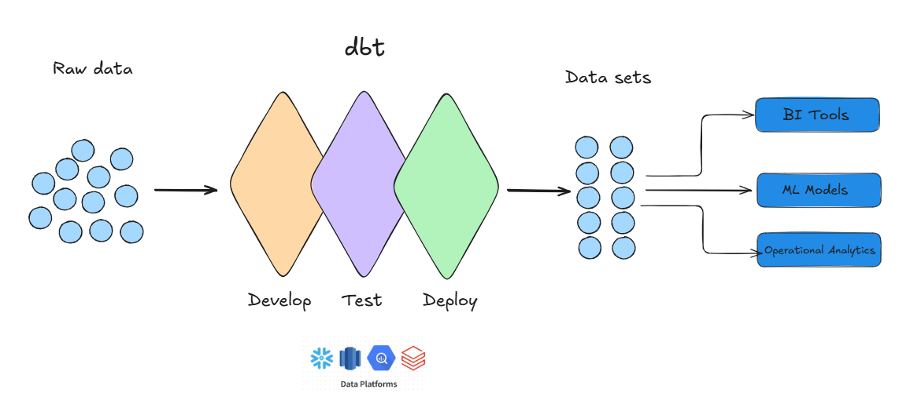

<div class="h-full flex flex-col justify-center pl-2">
  <div class="text-xs font-mono text-slate-400 tracking-widest uppercase mb-6">dbt Training</div>
  <div class="inline-flex items-center gap-2 bg-emerald-50 border border-emerald-200 text-emerald-700 text-xs font-mono px-3 py-1 rounded-full w-fit mb-6">
    🟢 Beginner · Module 01 · 90 min
  </div>
  <h1 class="text-6xl font-bold text-slate-900 leading-[1.05] mb-6">
    What is dbt<br>and Why<br>We Use It
  </h1>
  <p class="text-slate-400 text-base max-w-sm leading-relaxed">
    From raw SQL chaos to tested, documented, versioned transformations.
  </p>
</div>

<!--
Welcome everyone. This is Module 01 — the start of the Beginner tier. No prerequisites.

Before we dive in: ask the group what they already know about dbt. Listen for misconceptions — especially anyone who's used dbt Cloud before. We're on dbt Core only.

By the end of this session, the goal is one thing: you can explain what dbt is and where it fits in our stack, in plain language, to a colleague who's never heard of it.
-->

---

# The Problem: SQL Pipelines Without Structure

<div class="grid grid-cols-2 gap-10 mt-6">
<div>

**What happens without dbt**

Stakeholder needs an answer:
> *"I need a monthly report about how many contacts converted to active patients last month?"*

Data team writes pipelines, tables, views and connects it to a BI tool. Code gets stored in personal workspace. Execution is placed in a stored procedure and Snowflake task.

Three months later: **broken**. A column was renamed. No tests. No docs. Two ad-hoc queries produce different numbers.

</div>
<div class="flex flex-col gap-3 mt-1">

<div v-click class="bg-red-50 border border-red-200 rounded-lg p-4">
  <div class="text-red-700 font-semibold text-sm mb-1">❌ No single source of truth</div>
  <div class="text-red-600 text-xs">Same calculation in 10 different places</div>
</div>
<div v-click class="bg-red-50 border border-red-200 rounded-lg p-4">
  <div class="text-red-700 font-semibold text-sm mb-1">❌ No testing</div>
  <div class="text-red-600 text-xs">Transformations break silently</div>
</div>
<div v-click class="bg-red-50 border border-red-200 rounded-lg p-4">
  <div class="text-red-700 font-semibold text-sm mb-1">❌ No documentation</div>
  <div class="text-red-600 text-xs">Tribal knowledge about what columns mean</div>
</div>
<div v-click class="bg-red-50 border border-red-200 rounded-lg p-4">
  <div class="text-red-700 font-semibold text-sm mb-1">❌ No dependency management</div>
  <div class="text-red-600 text-xs">Nobody knows what breaks when a source changes</div>
</div>

</div>
</div>

<!--
This is not a hypothetical. Ask the group: "has this happened to you?" Give them 30 seconds to share.

Use a concrete example: HubSpot raw data lands in BRONZE.HUBSPOT.contacts. Before dbt, someone would query it directly — hardcoded schema, no tests, no lineage. A column rename in the Lambda pipeline breaks everything silently.

Don't rush this slide. The pain needs to feel real before the solution means anything.
-->

---

# What dbt Actually Is

<div class="grid grid-cols-2 gap-10 mt-4">
<div>

**The one-sentence definition**

dbt is a **transformation framework** that lets you write SQL `SELECT` statements — and handles materialisation, dependency resolution, testing, and documentation on top of them.

<div class="mt-6 space-y-2">
  <div class="flex items-center gap-2 text-sm"><span class="text-emerald-600 font-bold">✓</span> Compiles SQL models into executable statements</div>
  <div class="flex items-center gap-2 text-sm"><span class="text-emerald-600 font-bold">✓</span> Resolves the run order via a DAG</div>
  <div class="flex items-center gap-2 text-sm"><span class="text-emerald-600 font-bold">✓</span> Runs tests against your data</div>
  <div class="flex items-center gap-2 text-sm"><span class="text-emerald-600 font-bold">✓</span> Generates browsable documentation</div>
</div>

</div>
<div v-click>

**dbt does NOT:**

<div class="space-y-2 mt-1">
  <div class="bg-slate-100 rounded-lg p-3 text-sm text-slate-600">Extract data from HubSpot — that's Lambda</div>
  <div class="bg-slate-100 rounded-lg p-3 text-sm text-slate-600">Load data into Snowflake — already done before dbt runs</div>
  <div class="bg-slate-100 rounded-lg p-3 text-sm text-slate-600">Schedule itself — that's your orchestrator</div>
  <div class="bg-slate-100 rounded-lg p-3 text-sm text-slate-600">Store any data itself</div>
</div>

<div class="mt-4 bg-amber-50 border border-amber-200 rounded-lg p-3 text-xs text-amber-700">
  <strong>Common confusion:</strong> dbt is not a database, not an ETL tool, not a scheduler. It transforms data that is <em>already in Snowflake</em>.
</div>

</div>
</div>

<!--
The "does not" column is as important as the "does" column. Most confusion about dbt comes from people thinking it replaces the whole pipeline.

Checkpoint question after this slide: "Is dbt Core or dbt Cloud? What's the difference?" — expect someone to not know. Answer: Core is open-source CLI. Cloud is a hosted platform with IDE and scheduler. We use Core only. Everything in this training is Core.
-->

---

# dbt Core vs dbt Cloud

<div class="mt-6">

| | dbt Core | dbt Fusion | dbt Cloud |
|---|---|---|---|
| What it is | Open-source CLI tool | Next-gen local runtime (Rust-based, replaces Python engine) | Hosted platform: IDE, scheduler, CI |
| **What we use** | **✅ dbt Core** | **⏳ Not yet** | **❌ Not used** |
| How we run it | `dbt run`, `dbt test`, `dbt build` | Same CLI commands, much faster | N/A |
| How we schedule it | Your orchestrator | Your orchestrator | N/A |

</div>

<div class="mt-8 bg-emerald-50 border border-emerald-200 rounded-xl p-3">
  <div class="font-semibold text-emerald-800 mb-2">Everything in this training applies to dbt Core  — running native in Snowflake or local.</div>
</div>

<!--
This comes up constantly when people do their own research. They find a YouTube tutorial that shows a browser-based IDE — that's dbt Cloud. Our dev environment is VS Code + CLI.

If anyone has used dbt Cloud before, flag that their muscle memory around the scheduler and the IDE won't apply here.
-->

---

# The Data Stack

### dbt is the T in ELT: Extract, Load, Transform, Lambda handles E+L

<div class="h-full flex items-center justify-center mt-2">
  
</div>

<!--
Draw this on the whiteboard — don't just show the slide. The physical act of drawing it helps people remember the layer boundaries.

Key point to hammer: dbt does NOT write to Bronze. Lambda does. dbt starts at Staging and references Bronze as a *source*. This distinction matters in Module 05 when we cover sources.yml.

Checkpoint: "Who writes to the Bronze layer?" — Answer: Lambda / the ingestion layer. Not dbt.

Ask: "What is the first model dbt touches?" — Answer: Staging. It reads from Bronze via source(), not ref().
-->

---
layout: default
background: '#f9f8f5'
---

# dbt Vocabulary

<div class="grid grid-cols-3 gap-4 mt-4">

  <div class="bg-white border-t-4 border-emerald-400 rounded-xl p-4 shadow-sm">
    <div class="text-xs font-mono text-emerald-600 mb-1">dbt</div>
    <div class="text-sm font-bold text-slate-800 mb-2">Data Build Tool</div>
    <div class="text-xs text-slate-500">A transformation framework. You write SQL — dbt handles boilerplate code, compilation, run order, testing.</div>
  </div>

  <div class="bg-white border-t-4 border-sky-400 rounded-xl p-4 shadow-sm">
    <div class="text-xs font-mono text-sky-600 mb-1">model</div>
    <div class="text-sm font-bold text-slate-800 mb-2">A single SQL SELECT statement</div>
    <div class="text-xs text-slate-500">Stored as a <code>.sql</code> file. dbt compiles it and creates a Snowflake object (table, view, etc.) from it.</div>
  </div>

  <div class="bg-white border-t-4 border-violet-400 rounded-xl p-4 shadow-sm">
    <div class="text-xs font-mono text-violet-600 mb-1">materialization</div>
    <div class="text-sm font-bold text-slate-800 mb-2">How a model is persisted</div>
    <div class="text-xs text-slate-500">The Snowflake object dbt creates from a model. Options: <code>view</code>, <code>table</code>, <code>incremental</code>, <code>snapshot</code>.</div>
  </div>

  <div class="bg-white border-t-4 border-amber-400 rounded-xl p-4 shadow-sm">
    <div class="text-xs font-mono text-amber-600 mb-1">DAG</div>
    <div class="text-sm font-bold text-slate-800 mb-2">Directed Acyclic Graph</div>
    <div class="text-xs text-slate-500">The dependency map between models. Determines run order. "Acyclic" means no circular dependencies — model A cannot depend on itself.</div>
  </div>

  <div class="bg-white border-t-4 border-rose-400 rounded-xl p-4 shadow-sm">
    <div class="text-xs font-mono text-rose-600 mb-1">lineage</div>
    <div class="text-sm font-bold text-slate-800 mb-2">The visual dependency chain</div>
    <div class="text-xs text-slate-500">Shows what each model reads from (upstream) and what depends on it (downstream). Generated automatically by dbt docs.</div>
  </div>

  <div class="bg-white border-t-4 border-slate-400 rounded-xl p-4 shadow-sm">
    <div class="text-xs font-mono text-slate-500 mb-1">macro</div>
    <div class="text-sm font-bold text-slate-800 mb-2">Reusable Jinja-templated SQL</div>
    <div class="text-xs text-slate-500">Like a function. Defined once in <code>macros/</code>, called from any model. Used to avoid repeating logic across the project.</div>
  </div>

</div>

<!--
This slide is a reference — don't lecture through every term.

Read the room:
- If the group has no dbt experience, spend 2 minutes here. Ask: "Has anyone heard of a DAG before?"
- If there's prior experience, say "these are the six terms we'll use throughout the training" and move on.

The two that need the most explanation in practice:
- DAG: draw a simple 3-node graph on the whiteboard. Source → Staging → Silver. That's a DAG.
- Macro: "think of it like a SQL function you write once and reuse everywhere."

Lineage is best explained live in the dbt docs browser — come back to this in Module 06.
-->

---

# Project Structure

### The basic folder structure applies to all projects.

<div class="grid grid-cols-2 gap-10 mt-4">
<div>

**Open VS Code — dbt project**

```
analytics/
│
├── readme.md          ← mandatory. verbose!
├── .gitignore         ← mandatory, protect .secrets
│
├── .secrets/          ← tokens, git protected
│
├── dbt_project.yml    ← project config
├── profiles.yml       ← in snowflake, local: in ~/.dbt/
│
├── models/
│   ├── staging/       ← hubspot__contacts etc.
│   ├── silver/        ← dim_patient, fct_prescription
│   └── gold/          ← mrt_monthly_volume
│
├── snapshots/         ← scd2 models
│
├── macros/            ← reusable code, like functions
├── tests/             ← singular tests
└── target/            ← compiled SQL (git-ignored)
```

</div>
<div class="flex flex-col gap-3 mt-2">

  <div class="bg-slate-50 border border-slate-200 rounded-lg p-3 text-sm">
    <div class="font-mono text-slate-500 text-xs mb-1">dbt_project.yml</div>
    Project name, model paths, default materialisation per layer
  </div>

  <div class="bg-slate-50 border border-slate-200 rounded-lg p-3 text-sm">
    <div class="font-mono text-slate-500 text-xs mb-1">profiles.yml</div>
    Connection to Snowflake — account, role, warehouse. Environments: Prod and Dev.
  </div>

  <div class="bg-slate-50 border border-slate-200 rounded-lg p-3 text-sm">
    <div class="font-mono text-slate-500 text-xs mb-1">models/silver/dim_patient.sql</div>
    Contains <code v-pre>{{ ref() }}</code> — we'll cover this in Module 03
  </div>

  <div class="bg-slate-50 border border-slate-200 rounded-lg p-3 text-sm">
    <div class="font-mono text-slate-500 text-xs mb-1">target/ folder</div>
    Where compiled SQL lives — always git-ignored, never commit it
  </div>

</div>
</div>

<!--
Do NOT run dbt run here. Running a model requires ref(), materialisation, and schema config — all coming in later modules.

Make the deliberate navigation mistake — it's not optional. Participants need to see what disorientation looks like and how to recover. The message is: everyone gets lost in a codebase. Here's how you re-orient.

Don't explain every file in depth. The goal is just: "here's the map." Depth comes in Module 02.

After the demo, ask: 
- "Point to where a Silver model lives." Make someone answer before moving on.
- what are snapshots?
- what could macros be?
-->

---

# Exercise: Explore the Project (15 min)

**Answer all four questions using only the dbt project — no Googling.**

<div class="bg-amber-50 border-l-4 border-amber-400 rounded-lg px-4 py-3 mb-4 flex items-start gap-3">
  <span class="text-amber-500 text-lg font-bold leading-none mt-0.5">!</span>
  <div class="text-sm text-amber-800">
    <strong>Before you start:</strong> clone the training repo and create a new Git branch as your personal workspace.
    <code class="block mt-1 bg-amber-100 rounded px-2 py-1 text-xs font-mono">https://github.com/ThorstenWeberGER/dbt-training-excercise</code>
  </div>
</div>

<div class="grid grid-cols-2 gap-6 mt-4">
<div class="space-y-4">

<div class="bg-white border border-slate-200 rounded-xl p-4 shadow-sm">
  <div class="text-xs font-mono text-slate-400 mb-1">Q1</div>
  <div class="text-sm font-medium text-slate-800">What is the project name defined in <code>dbt_project.yml</code> and in which other file you will find this name?</div>
</div>

<div class="bg-white border border-slate-200 rounded-xl p-4 shadow-sm">
  <div class="text-xs font-mono text-slate-400 mb-1">Q2</div>
  <div class="text-sm font-medium text-slate-800">Find one Silver dimension model (<code>dim_*</code>). What table does it reference using <code v-pre>{{ ref() }}</code>?</div>
</div>

<div class="bg-white border border-slate-200 rounded-xl p-4 shadow-sm">
  <div class="text-xs font-mono text-slate-400 mb-1">Q3</div>
  <div class="text-sm font-medium text-slate-800">What is the purpose of the <code>dbt_project.yml</code> file and what can you configure here?</div>
</div>

</div>
<div class="space-y-4">

<div class="bg-white border border-slate-200 rounded-xl p-4 shadow-sm">
  <div class="text-xs font-mono text-slate-400 mb-1">Q4</div>
  <div class="text-sm font-medium text-slate-800">How many models are in <code>models/gold/</code>? List their names.</div>
</div>

<div class="bg-white border border-slate-200 rounded-xl p-4 shadow-sm">
  <div class="text-xs font-mono text-slate-400 mb-1">Q5</div>
  <div class="text-sm font-medium text-slate-800">Open <code>dbt_project.yml</code>. What is the default materialisation for Silver models? </div>
</div>

<div class="bg-emerald-50 border border-emerald-200 rounded-xl p-4">
  <div class="text-xs font-mono text-emerald-600 mb-1">Bonus</div>
  <div class="text-sm font-medium text-emerald-800">Run <code>dbt ls</code> in the terminal. How many models are listed?</div>
</div>

</div>
</div>

<!--
Give them 25 minutes. Circulate — but don't answer immediately. If someone is stuck after 2 minutes, give a hint about where to look, not what the answer is.

The exercise is deliberately passive (reading, not coding). That's correct for Module 01. The goal is orientation, not execution.

If anyone finishes in under 10 minutes, push them to the bonus question and ask them to also find where the scd2_merge macro lives.

All four questions must be answered correctly before you move on. Don't skip the checkpoint.
-->

---

# Debrief: The 3 Core Bullets

<div class="mt-6 space-y-4">

<div class="bg-white border-l-4 border-emerald-500 rounded-r-xl p-5 shadow-sm">
  <div class="text-xs font-mono text-slate-400 mb-2">01</div>
  <div class="text-lg font-semibold text-slate-800">dbt transforms data that is <span class="text-emerald-600">already in Snowflake</span> — it does not extract or load.</div>
</div>

<div class="bg-white border-l-4 border-emerald-500 rounded-r-xl p-5 shadow-sm">
  <div class="text-xs font-mono text-slate-400 mb-2">02</div>
  <div class="text-lg font-semibold text-slate-800">Configuration substitutes boilerplate code. <span class="text-emerald-600">dbt handles it</span>, like materialization, tests.</div>
</div>

<div class="bg-white border-l-4 border-emerald-500 rounded-r-xl p-5 shadow-sm">
  <div class="text-xs font-mono text-slate-400 mb-2">03</div>
  <div class="text-lg font-semibold text-slate-800">Every dbt model is a <span class="text-emerald-600">SELECT statement</span>. dbt wraps it in the right DDL based on materialisation config.</div>
</div>

</div>

<div class="mt-6 text-sm text-slate-400">Prep questions for Module 02 are in the module document. You'll be asked them cold at the start of next session.</div>

<!--
DO NOT reveal these bullets first. Ask participants to give you their three takeaways first. Write them on the whiteboard. Then compare to these three.

If any are missing or wrong, address them now — don't let wrong mental models carry into Module 02.

Final checkpoint: "Explain dbt in one sentence to a non-technical colleague." Ask someone to try. This is the Module 01 success criterion.

Remind them of the prep questions at the end of the module document — they'll be asked without warning at the start of Module 02.
-->

---
layout: center
---

<div class="text-center">
  <div class="text-xs font-mono text-slate-400 tracking-widest uppercase mb-4">Module 01 Complete</div>
  <h2 class="text-3xl font-bold text-slate-800 mb-2">Next: Module 02</h2>
  <p class="text-slate-500 mb-8">Project Setup, Repo Structure & Execution Sequence</p>
  <div class="inline-flex items-center gap-2 bg-slate-100 rounded-lg px-4 py-2 text-sm font-mono text-slate-600">
    Prep: review dbt_project.yml before next session
  </div>
</div>
