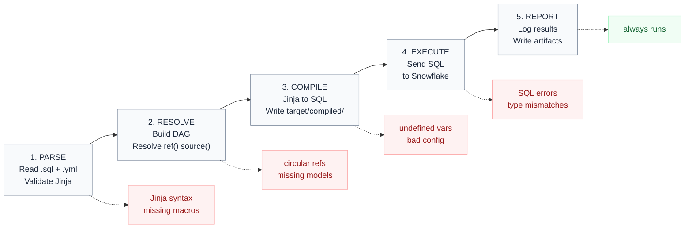

<div class="h-full flex flex-col justify-center pl-2">
  <div class="text-xs font-mono text-slate-400 tracking-widest uppercase mb-6">dbt Training</div>
  <div class="inline-flex items-center gap-2 bg-emerald-50 border border-emerald-200 text-emerald-700 text-xs font-mono px-3 py-1 rounded-full w-fit mb-6">
    🟢 Beginner · Module 02 · 60 min
  </div>
  <h1 class="text-5xl font-bold text-slate-900 leading-[1.1] mb-6">
    Project Setup,<br>Repo Structure<br>& Execution Sequence
  </h1>
  <p class="text-slate-400 text-sm max-w-sm">
    How dbt connects to Snowflake, what the project config controls, core CLI commands, and what actually happens when you run dbt.
  </p>
</div>

<!--
Start with the 4 prep questions from Module 01 — cold, no notes.
1. What does dbt_project.yml configure?
2. Difference between dbt Core and dbt Cloud?
3. Three things dbt does NOT do?
4. Which layer does dbt own in this project?

Don't move on until all four are correct. Fix any wrong answers now — they'll compound if left.
-->

---

# `profiles.yml` — How dbt Connects to Snowflake

<div class="grid grid-cols-2 gap-8 mt-4">
<div>

```yaml
analytics:
  target: dev
  outputs:
    dev:
      type: snowflake
      account: abc123.eu-west-1
      user: jane@company.com
      authenticator: externalbrowser
      role: analytics_service_role
      warehouse: COMPUTE_WH_DEV
      database: SILVER_DEV
      schema: TESTING__dev_jane
      threads: 4

    prod:
      type: snowflake
      role: analytics_service_role
      warehouse: COMPUTE_WH_PROD
      database: SILVER
      schema: PUBLIC
      threads: 8
```

</div>
<div class="flex flex-col gap-3 mt-2">

<div class="bg-amber-50 border border-amber-200 rounded-lg p-3 text-sm text-amber-800">
  <div class="font-mono text-xs text-slate-400 mb-1">Working local</div>
  <strong>DO NOT store credentials and push it got Git.</strong><br> Store your token in .secrets and .gitignore it.
</div>

<div class="bg-white border border-slate-200 rounded-lg p-3 text-sm">
  <div class="font-mono text-xs text-slate-400 mb-1">Dev/ Prod schema rule</div>
  1. <strong>Dev</strong> is for development and testing.<br>
  2. You <strong>don't write to prod</strong> from your laptop — that's the orchestrator's job-<br>
  3. Create a <strong>pull request</strong>, get confirmation, merge your branch to main. The orchestrator write to prod.
</div>

<div class="bg-emerald-50 border border-emerald-200 rounded-lg p-3 text-sm text-emerald-800">
  <code class="font-mono">dbt debug</code> — run <strong>local</strong> this after setup. Validates connection. Not required in Snowflake.
</div>

</div>
</div>

<!--
Walk through each key in the YAML live — don't just show the slide.

Key questions to ask mid-explanation:
- "What schema does your dev target write to?" → TESTING.dev_{yourname}
- "Why is profiles.yml not in the repo?" → credentials, personal config per developer

The externalbrowser authenticator means SSO login — Snowflake will open a browser tab. Show this live if possible so participants know what to expect.

Emphasise: the orchestrator uses the prod target. You as a developer always use dev.
-->

---

# `dbt_project.yml` — The Project Config

**YAML — human-readable config. Indentation is everything: two spaces = one level.**

```yaml {all|1-3|4-5|7-10|all}
name: analytics
version: "1.0.0"
profile: analytics          # must match the key in profiles.yml

model-paths: ["models"]    # one or multiple folders to look for models
source-paths: ["sources"]   # one or multiple folders to look for sources

models:
  analytics:                # ← project namespace — must match name above
    +persist_docs:          # writes comments and relationships to Snowflake
      relation: true
      columns: true
    staging:                # folder structure
      +materialized: view
      +tags: ["staging", "analytics"]    # used for selective exectution, 
                                         # MANDATORY: layer and project-name or source or schema
    silver:
      +materialized: table
      +tags: ["silver", "analytics"]
```

<div class="mt-3 bg-amber-50 border border-amber-200 rounded-lg p-3 text-sm text-amber-800">
  <strong>Why <code>analytics:</code>?</strong> It's a project namespace — scopes these configs to <em>your</em> models only, not to models from installed packages. Must match <code>name: analytics</code> at the top. Always include it.
</div>

<!--
Use the line highlights: click through profile link, then model-paths, then the analytics: namespace key.

Four things to emphasise:
1. The profile key must match profiles.yml exactly — a mismatch is the #1 setup error.
2. The + prefix means "apply to all models in this folder and subfolders."
3. persist_docs: true is why Power BI and Snowsight show our column descriptions — dbt runs COMMENT ON COLUMN after every build.
4. The analytics: namespace: it scopes these configs to your project only. If you install a package (dbt_utils etc.), package models live under their own namespace and won't inherit your configs. Without the namespace, your configs would bleed into package models.

Ask: "Can you skip the analytics: namespace?" → Technically yes, but if you ever add a package, your layer configs could apply to package models unexpectedly. Always include it.

Individual models can override any of this with a {{ config() }} block — covered in Module 03.
-->

---

# `+database` and `+schema` — Where Models Land

`+materialized` controls *how* dbt builds a model. `+database` and `+schema` control *where* it lands in Snowflake.

```yaml
models:
  analytics:
    silver:
      +materialized: table
      +database: SILVER    # Silver models always write to this database
      +schema: PUBLIC
    gold:
      +materialized: table
      +database: GOLD      # Gold models write to a separate database
      +schema: PUBLIC
```

<div class="mt-4 grid grid-cols-2 gap-4">
<div class="bg-white border border-slate-200 rounded-xl p-4 text-sm">
  <div class="font-mono text-xs text-slate-400 mb-2">Without <code>+database</code></div>
  Every layer lands in whatever database <code>profiles.yml</code> specifies. No separation.
</div>
<div class="bg-white border border-slate-200 rounded-xl p-4 text-sm">
  <div class="font-mono text-xs text-slate-400 mb-2">With <code>+database</code></div>
  Each layer is routed to its own Snowflake database. The separation you see in Snowflake is enforced here.
</div>
</div>

<div class="mt-4 bg-amber-50 border border-amber-200 rounded-lg p-3 text-sm text-amber-800">
  <strong>Irritating default behaviour:</strong><code>+schema/ +database</code> will take the default namespace and concat +schema. e.g. <code>database = dbt_training, schema = dbt_tweber, +schema = hubspot</code> creates <code>dbt.training.dbt_tweber_hubspot</code>.
</div>

<!--
The key insight: the SILVER / GOLD database split participants see in Snowflake is not magic. It's this config. Without +database, everything would pile into whichever database the profile points at.

The dev/prod problem is real and worth flagging now even though the fix (generate_database_name macro) comes later. Plant the question: "How does dbt know to write to SILVER_DEV instead of SILVER on a dev run?" — the answer is the macro, not profiles.yml alone.

Don't go deep on the macro. Just establish the problem exists and that there's a solution.
-->

---

# Core CLI Commands

<div class="mt-4">

| Command | What it does | When to use |
|---|---|---|
| `dbt compile` | Renders Jinja → raw SQL, no execution | Inspecting compiled output |
| `dbt run` | Executes models, no tests | **In production - seperate tests** |
| `dbt test` | Runs tests only | Debugging one specific test |
| `dbt snapshot` | Creates snapshots| Update SCD2 models |
| **`dbt build`** | **All of the above** | Default in **development** |
| `dbt docs generate` | Builds doc site artifact | Regularly after new models |

</div>

<div class="mt-4 bg-red-50 border border-red-200 rounded-lg p-3 text-sm text-red-800">
  <strong>Remember:</strong> <code>dbt run</code> does NOT include snapshots. In production set up a separate task for<code>dbt snapshots</code> after bronze.
</div>

<!--
Don't demo every command. Just walk the table.

The dbt build vs dbt run distinction is critical — it comes up again in Module 06 (Testing) with full explanation. Plant the seed here: "we'll come back to why dbt build is the only acceptable CI command in Module 06."

Selective runs: mention dbt run --select dim_patient+ briefly. The + means "and all downstream models." Selectors get a full module in Intermediate tier — don't go deep here.
-->

---


# The Execution Sequence

**What happens when you run `dbt run` or `dbt build`:**

<div class="mt-4 flex gap-6">

<div class="flex-1 space-y-3">

<div v-click="1" class="flex items-start gap-4 bg-white border border-slate-200 rounded-xl p-4">
  <div class="bg-purple-900 text-white text-xs font-mono px-2 py-1 rounded shrink-0">1. PARSE</div>
  <div class="text-sm">Read all <code>.sql</code> and <code>.yml</code> files, validate Jinja syntax<br><span class="text-red-500 text-xs">Fails here: Jinja syntax errors, missing macro definitions</span></div>
</div>

<div v-click="1" class="flex items-start gap-4 bg-white border border-slate-200 rounded-xl p-4">
  <div class="bg-purple-900 text-white text-xs font-mono px-2 py-1 rounded shrink-0">2. RESOLVE</div>
  <div class="text-sm">Build the DAG — resolve all <code v-pre>{{ ref() }}</code> and <code v-pre>{{ source() }}</code> calls<br><span class="text-red-500 text-xs">Fails here: circular refs, missing models</span></div>
</div>

<div v-click="1" class="flex items-start gap-4 bg-white border border-slate-200 rounded-xl p-4">
  <div class="bg-purple-900 text-white text-xs font-mono px-2 py-1 rounded shrink-0">3. COMPILE</div>
  <div class="text-sm">Render Jinja → raw SQL, write to <code>target/compiled/</code><br><span class="text-red-500 text-xs">Fails here: undefined variables, bad config blocks</span></div>
</div>

<div v-click="2" class="flex items-start gap-4 bg-white border border-slate-200 rounded-xl p-4">
  <div class="bg-orange-700 text-white text-xs font-mono px-2 py-1 rounded shrink-0">4. EXECUTE</div>
  <div class="text-sm">Send compiled SQL to Snowflake<br><span class="text-red-500 text-xs">Fails here: SQL errors, permission errors, type mismatches</span></div>
</div>

<div v-click="3" class="flex items-start gap-4 bg-white border border-slate-200 rounded-xl p-4">
  <div class="bg-green-900 text-white text-xs font-mono px-2 py-1 rounded shrink-0">5. REPORT</div>
  <div class="text-sm">Log results, write <code>manifest.json</code> and <code>run_results.json</code><br><span class="text-slate-400 text-xs">Always runs — even failed runs produce a report</span></div>
</div>

</div>

<div v-click="4" class="w-1/4 shrink-0">
  <div class="bg-white border border-slate-200 rounded-xl p-4 shadow-sm h-fit mt-0.5">
    <div class="text-xs font-mono text-slate-400 uppercase tracking-widest mb-3">Legend</div>
    <div class="space-y-3">
      <div class="flex items-start gap-2">
        <div class="w-3 h-3 rounded-full bg-purple-900 shrink-0 mt-0.5"></div>
        <div class="text-xs text-slate-600">dbt only — no connection to the data warehouse</div>
      </div>
      <div class="flex items-start gap-2">
        <div class="w-3 h-3 rounded-full bg-orange-700 shrink-0 mt-0.5"></div>
        <div class="text-xs text-slate-600">First time connection to the data warehouse</div>
      </div>
      <div class="flex items-start gap-2">
        <div class="w-3 h-3 rounded-full bg-green-900 shrink-0 mt-0.5"></div>
        <div class="text-xs text-slate-600">No effect on models — always runs regardless of outcome</div>
      </div>
    </div>
  </div>
</div>

</div>

<!--
The key message: when you get an error message, the phase tells you WHERE to look.

"Compilation Error" → your Jinja template is wrong. Check the .sql file, not Snowflake.
"Database Error" → Snowflake rejected the SQL. Open target/compiled/ and read what dbt actually sent.
"Dependency Error" → a ref() points to a model that doesn't exist. Check spelling and file path.

Ask: "At which phase does a Jinja syntax error appear?" → Phase 1 (Parse). This is a prep question for Module 03.

Make sure everyone knows target/compiled/ exists and that it's their best debugging tool. Show it in VS Code briefly.
-->

---

# Execution Sequence — Visualised

**This gets very important when developing and debuging. When can a mistake happen and be caught.**



<!--
The diagram maps each error type to its phase. When debugging: read the error header first — "Compilation Error", "Database Error", "Dependency Error". That tells you which phase failed, which tells you where to look.

Dotted lines point downward from each phase to the error type that can occur there. REPORT has a green node — it always runs, even on failure.

Have participants use this diagram as a reference during the exercise in Module 03 when they first encounter Jinja errors.
-->

---

# Other Project Files You'll See

<div class="mt-4 space-y-3">

<div class="bg-white border border-slate-200 rounded-xl p-4">
  <div class="font-mono text-slate-700 font-semibold mb-1">packages.yml</div>
  <div class="text-sm text-slate-600">Declares external dbt packages (e.g. <code>dbt_utils</code>). Run <code>dbt deps</code> to install them. Use <code>dbt_utils</code> for surrogate key generation and date spines; <code>dbt_expectations</code> for extended test coverage.</div>
</div>

<div class="bg-white border border-slate-200 rounded-xl p-4">
  <div class="font-mono text-slate-700 font-semibold mb-1">seeds/</div>
  <div class="text-sm text-slate-600">CSV files for small, static lookup tables that don't live in a source system — e.g. excluded test accounts, country-code mappings. Load with <code>dbt seed</code>.</div>
</div>

<div class="bg-white border border-slate-200 rounded-xl p-4">
  <div class="font-mono text-slate-700 font-semibold mb-1">analyses/</div>
  <div class="text-sm text-slate-600">SQL files that use <code>ref()</code> and <code>source()</code> for lineage, but are never materialised. Useful for audit queries during a migration — compare old and new logic without polluting production models.</div>
</div>

</div>

<!--
These don't need deep coverage — just recognition. When trainees open the project and see packages.yml or a seeds/ folder, they should have a mental model rather than being confused.

dbt_utils is installed in the project. If anyone asks, the most important thing it provides is generate_surrogate_key() — a macro that hashes multiple columns into a surrogate key. They'll use it in Module 09 (Macros) and later when building Silver dimensions.

seeds/ and analyses/ are rarely used in this project today but are part of the standard project structure. Don't spend more than 2 minutes on this slide.
-->

---
layout: center
---

<div class="text-center">
  <div class="text-xs font-mono text-slate-400 tracking-widest uppercase mb-4">Module 02 Complete</div>
  <h2 class="text-3xl font-bold text-slate-800 mb-2">Next: Module 03</h2>
  <p class="text-slate-500 mb-8">Jinja Basics for dbt</p>
  <div class="space-y-2">
    <div class="flex items-center gap-2 bg-slate-100 rounded-lg px-4 py-2 text-sm font-mono text-slate-600 w-full">
      Prep Q1: What to be careful of when editing <code>profiles.yml</code>?
    </div>
    <div class="flex items-center gap-2 bg-slate-100 rounded-lg px-4 py-2 text-sm font-mono text-slate-600 w-full">
      Prep Q2: What does dbt build do that dbt run does not?
    </div>
    <div class="flex items-center gap-2 bg-slate-100 rounded-lg px-4 py-2 text-sm font-mono text-slate-600 w-full">
      Prep Q3: At which phase does a Jinja syntax error appear?
    </div>
    <div class="flex items-center gap-2 bg-slate-100 rounded-lg px-4 py-2 text-sm font-mono text-slate-600 w-full">
      Prep Q4: Read book pages 223-241!
    </div>
  </div>
</div>
