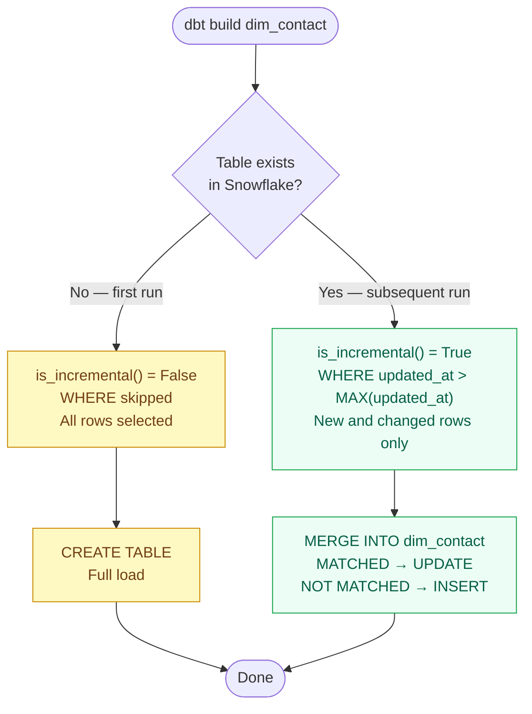

<div class="h-full flex flex-col justify-center pl-2">
  <div class="text-xs font-mono text-slate-400 tracking-widest uppercase mb-6">dbt Training</div>
  <div class="inline-flex items-center gap-2 bg-emerald-50 border border-emerald-200 text-emerald-700 text-xs font-mono px-3 py-1 rounded-full w-fit mb-6">
    🟢 Beginner · Module 04 · 90 min
  </div>
  <h1 class="text-6xl font-bold text-slate-900 leading-[1.05] mb-6">
    Materializations
  </h1>
  <p class="text-slate-400 text-sm max-w-sm">
    The most consequential decision in any dbt project. Drives cost, performance, freshness, and pipeline reliability.
  </p>
</div>

<!--
Recap prep questions from Module 03 — cold, no notes:
1. What does {{ ref('dim_patient') }} compile to in your dev environment?
2. What is the difference between {{ }} and ?
3. When would you use {{ config() }} instead of setting materialisation in dbt_project.yml?
4. What does {{ this }} refer to?

Probe {{ this }} specifically — it connects directly to today's is_incremental() content.
-->

---

# The Four Materializations

<div class="mt-4">

| Materialization | What dbt creates | Full rebuild? | Use case |
|---|---|---|---|
| `view` | `CREATE OR REPLACE VIEW` | ✅ view definition only | Staging, lightweight transforms |
| `table` | `DROP + CREATE TABLE AS SELECT` | ❗ always rebuild | Small Silver models SCD1, Gold marts, reference tables |
| `incremental` | `MERGE INTO` or `INSERT` | ❌ new/changed rows only | Large Silver facts, append-heavy |
| `ephemeral` | Nothing (becomes a CTE) | N/A | Intermediate steps, no table needed |

</div>

<div class="mt-6 bg-amber-50 border border-amber-200 rounded-lg p-4 text-sm text-amber-800">
  For SCD2 type models dbt provides <STRONG>snapshots</STRONG>. We will cover this later.
</div>

<!--
Don't go deep on each one yet — this slide is the overview. Depth comes on the next three slides.

The cost framing is important. "Which materialization should I use?" is not an academic question — it has direct operational cost implications.

Ask: "Name the four materializations" — they should be able to list them after this slide.
-->

---

# `view` and `table` — The Simple Two

<div class="grid grid-cols-2 gap-8 mt-4">
<div>

**view**

```sql
-- dbt compiles to:
CREATE OR REPLACE VIEW
  SILVER_DEV.TESTING__dev_jane.stg_hubspot__contacts
AS
SELECT contact_id, email, created_at
FROM BRONZE.HUBSPOT.contacts
```

<div class="mt-3 space-y-2 text-sm">
  <div class="flex gap-2"><span class="text-emerald-600">✓</span> Always reflects latest source data</div>
  <div class="flex gap-2"><span class="text-emerald-600">✓</span> Zero storage cost</div>
  <div class="flex gap-2"><span class="text-red-500">✗</span> Recomputes on every query — slow for complex transforms</div>
</div>

<div class="mt-3 bg-emerald-50 border border-emerald-200 rounded-lg p-3 text-xs text-emerald-700">
  <strong>By convention:</strong> All staging models. Views are cheap wrappers — rename, cast, nothing more.
</div>

</div>
<div>

**table**

```sql
-- dbt compiles to:
DROP TABLE IF EXISTS SILVER.PUBLIC.dim_pipeline;
CREATE TABLE SILVER.PUBLIC.dim_pipeline AS
SELECT ...
```

<div class="mt-3 space-y-2 text-sm">
  <div class="flex gap-2"><span class="text-emerald-600">✓</span> Fast to query — no recomputation</div>
  <div class="flex gap-2"><span class="text-red-500">✗</span> Full rebuild on every run — expensive for large tables</div>
</div>

<div class="mt-3 bg-emerald-50 border border-emerald-200 rounded-lg p-3 text-xs text-emerald-700">
  <strong>By convention:</strong> Gold marts (small aggregates) and Silver dimensions (medium size, nightly rebuild acceptable).
</div>

</div>
</div>

<!--
Show the DDL live in VS Code using dbt compile — let them see what dbt actually generates.

Key question: "Why would you never use materialized='table' for Bronze?" → Bronze is append-only, owned by Lambda — dbt doesn't touch it. And even if it did, a full rebuild of a Bronze table containing years of HubSpot history would be catastrophically expensive.

The DROP TABLE in the table materialization is worth flagging explicitly: if the run fails mid-way, you have a dropped table and no replacement. That's another reason large facts should be incremental.
-->

---

# `incremental` — The Critical One

```sql {all|1-5|7-9|11-13|all}
{{ config(
    materialized     = 'incremental',
    unique_key       = 'contact_key',
    on_schema_change = 'sync_all_columns'   -- our standard
) }}

SELECT contact_key, hubspot_contact_id, email, updated_at
FROM {{ ref('stg_hubspot__contacts') }}


    WHERE updated_at > (SELECT MAX(updated_at) FROM {{ this }})

```

<div class="grid grid-cols-2 gap-4 mt-4">
<div class="bg-white border border-slate-200 rounded-lg p-3 text-sm">
  <div class="font-semibold text-slate-700 mb-1">First run</div>
  <code>is_incremental()</code> = False → WHERE skipped → full load → table created
</div>
<div class="bg-white border border-slate-200 rounded-lg p-3 text-sm">
  <div class="font-semibold text-slate-700 mb-1">Subsequent runs</div>
  <code>is_incremental()</code> = True → WHERE applies → MERGE only new/changed rows
</div>
</div>

<!--
Use line highlights: click through config block, then SELECT, then the  block.

The unique_key is the match condition for the MERGE statement. Without it, dbt can only INSERT — it can't update existing rows. Show the compiled MERGE SQL in target/compiled/ so they see what Snowflake actually receives.

on_schema_change: explain 'ignore' (default, silent data bug) vs 'sync_all_columns' (our standard). 'ignore' means if you add a column to your SELECT, it silently disappears from the table. That's a production data quality issue that can go undetected for weeks.
-->

---

# Incremental: First Run vs Subsequent Runs



<!--
This diagram makes the is_incremental() state machine explicit. The most common trainee confusion: "when does is_incremental() return True?" — the diagram answers it visually.

Yellow path = first run (full load, CREATE TABLE). Green path = subsequent runs (MERGE only).

After showing the diagram, ask: "On the third run of this model, what SQL does Snowflake receive?" → A MERGE statement, because the table already exists. Make them trace the path through the diagram.
-->

---

# The Compiled MERGE Statement

**What Snowflake actually receives for an incremental model:**

```sql
MERGE INTO SILVER.PUBLIC.dim_contact AS DBT_INTERNAL_DEST
USING (
    SELECT contact_key, hubspot_contact_id, email, updated_at
    FROM SILVER_DEV.TESTING__dev_jane.stg_hubspot__contacts
    WHERE updated_at > (SELECT MAX(updated_at) FROM SILVER.PUBLIC.dim_contact)
) AS DBT_INTERNAL_SOURCE
ON DBT_INTERNAL_DEST.contact_key = DBT_INTERNAL_SOURCE.contact_key

WHEN MATCHED THEN UPDATE SET
    hubspot_contact_id = DBT_INTERNAL_SOURCE.hubspot_contact_id,
    email              = DBT_INTERNAL_SOURCE.email,
    updated_at         = DBT_INTERNAL_SOURCE.updated_at

WHEN NOT MATCHED THEN INSERT (contact_key, hubspot_contact_id, email, updated_at)
VALUES (DBT_INTERNAL_SOURCE.contact_key, ...)
```

<div class="mt-3 text-sm text-slate-500">Find this in <code>target/compiled/analytics/models/silver/dim_contact.sql</code></div>

<!--
This slide answers "what does dbt actually do?" at the SQL level. No magic.

The MERGE pattern is why unique_key is required — ON DBT_INTERNAL_DEST.contact_key = DBT_INTERNAL_SOURCE.contact_key. Without a unique_key, dbt generates INSERT INTO instead, which creates duplicates.

Walk them to target/compiled/ and show the real file for an existing incremental model in the repo.

Also mention: --full-refresh forces a table DROP + CREATE instead of MERGE. Use it after logic changes that affect historical rows, after source data corrections, or after schema migrations.
-->

---

# `on_schema_change` Options

<div class="mt-4">

| Value | Behaviour | Recommendation |
|---|---|---|
| `ignore` *(default)* | New columns in SELECT are silently dropped | ❌ Never — silent data bug |
| `fail` | Errors if SELECT has new columns | ⚠️ Useful in strict environments |
| **`sync_all_columns`** | **Adds new columns, removes deleted ones** | **✅ Our standard** |
| `append_new_columns` | Adds new columns only, never removes | ⚠️ Use case by case |

</div>

<div class="mt-6 bg-red-50 border border-red-200 rounded-xl p-4">
  <div class="font-semibold text-red-800 mb-2">Why `ignore` is dangerous</div>
  <div class="text-red-700 text-sm">You add a new column to your SELECT. dbt says nothing. The column never appears in the table. Downstream models and Power BI reports that depend on it fail — but only at query time, not at build time. The bug is invisible until someone notices wrong data.</div>
</div>

<!--
This is one of the most subtle production bugs in dbt. Make sure they understand why ignore is the default (backward compatibility) but not safe in practice.

After the CI tooling is set up, the dbt-sql-reviewer skill checks this — but for now, they need to remember to set it manually.
-->

---

# `ephemeral` — Brief but Important

```sql
{{ config(materialized='ephemeral') }}

SELECT
    contact_id,
    LOWER(email) AS email_clean
FROM {{ source('hubspot', 'contacts') }}
```

<div class="mt-4 grid grid-cols-2 gap-6">
<div class="bg-white border border-slate-200 rounded-xl p-4 text-sm">
  <div class="font-semibold text-slate-700 mb-2">What happens</div>
  No object is created in Snowflake. When another model references this via <code v-pre>{{ ref() }}</code>, dbt inlines it as a CTE.
</div>
<div class="bg-white border border-slate-200 rounded-xl p-4 text-sm">
  <div class="font-semibold text-slate-700 mb-2">When NOT to use</div>
  If multiple models reference the same ephemeral model, the computation is repeated in each one as a separate CTE. Use a view instead.
</div>
</div>

<div class="mt-4 bg-slate-50 border border-slate-200 rounded-lg p-3 text-sm text-slate-600">
  <strong>In practice:</strong> Ephemeral is rarely used. Prefer views for intermediate staging — they're queryable for debugging. An ephemeral model cannot be directly queried.
</div>

<!--
Keep this brief — 5 minutes. The key facts: no Snowflake object, becomes a CTE, not queryable directly.

The multiple-reference problem is subtle: if dim_patient and fct_prescription both ref() the same ephemeral staging model, that staging CTE is inlined twice — once in each compiled SQL. The computation runs twice in Snowflake. A view runs once and is cached.

We prefer views because they're debuggable. If something goes wrong in an ephemeral model, you can't query it to inspect the output.
-->

---

# Snowflake-specific: Dynamic Tables

<div class="mt-4 bg-white border border-slate-200 rounded-xl p-5">
  <div class="text-sm text-slate-700 mb-3">Snowflake's native alternative to incremental models — the database engine manages refresh automatically.</div>

```yaml
models:
  - name: fct_daily_revenue
    config:
      materialized: dynamic_table
```

  <div class="mt-3 text-sm text-slate-600">Write a plain <code>SELECT</code> — no <code></code> needed. Snowflake handles the incremental logic.</div>
</div>

<div class="mt-4 grid grid-cols-2 gap-3">
  <div class="bg-emerald-50 border border-emerald-200 rounded-lg p-3 text-sm">
    <div class="font-semibold text-emerald-700 mb-1">Advantage</div>
    <div class="text-emerald-800">Less code complexity. No <code>unique_key</code> or merge strategy to configure.</div>
  </div>
  <div class="bg-amber-50 border border-amber-200 rounded-lg p-3 text-sm">
    <div class="font-semibold text-amber-700 mb-1">Trade-off</div>
    <div class="text-amber-800">Less control over refresh timing and logic. No <code>--full-refresh</code> override.</div>
  </div>
</div>

<div class="mt-4 bg-slate-100 border border-slate-200 rounded-lg p-3 text-sm text-slate-600">
  <strong>Not used in this project today.</strong> Standard is <code>incremental</code> with <code>merge</code> strategy. Mention only if asked — it's a sign Snowflake is absorbing some of what dbt does manually.
</div>

<!--
This is awareness-only — 2 minutes max. Don't get pulled into a comparison discussion.

The key message: dynamic tables exist in Snowflake, they're dbt-supported, and they reduce the code you write for incremental models. They're not used in this project yet because the team prefers explicit control over merge logic. That may change.

If someone asks "should we switch?": it depends on how complex the incremental logic is. For simple timestamp-based incremental filters, dynamic tables would work. For complex SCD2 patterns, keep incremental.
-->

---
layout: default
background: '#f9f8f5'
---

# Where to Configure Materializations

<div class="flex items-center gap-2 text-xs mt-2 mb-4">
  <span class="bg-slate-100 text-slate-600 px-2 py-0.5 rounded font-mono">dbt_project.yml</span>
  <span class="text-slate-400">lowest priority</span>
  <span class="text-slate-300 mx-1">→</span>
  <span class="bg-slate-100 text-slate-600 px-2 py-0.5 rounded font-mono">schema.yml</span>
  <span class="text-slate-400">overrides project</span>
  <span class="text-slate-300 mx-1">→</span>
  <code class="bg-slate-100 text-slate-600 px-2 py-0.5 rounded font-mono" v-pre>{{ config() }}</code>
  <span class="text-slate-400">highest priority · last wins</span>
</div>

<div class="grid grid-cols-3 gap-4">

<div class="bg-white border border-slate-200 rounded-xl p-4">
  <div class="flex items-center justify-between mb-2">
    <code class="text-xs font-semibold text-slate-700">dbt_project.yml</code>
    <span class="text-xs bg-slate-100 text-slate-500 px-2 py-0.5 rounded-full font-mono">default</span>
  </div>
  <div class="text-xs text-slate-500 mb-3">Project-wide defaults. Applies to all models. Lives in project root.</div>

<div style="font-size: 11px">

```yaml
# dbt_project.yml
models:
  analytics:
    +materialized: view    # all models
    silver:
      +materialized: table
      facts:
        +materialized: incremental
```

</div>

</div>

<div class="bg-white border-2 border-emerald-300 rounded-xl p-4">
  <div class="flex items-center justify-between mb-2">
    <code class="text-xs font-semibold text-slate-700">schema.yml</code>
    <span class="text-xs bg-emerald-100 text-emerald-700 px-2 py-0.5 rounded-full font-mono">✅ recommended</span>
  </div>
  <div class="text-xs text-slate-500 mb-3">Per-model config alongside tests, column descriptions &amp; grants. In model folders.</div>

<div style="font-size: 11px">

```yaml
# models/silver/schema.yml
models:
  - name: dim_contact
    config:
      materialized: incremental
      unique_key: contact_key
      on_schema_change: sync_all_columns
    columns:
      - name: contact_key
        description: "Surrogate key — hash of hubspot_contact_id"
        tests: [not_null, unique]
```

</div>

</div>

<div class="bg-white border border-slate-200 rounded-xl p-4">
  <div class="flex items-center justify-between mb-2">
    <code class="text-xs font-semibold text-slate-700" v-pre>model.sql</code>
    <span class="text-xs bg-amber-100 text-amber-700 px-2 py-0.5 rounded-full font-mono">highest priority</span>
  </div>
  <div class="text-xs text-slate-500 mb-3">Inline at the top of the model. Overrides both levels above. For development only.</div>

<div style="font-size: 11px">

```sql
{{ config(
    materialized     = 'incremental',
    unique_key       = 'contact_key',
    on_schema_change = 'sync_all_columns'
) }}

SELECT contact_key, email, updated_at
FROM {{ ref('stg_hubspot__contacts') }}
```

</div>

</div>

</div>

<div class="mt-4 bg-emerald-50 border border-emerald-200 rounded-lg p-3 text-sm text-emerald-800">
  <strong>Why schema.yml?</strong> Tests, column descriptions, grants, and materialization config all live in one file. Splitting config between model SQL and YAML creates drift. Move <code v-pre>{{ config() }}</code> to <code>schema.yml</code> before merging — the SQL file should be pure logic.
</div>

<!--
Walk through the hierarchy with a concrete example: a model in analytics/silver/facts/ inherits materialized=incremental from dbt_project.yml. If schema.yml says table, that wins. If the model has {{ config(materialized='view') }}, that wins over both.

Key message:
- dbt_project.yml = broad strokes (folder defaults). Change it rarely.
- schema.yml = where day-to-day config lives. Tests, descriptions, grants, and materialization in one place. Reviewers look here first.
- {{ config() }} = for temporary overrides during development. Never commit it when schema.yml does the same job — splitting config across two files causes confusion in PRs.

Ask: "If dbt_project.yml sets silver to table and schema.yml sets dim_contact to incremental, what materialization does dim_contact use?" → incremental (schema.yml wins).

Checkpoint: "Where would you put on_schema_change for a new incremental model?" → schema.yml config block, not in the SQL.
-->

---

# Exercise: Find the Bugs

**Three models are misconfigured. Identify the problem, explain why, write the fix.**

<div class="space-y-4 mt-4">

<div class="bg-white border border-slate-200 rounded-xl p-4">
  <div class="text-xs font-mono text-red-500 mb-2">Model 1 — int_pipeline_stages.sql</div>

```sql
{{ config(materialized='table') }}
SELECT pipeline_stage_id, stage_name, is_closed
FROM {{ source('hubspot', 'pipeline_stages') }}
```

</div>

<div class="bg-white border border-slate-200 rounded-xl p-4">
  <div class="text-xs font-mono text-red-500 mb-2">Model 2 — fct_daily_ticket_volume.sql (50M rows/day)</div>

```sql
{{ config(materialized='table') }}
SELECT ticket_date, COUNT(*) AS ticket_count
FROM {{ ref('dim_ticket') }} GROUP BY 1
```

</div>

<div class="bg-white border border-slate-200 rounded-xl p-4">
  <div class="text-xs font-mono text-red-500 mb-2">Model 3 — dim_contact.sql (incremental)</div>

```sql
{{ config(materialized='incremental', unique_key='contact_key', on_schema_change='ignore') }}
SELECT contact_key, email, updated_at FROM {{ ref('stg_hubspot__contacts') }}
{{ if is_incremental() }} WHERE updated_at > (SELECT MAX(updated_at) FROM {{ this }}) {{ endif }}
```

</div>

</div>

<!--
Expected answers:
1. Staging must be view, not table. Fix: config(materialized='view')
2. 50M rows rebuilt nightly as table is expensive. Fix: incremental with unique_key='ticket_date' (or a surrogate key), on_schema_change='sync_all_columns'
3. Three bugs: (a) on_schema_change='ignore' should be 'sync_all_columns', (b) {{ if }} should be , (c) {{ endif }} should be 

Model 3 has both a business logic bug and a Jinja syntax bug — watch whether participants catch both.

Circulate. If someone finishes early, ask them to write the corrected full model including the WHERE clause with is_incremental().
-->

---
layout: center
---

<div class="text-center">
  <div class="text-xs font-mono text-slate-400 tracking-widest uppercase mb-4">Module 04 Complete</div>
  <h2 class="text-3xl font-bold text-slate-800 mb-2">Next: Module 05</h2>
  <p class="text-slate-500 mb-8">Sources and the Medallion Architecture</p>
  <div class="space-y-2 text-left max-w-md mx-auto">
    <div class="bg-slate-100 rounded-lg px-4 py-2 text-sm font-mono text-slate-600">Prep Q1: What SQL does a table materialization generate?</div>
    <div class="bg-slate-100 rounded-lg px-4 py-2 text-sm font-mono text-slate-600">Prep Q2: What does is_incremental() return on first run?</div>
    <div class="bg-slate-100 rounded-lg px-4 py-2 text-sm font-mono text-slate-600">Prep Q3: Mandatory on_schema_change setting for incremental models?</div>
    <div class="bg-slate-100 rounded-lg px-4 py-2 text-sm font-mono text-slate-600">Prep Q4: Why never use table for a staging model?</div>
  </div>
</div>
