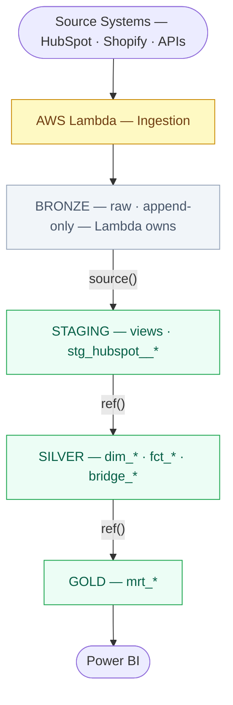

<div class="h-full flex flex-col justify-center pl-2">
  <div class="text-xs font-mono text-slate-400 tracking-widest uppercase mb-6">dbt Training</div>
  <div class="inline-flex items-center gap-2 bg-emerald-50 border border-emerald-200 text-emerald-700 text-xs font-mono px-3 py-1 rounded-full w-fit mb-6">
    🟢 Beginner · Module 05 · 90 min
  </div>
  <h1 class="text-5xl font-bold text-slate-900 leading-[1.1] mb-6">
    Sources and the<br>Medallion Architecture
  </h1>
  <p class="text-slate-400 text-sm max-w-sm">
    How dbt knows about Bronze tables, why layer boundaries matter, and how source freshness protects your pipelines.
  </p>
</div>

<!--
Recap prep questions from Module 04 — cold, no notes:
1. What SQL statement does a table materialization generate? → DROP + CREATE TABLE AS SELECT
2. What does is_incremental() return on the first run? → False
3. Mandatory on_schema_change setting? → sync_all_columns
4. Why never use table for a staging model? → No business logic, no storage needed, view is cheaper and sufficient

All four correct before continuing.
-->

---

# The Medallion Architecture

<div class="grid grid-cols-2 gap-6 mt-4">
<div>
<div style="transform: scale(0.55); transform-origin: top center; margin-bottom: -160px;">



</div>
</div>
<div class="flex flex-col gap-4 pt-2">

<div class="bg-amber-50 border border-amber-200 rounded-lg p-3 text-sm text-amber-800">
  dbt references Bronze as a <strong>source</strong>, not via <code>ref()</code>. Bronze tables are never built by dbt.
</div>

<div class="bg-white border border-slate-200 rounded-xl p-4 text-sm">
  <div class="font-mono text-slate-400 text-xs mb-2">When referencing Bronze in a staging model</div>
  <code class="text-emerald-600" v-pre>{{ source('hubspot', 'contacts') }}</code>
  <div class="text-slate-500 text-xs mt-1">Declares a dependency on the source → DAG tracks it</div>
</div>

<div class="bg-white border border-slate-200 rounded-xl p-4 text-sm">
  <div class="font-mono text-slate-400 text-xs mb-2">When referencing any other dbt model</div>
  <code class="text-emerald-600" v-pre>{{ ref('dim_patient') }}</code>
  <div class="text-slate-500 text-xs mt-1">Resolves to correct schema per target environment</div>
</div>

</div>
</div>

<!--
Draw this on the whiteboard — don't just show the slide. The physical act of drawing the layers helps people remember the ownership boundaries.

The critical point: dbt starts at Staging. It references Bronze as a source (declared in sources.yml). The line "dbt takes over here" is not just organizational — it determines which Jinja function you use (source() vs ref()).

This architecture is also why we have freshness checks: if Lambda stops running, Bronze goes stale. dbt can detect this via source freshness before wasting compute building Silver on outdated data.

Ask: "Who writes to the Bronze layer?" → Lambda / ingestion layer. Not dbt. Never dbt.

The source() vs ref() distinction is not just syntax — it's semantic. source() says "this data comes from outside dbt." ref() says "this data was built by dbt." The DAG reflects this distinction.

If someone hardcodes BRONZE.HUBSPOT.contacts instead of using source(), dbt has no idea that model depends on that Bronze table. The lineage graph is incomplete. Source freshness won't work for that model.
-->

---

# Declaring Sources in `sources.yml`

```yaml {all|1-7|9-16|18-20|all}
version: 2

sources:
  - name: hubspot                         # alias used in {{ source() }}
    database: BRONZE
    schema: HUBSPOT
    description: "HubSpot CRM data ingested via AWS Lambda."

    tables:
      - name: contacts
        description: "One row per HubSpot contact. Append-only."
        loaded_at_field: _ingested_at     # column dbt uses for freshness

      - name: deals
        description: "HubSpot deal records including pipeline stage history."
        loaded_at_field: _ingested_at

      - name: pipeline_stages
        description: "Static lookup: pipeline stage definitions."
        # no loaded_at_field — static table, skip freshness
```

<!--
Use line highlights: first show the source-level config (name, database, schema), then the table declarations, then the pipeline_stages table without a loaded_at_field.

Without this file, {{ source('hubspot', 'contacts') }} fails at the Parse phase — dbt can't resolve the source.

The loaded_at_field is the column dbt queries to check freshness: SELECT MAX(_ingested_at) FROM BRONZE.HUBSPOT.contacts. If the MAX is older than your error threshold, the freshness check fails.

Static tables like pipeline_stages don't need freshness — they change infrequently and deliberately. Opting out with freshness: null prevents false alerts.
-->

---

# Hardcoding vs. `{{ source() }}`

<div class="grid grid-cols-2 gap-6 mt-4">
<div>

**❌ Hardcoded — never do this**

```sql
SELECT *
FROM BRONZE.HUBSPOT.contacts
```

<div class="mt-3 space-y-2 text-sm">
  <div class="flex gap-2 text-red-600"><span>-</span> Does not appear in the DAG</div>
  <div class="flex gap-2 text-red-600"><span>-</span> Freshness check doesn't work</div>
  <div class="flex gap-2 text-red-600"><span>-</span> Always points to prod — ignores your dev target</div>
  <div class="flex gap-2 text-red-600"><span>-</span> Schema change requires updating every model</div>
</div>

</div>
<div>

**✅ With `source()` — always do this**

```sql
SELECT *
FROM {{ source('hubspot', 'contacts') }}
```

<div class="mt-3 space-y-2 text-sm">
  <div class="flex gap-2 text-emerald-600"><span>-</span> Appears in DAG with lineage</div>
  <div class="flex gap-2 text-emerald-600"><span>-</span> Freshness check works</div>
  <div class="flex gap-2 text-emerald-600"><span>-</span> Resolves to correct schema per target</div>
  <div class="flex gap-2 text-emerald-600"><span>-</span> Schema change: update sources.yml once</div>
</div>

</div>
</div>

<div class="mt-4 bg-amber-50 border border-amber-200 rounded-lg p-3 text-sm text-amber-800">
  Both produce the same compiled SQL in practice — but they're not equivalent. You lose DAG visibility, freshness, and environment-awareness with hardcoding.
</div>

<!--
The "both produce the same SQL" point is important to acknowledge — participants may notice the compiled output looks identical. The difference is metadata and tooling, not the SQL that runs.

Checkpoint: "Name two things you lose by hardcoding instead of using source()." → Any two of: DAG lineage, freshness checks, environment-awareness, single-point schema update.
-->

---

# Source Freshness

```yaml
sources:
  - name: hubspot
    freshness:
      warn_after:  {count: 6,  period: hour}
      error_after: {count: 24, period: hour}

    tables:
      - name: contacts
        loaded_at_field: _ingested_at

      - name: pipeline_stages
        freshness: null          # static table — opt out
```

```bash
dbt source freshness
```

```
Found 1 source, 2 tables.
contacts: 3 hours 42 minutes ago — PASS
deals:    26 hours 15 minutes ago — ERROR
```

<div class="mt-3 bg-slate-50 border border-slate-200 rounded-lg p-3 text-sm text-slate-600">
  <strong>In your orchestrator:</strong> Freshness check runs before any dbt models. If a source errors, the pipeline stops — preventing Silver and Gold from being built on stale Bronze data.
</div>

<!--
Run dbt source freshness live. Show the output. The timestamp comparison is simple: dbt queries MAX(_ingested_at) and compares it to now(). If the age exceeds the threshold, it warns or errors.

The orchestrator integration is important context: freshness checks are not just informational. They gate the pipeline. If HubSpot stops sending data and freshness is set correctly, the pipeline stops before building bad downstream models.

Ask: "What does dbt do if a source is stale and freshness is set to error?" → The dbt source freshness command exits with a non-zero code, which the orchestrator treats as a failure, and downstream tasks don't run.
-->

---

# Exercise: Add a New Source (25 min)

**Scenario:** Adding the HubSpot `owners` table — `BRONZE.HUBSPOT.owners`. Updated every 12 hours. Has a `_ingested_at` column.

<div class="space-y-4 mt-4">

<div class="bg-white border border-slate-200 rounded-xl p-4">
  <div class="text-xs font-mono text-slate-400 mb-2">Step 1 — Add to sources.yml</div>
  <div class="text-sm text-slate-600">Add the <code>owners</code> table with freshness thresholds: warn at 14h, error at 25h.</div>
</div>

<div class="bg-white border border-slate-200 rounded-xl p-4">
  <div class="text-xs font-mono text-slate-400 mb-2">Step 2 — Write the staging model</div>
  <div class="text-sm text-slate-600">Create <code>stg_hubspot__owners.sql</code>: reference source correctly, select <code>owner_id</code>, <code>first_name</code>, <code>last_name</code>, <code>email</code>, rename <code>_ingested_at</code> → <code>ingested_at</code>, materialise as view.</div>
</div>

<div class="bg-emerald-50 border border-emerald-200 rounded-xl p-4">
  <div class="text-xs font-mono text-emerald-600 mb-2">Step 3 — Verify</div>
  <div class="text-sm text-emerald-700">Run <code>dbt compile --select stg_hubspot__owners</code>. Verify the compiled output references <code>BRONZE.HUBSPOT.owners</code>.</div>
</div>

<div class="bg-white border border-emerald-200 rounded-xl p-4">
  <div class="text-xs font-mono text-slate-400 mb-2">Step 4 — Read the docs</div>
  <div class="text-sm text-slate-600">Google dbt docs about source configuration: <code>dbt docs add sources to your dag</code>. Browse, note diverse options.</div>
</div>

</div>

<!--
Circulate. Most common mistakes:
- Missing sources.yml declaration (dbt will error: source not found)
- Hardcoded table name instead of source()
- Wrong Jinja delimiter on if blocks (less likely here since no if blocks, but watch for {{ source }} instead of {{ source() }})
- Forgetting {{ config(materialized='view') }} — will inherit from dbt_project.yml but good practice to be explicit in staging models

dbt compile is the verification step — they can self-check. If compile succeeds, the source reference is correct.
-->

---

# What You Can Now Do — Module 05

<div class="grid grid-cols-2 gap-4 mt-6">

  <div class="flex items-start gap-3 bg-white border border-slate-200 rounded-xl p-4">
    <span class="text-emerald-500 text-xl mt-0.5">✓</span>
    <div>
      <div class="font-semibold text-slate-800 text-sm">Medallion Architecture</div>
      <div class="text-slate-500 text-xs mt-1">Explain Bronze → Staging → Silver → Gold and why dbt never writes to Bronze</div>
    </div>
  </div>

  <div class="flex items-start gap-3 bg-white border border-slate-200 rounded-xl p-4">
    <span class="text-emerald-500 text-xl mt-0.5">✓</span>
    <div>
      <div class="font-semibold text-slate-800 text-sm">Declare Sources</div>
      <div class="text-slate-500 text-xs mt-1">Write a <code>sources.yml</code> with source name, database, schema, and table entries</div>
    </div>
  </div>

  <div class="flex items-start gap-3 bg-white border border-slate-200 rounded-xl p-4">
    <span class="text-emerald-500 text-xl mt-0.5">✓</span>
    <div>
      <div class="font-semibold text-slate-800 text-sm">Use <code>source()</code> Correctly</div>
      <div class="text-slate-500 text-xs mt-1">Reference Bronze via <code v-pre>{{ source() }}</code> — never hardcode — and explain what you lose without it</div>
    </div>
  </div>

  <div class="flex items-start gap-3 bg-white border border-slate-200 rounded-xl p-4">
    <span class="text-emerald-500 text-xl mt-0.5">✓</span>
    <div>
      <div class="font-semibold text-slate-800 text-sm">Source Freshness</div>
      <div class="text-slate-500 text-xs mt-1">Configure <code>warn_after</code> / <code>error_after</code> thresholds and interpret <code>dbt source freshness</code> output</div>
    </div>
  </div>

</div>

<div class="mt-5 bg-emerald-50 border border-emerald-200 rounded-lg p-3 text-sm text-emerald-800">
  <strong>Tier 1 checkpoint:</strong> You can read from any Bronze source, declare it correctly, and protect the pipeline from stale data — before a single Silver model runs.
</div>

<!--
Use this slide as a verbal recap — ask participants to call out what each card means before you click to it.

If anyone is uncertain on source() vs ref(), spend another 2 minutes here — it's the most common mistake in code review for new dbt writers.
-->

---
layout: default
background: '#f9f8f5'
---

<div class="h-full flex flex-col items-center justify-center text-center">
  <div class="text-xs font-mono text-slate-400 tracking-widest uppercase mb-4">Module 05 Complete</div>
  <h2 class="text-3xl font-bold text-slate-800 mb-2">Next: Module 06</h2>
  <p class="text-slate-500 mb-8">Testing Data Quality</p>
  <div class="space-y-2 text-left max-w-md mx-auto">
    <div class="bg-slate-100 rounded-lg px-4 py-2 text-sm font-mono text-slate-600" v-pre>Prep Q1: What must exist before using {{ source('hubspot', 'contacts') }}?</div>
    <div class="bg-slate-100 rounded-lg px-4 py-2 text-sm font-mono text-slate-600">Prep Q2: Two things lost by hardcoding vs source()?</div>
    <div class="bg-slate-100 rounded-lg px-4 py-2 text-sm font-mono text-slate-600">Prep Q3: What column does dbt query for freshness?</div>
    <div class="bg-slate-100 rounded-lg px-4 py-2 text-sm font-mono text-slate-600">Prep Q4: Why does dbt NOT own the Bronze layer?</div>
  </div>
</div>

<!--
ANSWERS — ask cold before revealing:

Q1: A sources.yml declaration with the source name, database, schema, and the specific table entry.
    Without it dbt errors at Parse phase: "source 'hubspot' not found."

Q2: Any two of:
    - DAG lineage — hardcoded table is invisible to dbt; the dependency is not tracked
    - Source freshness — dbt source freshness only works for declared sources
    - Environment-awareness — hardcoded name always points to the same database regardless of target
    - Single update point — schema/database changes require editing every model, not just sources.yml

Q3: The column declared as loaded_at_field in sources.yml — in our case _ingested_at.
    dbt runs: SELECT MAX(_ingested_at) FROM BRONZE.HUBSPOT.contacts and compares to NOW().

Q4: Bronze is written by Lambda (append-only ingestion). dbt only transforms data already in the warehouse.
    dbt starts at Staging — it reads from Bronze via source(), but never writes to it.
    If dbt owned Bronze it would conflict with Lambda's writes and break the ingestion contract.
-->
