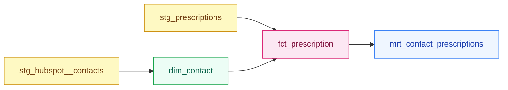

<div class="h-full flex flex-col justify-center pl-2">
  <div class="text-xs font-mono text-slate-400 tracking-widest uppercase mb-6">dbt Training</div>
  <div class="inline-flex items-center gap-2 bg-amber-50 border border-amber-200 text-amber-700 text-xs font-mono px-3 py-1 rounded-full w-fit mb-6">
    🟡 Working Effectively · Module 11 · 45 min
  </div>
  <h1 class="text-6xl font-bold text-slate-900 leading-[1.05] mb-6">
    Selectors, Tags, and Running Subsets
  </h1>
  <p class="text-slate-400 text-sm max-w-sm">
    Stop rebuilding everything. Run exactly what you need.
  </p>
</div>

<!--
Recap prep questions from Module 10 — cold, no notes:
1. What does dbt_valid_to = NULL mean in a snapshot table? (It's the current, active record — not yet superseded.)
2. When would you choose the check strategy over the timestamp strategy? (When updated_at is unreliable or not bumped for every relevant field change — check always detects value changes regardless of timestamp.)
3. Why does dbt snapshot --full-refresh break downstream foreign keys? (dbt_scd_id includes the insert timestamp; a full refresh changes valid_from, which changes dbt_scd_id, so every FK in fact tables silently points to nothing.)
4. In the scd2_merge pattern, where is the surrogate key hash computed and why? (In the source CTE, from data values — not from timestamps — so the key is identical on every run including full refresh.)

Probe question 3 in particular — the full-refresh FK breakage is the core reason the project uses a custom SCD2 pattern. If they understand the problem, the solution in today's module makes sense immediately.
-->

---

# The Problem: `dbt run` Takes 8 Minutes

<div class="mt-4">

| Model | Layer | Run time | Changed today? |
|---|---|---|---|
| `stg_hubspot__contacts` | Staging | 4 sec | ❌ No |
| `stg_hubspot__pipeline_stages` | Staging | 3 sec | ❌ No |
| `stg_hubspot__deals` | Staging | 4 sec | ❌ No |
| `stg_products` | Staging | 2 sec | ❌ No |
| `stg_prescriptions` | Staging | 3 sec | ❌ No |
| `dim_contact` | Silver | 45 sec | ❌ No |
| `dim_pipeline_stage` | Silver | 12 sec | ❌ No |
| `dim_product` | Silver | 8 sec | ❌ No |
| `fct_deal` | Silver | 3 min | ✅ **Yes** |
| `fct_prescription` | Silver | 2 min | ❌ No |
| `mrt_deals_funnel` | Gold | 90 sec | ❌ No |
| `mrt_contact_prescriptions` | Gold | 45 sec | ❌ No |
| `snap_contacts` | Snapshot | 20 sec | ❌ No |

</div>

<div class="mt-4 bg-red-50 border border-red-200 rounded-lg p-3 text-sm text-red-800">
  <strong>Only 1 model changed.</strong> You rebuilt 12 others you didn't need to. That's the problem selection syntax solves.
</div>

<!--
Make the cost framing real before touching the syntax. The table shows the entire project — participants can see immediately that 12 of 13 models were wasted work.

Ask: "If fct_deal changed, which models depend on it?" → mrt_deals_funnel. That's the only model that needs rebuilding alongside fct_deal. Everything else is noise.

The 8-minute example is scaled down from real production numbers. On a large project with 200+ models, "dbt run" without selection can take 40-60 minutes.
-->

---

# The Selection Syntax

<div class="mt-4 grid grid-cols-2 gap-6">
<div>

**`--select`** — choose what to run

```bash
# By model name
dbt run --select fct_deal

# By directory / layer
dbt run --select silver.*
dbt run --select staging.*

# By tag
dbt run --select tag:daily

# By source
dbt run --select source:hubspot

# Graph operators
dbt run --select +fct_prescription
dbt run --select mrt_deals_funnel+
dbt run --select +fct_prescription+
```

</div>
<div>

**`--exclude`** — subtract from the selection

```bash
# All Silver, except fct_prescription
dbt run \
  --select silver.* \
  --exclude fct_prescription

# Daily tag, skip Gold
dbt build \
  --select tag:daily \
  --exclude gold.*

# Combine freely
dbt build \
  --select +fct_deal \
  --exclude staging.*
```

<div class="mt-3 bg-slate-50 border border-slate-200 rounded-lg p-3 text-xs text-slate-600">
  <code>--exclude</code> accepts the same syntax as <code>--select</code>. dbt selects first, then removes excluded nodes.
</div>

</div>
</div>

<!--
Show that --select and --exclude use identical syntax — once you know one, you know both.

The line-continuation backslash is just for readability in these examples. In practice participants will type the full command on one line.

Common mistake: using --exclude without --select. That selects *everything* except the excluded models — rarely what you want. Always be explicit about what you're selecting.

Checkpoint after this slide: "What command runs all Silver models except dim_contact?" → dbt run --select silver.* --exclude dim_contact
-->

---

# Selection Methods at a Glance

<div class="mt-6">

<div v-click>

| Method | Syntax | Example | Selects |
|---|---|---|---|
| By name | `model_name` | `fct_deal` | That model only |

</div>

<div v-click>

| Method | Syntax | Example | Selects |
|---|---|---|---|
| By directory | `folder.*` | `silver.*` | All models in that folder |

</div>

<div v-click>

| Method | Syntax | Example | Selects |
|---|---|---|---|
| By tag | `tag:name` | `tag:daily` | All models with that tag |

</div>

<div v-click>

| Method | Syntax | Example | Selects |
|---|---|---|---|
| By source | `source:name` | `source:hubspot` | Models that source from that source |

</div>

<div v-click>

| Method | Syntax | Example | Selects |
|---|---|---|---|
| By result state | `result:error` | `result:error --state ./target` | Models that errored in the last run |

</div>

</div>

<!--
Reveal each row one click at a time. Don't read the table aloud — let participants read it.

After all rows are visible, ask: "Which method would you use in a nightly scheduler to run only the models that refresh every day?" → tag:daily

Then ask: "Which method would you use in a CI pipeline retry to avoid re-running clean models?" → result:error --state ./target

The source: selector is often overlooked. It's very useful when a source schema changes and you want to re-stage all models that touch that source without knowing their names.
-->

---

# Graph Operators — Walking the DAG



<div class="mt-4 grid grid-cols-3 gap-3 text-sm">
  <div class="bg-amber-50 border border-amber-200 rounded-lg p-3">
    <code class="text-amber-800 font-semibold">+fct_prescription</code>
    <div class="text-amber-700 mt-1 text-xs">fct_prescription + all upstream: stg_contacts, stg_prescriptions, dim_contact</div>
  </div>
  <div class="bg-blue-50 border border-blue-200 rounded-lg p-3">
    <code class="text-blue-800 font-semibold">fct_prescription+</code>
    <div class="text-blue-700 mt-1 text-xs">fct_prescription + all downstream: mrt_contact_prescriptions</div>
  </div>
  <div class="bg-purple-50 border border-purple-200 rounded-lg p-3">
    <code class="text-purple-800 font-semibold">+fct_prescription+</code>
    <div class="text-purple-700 mt-1 text-xs">fct_prescription + all upstream + all downstream: all 5 models</div>
  </div>
</div>

<div class="mt-3 bg-slate-50 border border-slate-200 rounded-lg p-3 text-xs text-slate-600">
  <strong>Memory aid:</strong> the <code>+</code> is always on the side where the graph extends. Prefix <code>+model</code> → extends toward parents (upstream). Suffix <code>model+</code> → extends toward children (downstream).
</div>

<!--
Walk through the DAG with the operators mapped to it. The pink node is fct_prescription — the starting point in all three examples.

+ prefix (before) = go upstream = follow arrows backwards to find ancestors
+ suffix (after) = go downstream = follow arrows forward to find dependents
+ both = the full neighborhood

Ask participants to trace each operator on the diagram before revealing the description cards:
- "Which models does +fct_prescription select?" → let them answer, then confirm with the card.
- "If I changed stg_prescriptions, which command would rebuild stg_prescriptions and everything that reads from it?" → dbt run --select stg_prescriptions+

The mnemonic that works: "the + is on the side where the graph extends." Left side = going left (upstream). Right side = going right (downstream).
-->

---

# Depth Limiting: `1+model` and `model+2`

<div class="mt-4">

Without a depth number, `+model` walks the entire upstream graph — potentially dozens of models. In a large project, `+fct_prescription` might match 20 upstream models. If you know only the direct staging parent is stale, use `1+fct_prescription` to limit to one level up — faster and cheaper.

Add a number to limit how many levels you traverse:

</div>

<div class="mt-4 grid grid-cols-2 gap-6">
<div>

```bash
# No limit — full upstream chain
dbt run --select +fct_prescription
# Selects: stg_contacts, stg_prescriptions,
#          dim_contact, fct_prescription

# 1 level upstream only
dbt run --select 1+fct_prescription
# Selects: dim_contact, stg_prescriptions,
#          fct_prescription
# (stg_contacts is 2 levels up — excluded)

# 2 levels downstream from dim_contact
dbt run --select dim_contact+2
# Selects: dim_contact, fct_prescription,
#          mrt_contact_prescriptions
```

</div>
<div>

<div class="bg-white border border-slate-200 rounded-xl p-4 text-sm">
  <div class="font-semibold text-slate-700 mb-3">When to use depth limits</div>
  <div class="space-y-2">
    <div class="flex gap-2"><span class="text-slate-400 mt-0.5">→</span><div><strong>1+model</strong> — rebuild a model with only its direct parents. Use when you know the grandparent layer is already fresh.</div></div>
    <div class="flex gap-2"><span class="text-slate-400 mt-0.5">→</span><div><strong>model+N</strong> — limit blast radius when testing a change. See 2 levels downstream without running the full Gold layer.</div></div>
  </div>
</div>

<div class="mt-3 bg-slate-50 border border-slate-200 rounded-lg p-3 text-xs text-slate-600">
  Depth limits are less common than plain operators. Know they exist — reach for them when an unbounded + selects far more than you intended.
</div>

</div>
</div>

<!--
Depth limits are an advanced form that trips people up because the number goes between the + and the model name for upstream (1+model) but after the model name for downstream (model+2).

Don't spend more than 2 minutes here — this is awareness content. The key message: if +model selects 20 ancestors you didn't expect, add a number to limit the traversal.

Most participants will reach for this for the first time when they run +some_model in a large project and see 30 models queue up. That's when they'll remember depth limiting exists.
-->

---

# Tags — Categorizing Models

<div class="mt-4 grid grid-cols-2 gap-6">
<div>

**In `dbt_project.yml` — folder-level defaults**

```yaml
models:
  analytics:
    staging:
      +tags: ['staging']
    silver:
      +tags: ['silver']
      facts:
        +tags: ['daily']
    gold:
      +tags: ['gold', 'weekly']
```

<div class="mt-3 bg-slate-50 border border-slate-200 rounded-lg p-3 text-xs text-slate-600">
  The <code>+</code> prefix cascades the tag down to all models in the folder. A model in <code>silver/facts/</code> inherits both <code>silver</code> and <code>daily</code>.
</div>

</div>
<div>

**In `schema.yml` — model-level tags**

```yaml
models:
  - name: fct_deal
    config:
      tags: ['daily', 'finance']
  - name: mrt_deals_funnel
    config:
      tags: ['weekly', 'finance']
```

**Or inline in the model:**

```sql
{{ config(tags=['daily', 'finance']) }}
```

<div class="mt-3 bg-emerald-50 border border-emerald-200 rounded-lg p-3 text-xs text-emerald-800">
  Tags stack. <code>fct_deal</code> has <code>daily</code> from the folder rule and <code>finance</code> from schema.yml. Both selectors work.
</div>

<div class="mt-3 bg-blue-50 border border-blue-200 rounded-lg p-3 text-xs text-blue-800">
  <strong>Scheduling use case:</strong> Once models are tagged, your orchestrator (Airflow, GitHub Actions cron) can select by tag instead of model names. When you add a new <code>fct_*</code> model and tag it <code>daily</code>, the scheduler picks it up automatically — no changes to the scheduling configuration needed.
</div>

</div>
</div>

<!--
Show the exercise project's dbt_project.yml and point out the existing tags live. Participants should recognize daily on the Silver facts folder.

The practical value of tags: you never hardcode model names into a scheduler. You add a tag to a new model and the schedule picks it up automatically.

Ask: "Right now, which models have the daily tag?" → fct_deal and fct_prescription. "If you add a new fact model next sprint, what do you need to do to get it running nightly?" → add it to the silver/facts/ folder (it inherits the tag) or add the tag explicitly in its config.

The finance bonus exercise in the lesson plan uses exactly this slide's pattern.
-->

---

# `dbt build` vs `dbt run` vs `dbt test`

<div class="mt-6">

| Command | Runs models? | Runs tests? | Runs seeds? | Runs snapshots? | When to use |
|---|---|---|---|---|---|
| `dbt run` | ✅ | ❌ | ❌ | ❌ | Fast dev iteration — see transformed data quickly |
| `dbt test` | ❌ | ✅ | ❌ | ❌ | Validate after `dbt run`, or retest after a data fix |
| `dbt build` | ✅ | ✅ | ✅ | ✅ | CI pipelines, production runs — **our standard** |

</div>

<div class="mt-5 bg-blue-50 border border-blue-200 rounded-xl p-4 text-sm text-blue-800">
  <strong>Why dbt build is the default:</strong> Tests run immediately after each model in dependency order. If <code>fct_prescription</code> produces a NULL in a <code>not_null</code>-tested column, <code>dbt build</code> fails that node before <code>mrt_contact_prescriptions</code> runs on bad data. <code>dbt run</code> would continue and produce a corrupted Gold mart.
</div>

<div class="mt-3 bg-slate-50 border border-slate-200 rounded-lg p-3 text-xs text-slate-700">
  <strong>Example:</strong> <code>fct_prescription</code> has a <code>not_null</code> test. If <code>dbt run</code> succeeds but the model produces NULL keys, <code>dbt run</code> won't catch it. <code>dbt build</code> runs the test immediately after the model — the pipeline stops before <code>mrt_contact_prescriptions</code> runs on corrupt data.
</div>

<div class="mt-3 bg-slate-50 border border-slate-200 rounded-lg p-3 text-sm text-slate-600">
  All <code>--select</code>, <code>--exclude</code>, and graph operators work identically with all three commands.
</div>

<!--
The key insight is the ordering guarantee in dbt build: model runs, then its tests run immediately, before moving to the next node. dbt run runs all models first, then test runs all tests — meaning a bad model can poison downstream models before tests catch it.

Ask: "In a CI pipeline that runs on every PR, would you use dbt run or dbt build?" → dbt build, always. You want tests to catch bad data before it reaches downstream models.

dbt test alone is useful when you've done a manual data fix directly in Snowflake and want to confirm quality without rerunning the model that produced the data.

Standard for this team: dbt build in all automated contexts (CI, scheduled runs). dbt run is fine in local development when you want a fast feedback loop.
-->

---

# `result:error` — Recovering From Partial Failures

<div class="mt-4">

A `dbt build` failed on 3 models. 10 others succeeded. You don't want to rerun the clean ones. Why not just re-run `dbt build --select silver.*`? Because 7 models already succeeded. Running them again wastes 3 minutes. `result:error` skips the clean models and runs only the failed ones.

</div>

<div class="mt-4 grid grid-cols-2 gap-6">
<div>

**Step 1 — The original run (partial failure)**

```bash
dbt build --select silver.*

# Output:
# 7 models built. 0 errors.   ← OK
# 0 of 4 tests passed.        ← Tests failed
# 3 models error.             ← These need fixing
```

**Step 2 — Fix the root cause, then:**

```bash
dbt run --select result:error \
        --state ./target
```

dbt reads `target/run_results.json` from the previous run, finds the errored nodes, and selects only them.

</div>
<div>

<div class="bg-white border border-slate-200 rounded-xl p-4 text-sm">
  <div class="font-semibold text-slate-700 mb-3">What lives in <code>./target</code></div>
  <div class="space-y-2 text-slate-600">
    <div><code class="text-xs bg-slate-100 px-1 rounded">manifest.json</code> — the compiled DAG for this run</div>
    <div><code class="text-xs bg-slate-100 px-1 rounded">run_results.json</code> — status of every node (pass / error / skip)</div>
    <div><code class="text-xs bg-slate-100 px-1 rounded">compiled/</code> — the SQL dbt generated for each model</div>
  </div>
</div>

<div class="mt-3 bg-amber-50 border border-amber-200 rounded-lg p-3 text-xs text-amber-800">
  <strong>Important:</strong> <code>./target</code> is overwritten on every run. If you run anything between the failure and the retry, the state is lost. Run the retry immediately after fixing the issue — or copy <code>run_results.json</code> before rerunning.
</div>

</div>
</div>

<!--
result:error is where CI pipelines become much more efficient. In a 200-model project, retrying a failed run without result:error means re-running 197 clean models unnecessarily.

The --state flag is required. Without it, dbt doesn't know where to find the previous run's artifacts. In CI, you typically pass --state ./target or point to a downloaded artifact from the failed job.

In dbt Cloud, this is automated via the "defer" feature — the CI run automatically defers to the production run's state. On dbt Core (our setup), you manage the target directory manually.

The warning about target being overwritten is practical and important: if a participant runs dbt compile or dbt debug between the failure and the retry, the run_results.json is gone. Tell them to keep the retry workflow tight.
-->

---
layout: default
background: '#f9f8f5'
---

# Exercise — Write the Selection Command (15 min)

<div class="mb-3 bg-amber-50 border border-amber-200 rounded-lg px-4 py-3 text-sm text-amber-800">
  <strong>Five scenarios. Write the exact <code>dbt</code> command for each.</strong> Use the exercise project model names. Work solo — we'll debrief together at minute 40.
</div>

<div class="space-y-2 mt-4">

<div class="bg-white border border-slate-200 rounded-xl px-4 py-3">
  <div class="text-xs font-mono text-slate-400 mb-1">Scenario 1</div>
  <div class="text-sm">"Rebuild only the Silver fact models and their tests."</div>
</div>

<div class="bg-white border border-slate-200 rounded-xl px-4 py-3">
  <div class="text-xs font-mono text-slate-400 mb-1">Scenario 2</div>
  <div class="text-sm">"Run <code>fct_prescription</code> and everything it depends on."</div>
</div>

<div class="bg-white border border-slate-200 rounded-xl px-4 py-3">
  <div class="text-xs font-mono text-slate-400 mb-1">Scenario 3</div>
  <div class="text-sm">"Run <code>mrt_deals_funnel</code> and all models downstream of it."</div>
</div>

<div class="bg-white border border-slate-200 rounded-xl px-4 py-3">
  <div class="text-xs font-mono text-slate-400 mb-1">Scenario 4</div>
  <div class="text-sm">"Run all daily-tagged models but skip Gold marts."</div>
</div>

<div class="bg-white border border-slate-200 rounded-xl px-4 py-3">
  <div class="text-xs font-mono text-slate-400 mb-1">Scenario 5</div>
  <div class="text-sm">"After a partial failure, rerun only the models that errored."</div>
</div>

<div class="bg-white border border-amber-100 rounded-xl px-4 py-3">
  <div class="text-xs font-mono text-amber-500 mb-1">Bonus</div>
  <div class="text-sm">Add a <code>finance</code> tag to <code>fct_deal</code> and <code>mrt_deals_funnel</code> in <code>dbt_project.yml</code>, then write a command to run only finance-tagged models with their tests.</div>
  <div class="text-xs text-slate-500 mt-2">You can add this tag in <code>dbt_project.yml</code> (folder-level, using <code>+tags: [finance]</code>) or in each model's <code>schema.yml</code> config block. Both approaches work — <code>dbt_project.yml</code> is better when you want to tag an entire folder.</div>
</div>

</div>

<!--
Answers — do not show until after debrief:

Scenario 1: dbt build --select tag:daily   (or dbt build --select silver.facts.*)
Scenario 2: dbt run --select +fct_prescription
Scenario 3: dbt run --select mrt_deals_funnel+
Scenario 4: dbt build --select tag:daily --exclude gold.*   (or --exclude tag:weekly)
Scenario 5: dbt run --select result:error --state ./target

Bonus:
  Add to dbt_project.yml:
    silver: facts: fct_deal: +tags: ['daily', 'finance']
    gold: mrt_deals_funnel: +tags: ['weekly', 'finance']
  Command: dbt build --select tag:finance

Common mistakes to watch for while circulating:
- Scenario 2: using fct_prescription+ instead of +fct_prescription (direction confusion)
- Scenario 3: forgetting the trailing + on mrt_deals_funnel
- Scenario 5: forgetting --state ./target (result:error without --state is invalid)
- Bonus: trying to set tags in the model's config block without adding them to dbt_project.yml first

If participants finish early: "What command would rebuild only the models that depend on dim_contact?" → dbt run --select dim_contact+
-->

---

# Key Takeaways

<div class="mt-8 space-y-4">

<div class="flex gap-4 items-start bg-white border border-slate-200 rounded-xl p-4">
  <div class="text-2xl">🎯</div>
  <div>
    <div class="font-semibold text-slate-800 mb-1">Select precisely, not broadly</div>
    <div class="text-slate-600 text-sm"><code>dbt run --select +fct_deal</code> rebuilds exactly what changed and its inputs. <code>dbt run</code> rebuilds everything. One is a scalpel; the other is a sledgehammer.</div>
  </div>
</div>

<div class="flex gap-4 items-start bg-white border border-slate-200 rounded-xl p-4">
  <div class="text-2xl">🏷️</div>
  <div>
    <div class="font-semibold text-slate-800 mb-1">Tags decouple model names from your scheduler</div>
    <div class="text-slate-600 text-sm">Tag your models by cadence (<code>daily</code>, <code>weekly</code>) and domain (<code>finance</code>). Schedulers select by tag — when you add a model, the schedule picks it up automatically without touching pipeline config.</div>
  </div>
</div>

<div class="flex gap-4 items-start bg-white border border-slate-200 rounded-xl p-4">
  <div class="text-2xl">🔨</div>
  <div>
    <div class="font-semibold text-slate-800 mb-1"><code>dbt build</code> is the default for production</div>
    <div class="text-slate-600 text-sm">It runs models, tests, seeds, and snapshots in dependency order. Tests run immediately after each model — bad data doesn't propagate downstream. Use <code>dbt run</code> only for fast local iteration.</div>
  </div>
</div>

</div>

<!--
Three takeaways in 2 minutes. Read them if needed, but ideally ask participants to summarize each one in their own words.

Bridge to Module 12: "Tags and result:error are both essential in CI pipelines. In Module 12, you'll build the actual CI workflow that uses these commands — slim CI runs, PR checks, and production vs dev state management."
-->

---
layout: center
---

<div class="text-center">
  <div class="text-xs font-mono text-slate-400 tracking-widest uppercase mb-4">Module 11 Complete</div>
  <h2 class="text-3xl font-bold text-slate-800 mb-2">Next: Module 12</h2>
  <p class="text-slate-500 mb-8">CI/CD with dbt — Slim Runs, PR Checks, and State Management</p>
  <div class="space-y-2 text-left max-w-lg mx-auto">
    <div class="bg-slate-100 rounded-lg px-4 py-2 text-sm font-mono text-slate-600">Prep Q1: What is the difference between dbt run and dbt build in a CI pipeline context?</div>
    <div class="bg-slate-100 rounded-lg px-4 py-2 text-sm font-mono text-slate-600">Prep Q2: If a PR changes dim_contact, which downstream models might be affected — and how would you find out?</div>
    <div class="bg-slate-100 rounded-lg px-4 py-2 text-sm font-mono text-slate-600">Prep Q3: What is a "slim CI" run, and why would you want it instead of dbt build --select silver.*?</div>
    <div class="bg-slate-100 rounded-lg px-4 py-2 text-sm font-mono text-slate-600">Prep Q4: What does --defer do, and why would a CI job use it instead of rebuilding every model from scratch?</div>
  </div>
</div>
