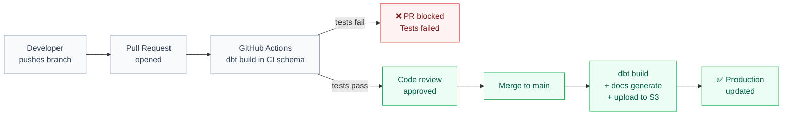
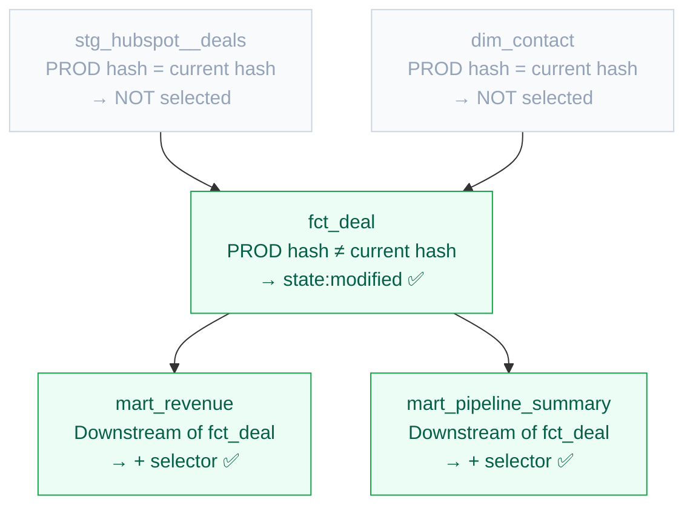
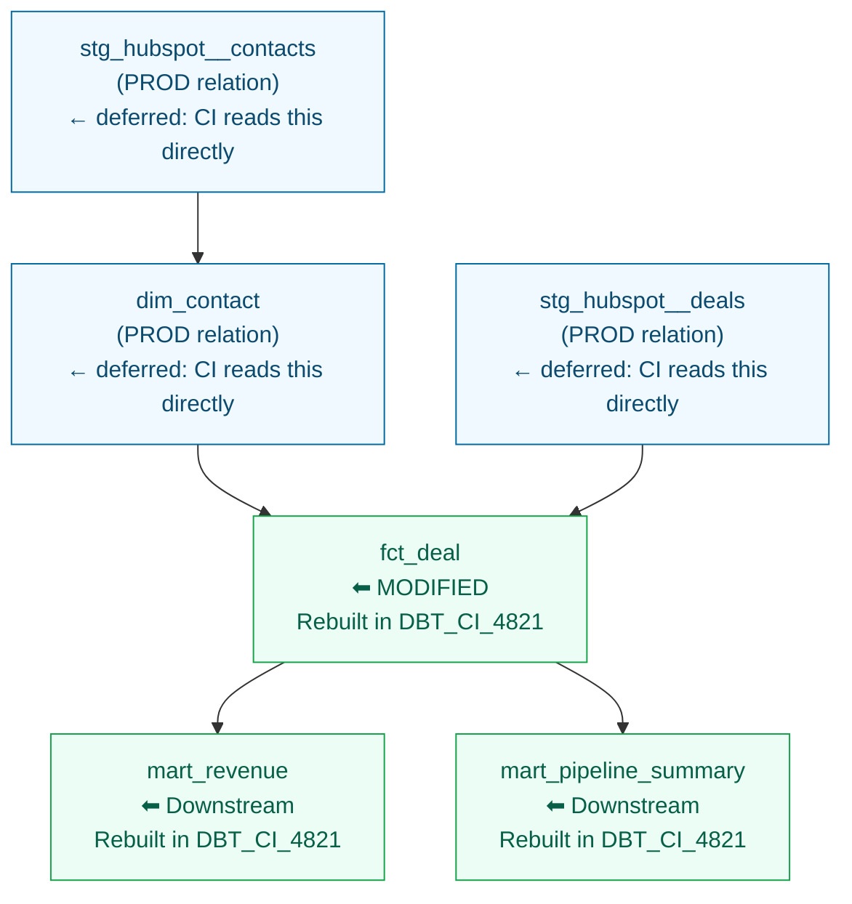

<div class="h-full flex flex-col justify-center pl-2">
  <div class="text-xs font-mono text-slate-400 tracking-widest uppercase mb-6">dbt Training</div>
  <div class="inline-flex items-center gap-2 bg-amber-50 border border-amber-200 text-amber-700 text-xs font-mono px-3 py-1 rounded-full w-fit mb-6">
    🟡 Working Effectively · Module 12 · 90 min
  </div>
  <h1 class="text-6xl font-bold text-slate-900 leading-[1.05] mb-6">
    CI/CD and<br>Slim CI
  </h1>
  <p class="text-slate-400 text-sm max-w-sm">
    How broken models get stopped before they reach production — and why it matters how fast CI runs.
  </p>
</div>

<!--
Recap prep questions from Module 11 — cold, no notes:
1. What is the difference between `dbt run` and `dbt build` in a CI pipeline context?
2. If a PR changes dim_contact, which downstream models might be affected — and how would you find out?
3. What is a "slim CI" run, and why would you want it instead of `dbt build --select silver.*`?
4. What does `--defer` do, and why would a CI job use it instead of rebuilding every model from scratch?

Probe question 3 specifically — "slim CI" frames the cost problem that the next slides resolve. If they can articulate why running the full project on every PR is wasteful, the manifest/state:modified+ explanation lands much faster.
-->

---

# It's 3am. A Dashboard is Broken.

<div class="grid grid-cols-2 gap-8 mt-6">

<div class="space-y-4">

<div class="bg-red-50 border border-red-200 rounded-xl p-4">
  <div class="text-xs font-mono text-red-400 mb-2">Slack · #data-alerts · 03:14</div>
  <div class="text-sm text-red-800 font-medium">Pipeline failed. mart_revenue is empty. Power BI dashboard showing zeros for all of March.</div>
</div>

<div class="bg-red-50 border border-red-200 rounded-xl p-4">
  <div class="text-xs font-mono text-red-400 mb-2">GitHub · main · 2h ago</div>
  <div class="text-sm text-red-800 font-medium">Merged: "fix deal stage mapping" — 3 files changed</div>
</div>

<div class="bg-amber-50 border border-amber-200 rounded-xl p-4 text-sm text-amber-800">
  <strong>What went wrong:</strong> A column rename broke a <code>not_null</code> test downstream. No CI. The code merged and ran against production.
</div>

</div>

<div class="flex flex-col justify-center space-y-3 text-sm">
  <div class="flex items-start gap-3">
    <span class="text-red-500 font-bold mt-0.5">✗</span>
    <span class="text-slate-700">No CI — broken SQL reached production</span>
  </div>
  <div class="flex items-start gap-3">
    <span class="text-red-500 font-bold mt-0.5">✗</span>
    <span class="text-slate-700">Tests existed but never ran automatically</span>
  </div>
  <div class="flex items-start gap-3">
    <span class="text-red-500 font-bold mt-0.5">✗</span>
    <span class="text-slate-700">Someone had to find this at 3am</span>
  </div>
  <div class="mt-4 bg-emerald-50 border border-emerald-200 rounded-lg p-3 text-emerald-800">
    <strong>With CI:</strong> The PR is blocked. The merge never happens. Production never sees the broken model.
  </div>
</div>

</div>

<!--
This is the motivating scenario. Make it visceral — this is a real thing that happens on data teams without CI.

The key point: the tests existed. The model had a not_null test. It just never ran automatically, so it only failed when the nightly production run hit the broken SQL.

CI doesn't add new tests. It makes the tests you already have into a mandatory gate.
-->

---

# What CI/CD Means in dbt

<div class="mt-4">



</div>

<div class="grid grid-cols-3 gap-4 mt-4 text-sm">
  <div class="bg-white border border-slate-200 rounded-lg p-3">
    <div class="font-semibold text-slate-700 mb-1">CI (Continuous Integration)</div>
    <div class="text-slate-500">Runs on every PR push. Builds models. Runs tests. Blocks merge on failure.</div>
  </div>
  <div class="bg-white border border-slate-200 rounded-lg p-3">
    <div class="font-semibold text-slate-700 mb-1">CD (Continuous Delivery)</div>
    <div class="text-slate-500">Runs on merge to main. Full build against PROD. Publishes docs to S3.</div>
  </div>
  <div class="bg-emerald-50 border border-emerald-200 rounded-lg p-3">
    <div class="font-semibold text-emerald-700 mb-1">The guarantee</div>
    <div class="text-emerald-700">If CI passes, every test you wrote passed against real data. Broken models cannot merge.</div>
  </div>
</div>

<!--
Walk the diagram top to bottom. Point out the two exit paths from the CI step: tests pass (green) or tests fail (red).

Key distinction: CI schema ≠ production. CI builds into a throwaway schema named after the run ID. Nothing from CI touches PROD. When CI finishes, the schema is dropped.

The CD step is what actually ships to production — and it only runs after a human approves the PR.
-->

---

# PR Workflow: What Runs When

<div class="grid grid-cols-2 gap-6 mt-6">

<div class="bg-white border border-slate-200 rounded-xl p-5">
  <div class="flex items-center gap-2 mb-4">
    <span class="bg-blue-100 text-blue-700 text-xs font-mono px-2 py-1 rounded-full">on: pull_request</span>
    <span class="text-slate-500 text-sm">every PR push</span>
  </div>
  <div class="space-y-2 text-sm">
    <div v-click class="flex items-start gap-2">
      <span class="text-blue-500 mt-0.5">▸</span>
      <div>Download prod <code>manifest.json</code> from S3</div>
    </div>
    <div v-click class="flex items-start gap-2">
      <span class="text-blue-500 mt-0.5">▸</span>
      <div><code>dbt deps</code></div>
    </div>
    <div v-click class="flex items-start gap-2">
      <span class="text-blue-500 mt-0.5">▸</span>
      <div><code>dbt build --select state:modified+ --defer --state ./prod-artifacts --target ci</code></div>
    </div>
    <div v-click class="flex items-start gap-2">
      <span class="text-blue-500 mt-0.5">▸</span>
      <div>Drop CI schema (cleanup)</div>
    </div>
  </div>
  <div class="mt-4 bg-blue-50 border border-blue-200 rounded-lg p-3 text-xs text-blue-700">
    Writes to <strong>DBT_CI_&lt;run-id&gt;</strong> — a throwaway schema. Never touches PROD.
  </div>
  <div class="mt-2 bg-amber-50 border border-amber-200 rounded-lg p-3 text-xs text-amber-800">
    <strong>Parallel PR safety:</strong> Unique schema per run ensures parallel PRs don't corrupt each other's test results.
  </div>
</div>

<div class="bg-white border border-slate-200 rounded-xl p-5">
  <div class="flex items-center gap-2 mb-4">
    <span class="bg-emerald-100 text-emerald-700 text-xs font-mono px-2 py-1 rounded-full">on: push to main</span>
    <span class="text-slate-500 text-sm">after merge</span>
  </div>
  <div class="space-y-2 text-sm">
    <div v-click class="flex items-start gap-2">
      <span class="text-emerald-500 mt-0.5">▸</span>
      <div><code>dbt deps</code></div>
    </div>
    <div v-click class="flex items-start gap-2">
      <span class="text-emerald-500 mt-0.5">▸</span>
      <div><code>dbt build --target prod</code> (full project)</div>
    </div>
    <div v-click class="flex items-start gap-2">
      <span class="text-emerald-500 mt-0.5">▸</span>
      <div><code>dbt docs generate</code></div>
    </div>
    <div v-click class="flex items-start gap-2">
      <span class="text-emerald-500 mt-0.5">▸</span>
      <div>Upload <code>manifest.json</code> → S3 (for next Slim CI)</div>
    </div>
    <div v-click class="flex items-start gap-2">
      <span class="text-emerald-500 mt-0.5">▸</span>
      <div>Sync docs site → S3</div>
    </div>
  </div>
  <div class="mt-4 bg-emerald-50 border border-emerald-200 rounded-lg p-3 text-xs text-emerald-700">
    Writes to <strong>PUBLIC</strong> — the real production schema.
  </div>
</div>

</div>

<!--
Use v-click to reveal each step — let the audience read each one before moving on.

Key question after revealing the merge steps: "Why does the deploy job upload manifest.json to S3 at the end?" → So the next PR's Slim CI can compare against the latest production state. The manifest from this run becomes the baseline for the next comparison.

The docs upload means the team always has a current lineage graph. After every merge, bloomwell-dbt-docs reflects the latest state of production.
-->

---

# The Cost Problem: Running Everything on Every PR

<div class="mt-6 grid grid-cols-2 gap-8">

<div>

<div class="bg-red-50 border border-red-200 rounded-xl p-5">
  <div class="text-xs font-mono text-red-500 mb-3">Without Slim CI</div>

```
Project: 18 models
Average build time: 3 min/model
───────────────────────────────
Full dbt build:  18 × 3 = 54 min
PRs per week:    10
─────────────────────────────── 
CI compute/week: 540 min
CI compute/month: ~2,160 min
```

  <div class="mt-3 text-sm text-red-700 font-semibold">Most of that compute rebuilds models that did not change.</div>
</div>

</div>

<div>

<div class="bg-emerald-50 border border-emerald-200 rounded-xl p-5">
  <div class="text-xs font-mono text-emerald-600 mb-3">With Slim CI (typical PR: 1 model changed)</div>

```
Modified:   fct_deal
Downstream: mart_revenue
            mart_pipeline_summary
────────────────────────────────
Selected:   3 models × 3 min = 9 min
PRs/week:   10
────────────────────────────────
CI compute/week:  90 min
Savings:          450 min/week (83%)
```

  <div class="mt-3 text-sm text-emerald-700 font-semibold">Same test coverage. Fraction of the cost.</div>
</div>

</div>

</div>

<div class="mt-4 bg-amber-50 border border-amber-200 rounded-lg p-3 text-sm text-amber-800">
  <strong>As the project grows, this gap widens.</strong> 50 models × 3 min = 150 min per PR. Slim CI still builds 3–5 models per typical PR.
</div>

<!--
Make the numbers real. "83% reduction" is abstract. "450 minutes per week of Snowflake compute you don't pay for" is concrete.

The compounding argument: as the project grows, full-run CI becomes untenable. Slim CI stays roughly constant because most PRs change 1–3 models regardless of project size.

Ask: "If your project doubles from 18 to 36 models next year, what happens to CI time without Slim CI?" → Doubles to 108 min per PR run. With Slim CI? Same 9 min per PR.
-->

---

# Slim CI: `manifest.json` + `state:modified+`

<div class="mt-4 grid grid-cols-2 gap-6">

<div class="space-y-4">

<div class="bg-white border border-slate-200 rounded-xl p-4 text-sm">
  <div class="font-semibold text-slate-700 mb-2">What is <code>manifest.json</code>?</div>
  <div class="text-slate-600 space-y-1">
    <div>Produced by every <code>dbt build</code>. Lives in <code>./target/</code>.</div>
    <div>Contains: the full model graph + a <strong>compiled SQL hash</strong> for each model.</div>
    <div>Uploaded to S3 after each production run.</div>
    <div>Downloaded by CI before it runs.</div>
  </div>
</div>

<div class="bg-white border border-slate-200 rounded-xl p-4 text-sm">
  <div class="font-semibold text-slate-700 mb-2">What does <code>state:modified+</code> do?</div>

| Part | Selects |
|---|---|
| `state:modified` | Models whose SQL hash ≠ production hash |
| `+` (trailing) | All downstream dependents |
| `--state ./prod-artifacts` | Production manifest to compare against |

</div>

</div>

<div class="bg-white border border-slate-200 rounded-xl p-4 text-sm">
  <div class="font-semibold text-slate-700 mb-3">Example: you changed <code>fct_deal.sql</code></div>



  <div class="mt-2 text-slate-500">3 of 18 models selected. 15 skipped.</div>
</div>

</div>

<!--
The manifest.json is the key enabler. Without it, dbt has no baseline to compare against — it can't know what "modified" means. That's why the deploy job uploads the manifest to S3 at the end: it becomes the baseline for the next PR.

Walk through the diagram. The grayed-out nodes (stg_hubspot__deals, dim_contact) are not selected because their SQL hashes haven't changed. dbt knows this by comparing the hash in the current compiled output against the hash stored in the production manifest.json.

Ask: "What happens if you change both fct_deal.sql AND dim_contact.sql in the same PR?" → Both are state:modified. Their downstream dependents are also added via +. If those overlap, dbt deduplicates the selection.
-->

---

# How `--defer` Works

<div class="mt-4">



</div>

<div class="grid grid-cols-2 gap-4 mt-4 text-sm">
  <div class="bg-blue-50 border border-blue-200 rounded-lg p-3">
    <div class="font-semibold text-blue-700 mb-1">Without <code>--defer</code></div>
    <div class="text-blue-800">CI must rebuild staging and dim models just to have input data. 15 extra models for a 3-model change.</div>
  </div>
  <div class="bg-emerald-50 border border-emerald-200 rounded-lg p-3">
    <div class="font-semibold text-emerald-700 mb-1">With <code>--defer</code></div>
    <div class="text-emerald-700">CI reads unmodified upstream models directly from PROD. Builds only what changed + downstream.</div>
  </div>
</div>

<!--
This diagram is the clearest way to explain --defer. The blue nodes are not rebuilt — CI transparently reads the PROD relations for those. The green nodes are the ones actually built in the CI schema.

The analogy: --defer is like code reuse. You don't rewrite libraries every time you build your app. CI doesn't rebuild unchanged models every time you run.

Ask: "Is there any risk to reading from production for the unmodified upstream models?" → Slight staleness if production was updated since the last merge, but for CI purposes this is acceptable. The point is to test whether your change to fct_deal works, not to re-verify staging model correctness.
-->

---

# GitHub Actions Walkthrough

```yaml {all|1-5|7-14|16-24|26-36|38-44|all}
# .github/workflows/dbt_ci.yml
name: dbt CI/CD

on:
  pull_request:
    branches: [main]
  push:
    branches: [main]

jobs:
  slim_ci:
    runs-on: ubuntu-latest
    if: github.event_name == 'pull_request'
    env:
      DBT_TARGET: ci
      SNOWFLAKE_ACCOUNT:   ${{ secrets.SNOWFLAKE_ACCOUNT }}
      SNOWFLAKE_USER:      ${{ secrets.SNOWFLAKE_USER }}
      SNOWFLAKE_PASSWORD:  ${{ secrets.SNOWFLAKE_PASSWORD }}
      SNOWFLAKE_DATABASE:  ${{ secrets.SNOWFLAKE_DATABASE }}
      SNOWFLAKE_WAREHOUSE: ${{ secrets.SNOWFLAKE_WAREHOUSE }}
      SNOWFLAKE_ROLE:      ${{ secrets.SNOWFLAKE_ROLE }}
      DBT_SCHEMA:          DBT_CI_${{ github.run_id }}

    steps:
      - uses: actions/checkout@v4
      - uses: actions/setup-python@v5
        with: { python-version: '3.11' }
      - run: pip install dbt-snowflake==1.8.4
      - name: Download production manifest
        run: |
          mkdir -p ./prod-artifacts
          aws s3 cp s3://bloomwell-dbt-artifacts/prod/manifest.json \
            ./prod-artifacts/manifest.json
      - run: dbt deps
      - name: dbt build — slim CI
        run: |
          dbt build --select state:modified+ \
            --defer --state ./prod-artifacts --target ci
      - name: Drop CI schema
        if: always()
        run: dbt run-operation drop_schema \
          --args "{'schema': '$DBT_SCHEMA'}" --target ci
```

<!--
Use line highlights — click through each section:
1. The on: triggers — pull_request vs push to main
2. The env block — note every credential uses secrets.* — never a hardcoded value
3. DBT_SCHEMA: DBT_CI_${{ github.run_id }} — unique per run, enables parallel CI runs
4. Download manifest step — this is where the prod baseline comes from
5. The dbt build command — state:modified+, --defer, --state pointing to prod-artifacts
6. Drop CI schema with if: always() — cleanup even on failure

Ask after the secrets section: "Why does the password use ${{ secrets.SNOWFLAKE_PASSWORD }} instead of the actual password?" → The YAML is committed to the repo. Anyone who can read the code can see the YAML. Secrets are stored in GitHub's encrypted secrets store and injected at runtime — never visible in code or logs.

Ask after the manifest step: "What would happen if this step failed — if S3 was unreachable?" → dbt build --select state:modified+ would fail because there's no manifest.json to compare against. It would error with a missing state path.
-->

---

# Environment Variables and Targets

<div class="grid grid-cols-2 gap-6 mt-4">

<div class="bg-white border border-slate-200 rounded-xl p-4">
  <div class="text-xs font-semibold text-slate-500 mb-3">profiles.yml (committed — no secrets)</div>

```yaml
analytics:
  target: dev
  outputs:
    dev:
      type: snowflake
      account:  "{{ env_var('SNOWFLAKE_ACCOUNT') }}"
      user:     "{{ env_var('SNOWFLAKE_USER') }}"
      password: "{{ env_var('SNOWFLAKE_PASSWORD') }}"
      schema:   "TESTING__{{ env_var('DBT_DEVELOPER_NAME', 'dev') }}"

    ci:
      type: snowflake
      account:  "{{ env_var('SNOWFLAKE_ACCOUNT') }}"
      user:     "{{ env_var('SNOWFLAKE_USER') }}"
      password: "{{ env_var('SNOWFLAKE_PASSWORD') }}"
      schema:   "{{ env_var('DBT_SCHEMA', 'DBT_CI') }}"

    prod:
      type: snowflake
      account:  "{{ env_var('SNOWFLAKE_ACCOUNT') }}"
      user:     "{{ env_var('SNOWFLAKE_USER') }}"
      password: "{{ env_var('SNOWFLAKE_PASSWORD') }}"
      schema:   PUBLIC
```

</div>

<div class="space-y-3">

<div class="bg-white border border-slate-200 rounded-xl p-4 text-sm">
  <div class="font-semibold text-slate-700 mb-2">Three targets, three schemas</div>

| Target | Used by | Schema |
|---|---|---|
| `dev` | Developer locally | `TESTING__yourname` |
| `ci` | GitHub Actions (PR) | `DBT_CI_<run-id>` |
| `prod` | GitHub Actions (merge) | `PUBLIC` |

</div>

<div class="bg-amber-50 border border-amber-200 rounded-lg p-3 text-sm text-amber-800">
  <strong>Rule:</strong> <code>profiles.yml</code> is committed. Never put a password in it. All credentials go through <code>env_var()</code>. Local devs set these in a <code>.env</code> file (git-ignored). CI reads from GitHub secrets.
</div>

<div class="bg-emerald-50 border border-emerald-200 rounded-lg p-3 text-sm text-emerald-700">
  <strong>Key point:</strong> CI uses target <code>ci</code>. The <code>--target ci</code> flag in the workflow tells dbt which output block to use. It never accidentally writes to <code>PUBLIC</code>.
</div>

</div>

</div>

<!--
Walk the profiles.yml left to right. The file contains no actual credentials — only env_var() calls. The values are injected at runtime from the environment.

For local dev: developers set SNOWFLAKE_ACCOUNT, SNOWFLAKE_USER, etc. in a .env file. That file is git-ignored — it never gets committed.

For CI: GitHub Actions sets those same env vars from repository secrets. The YAML file has ${{ secrets.SNOWFLAKE_PASSWORD }} which GitHub resolves at runtime and injects as an environment variable.

The DBT_DEVELOPER_NAME pattern means each developer gets their own schema: TESTING__thorsten, TESTING__marie, etc. Developers can't accidentally overwrite each other's work.
-->

---

# Documentation Quality Gate

<div class="mt-4 grid grid-cols-2 gap-6">

<div class="space-y-3">

<div class="bg-red-50 border border-red-200 rounded-xl p-4 text-sm">
  <div class="font-semibold text-red-700 mb-2">A PR is blocked if any of these are missing:</div>
  <div class="space-y-2">
    <div v-click class="flex items-start gap-2">
      <span class="text-red-500 mt-0.5">✗</span>
      <span>A Silver or Gold model has no <code>description</code> in <code>schema.yml</code></span>
    </div>
    <div v-click class="flex items-start gap-2">
      <span class="text-red-500 mt-0.5">✗</span>
      <span>The SQL file has no <code>-- grain:</code> comment at the top</span>
    </div>
    <div v-click class="flex items-start gap-2">
      <span class="text-red-500 mt-0.5">✗</span>
      <span>A <code>_key</code> column (surrogate or FK) has no <code>description</code></span>
    </div>
  </div>
</div>

<div v-click class="bg-slate-50 border border-slate-200 rounded-xl p-4 text-sm">
  <div class="font-semibold text-slate-700 mb-2">How it is enforced</div>
  <div class="text-slate-600">The reviewer runs the <code>dbt-sql-reviewer</code> skill before approving. Every failed check becomes a review comment. The PR cannot be approved until all checks pass.</div>
</div>

</div>

<div>

<div class="bg-white border border-slate-200 rounded-xl p-4 text-sm">
  <div class="font-semibold text-slate-700 mb-3">A model that passes the gate</div>

```sql
-- grain: one row per deal per day
-- Each row represents the state of a HubSpot deal
-- as recorded at the end of the calendar day.

{{ config(
    materialized  = 'incremental',
    unique_key    = 'fct_deal_key',
    on_schema_change = 'sync_all_columns'
) }}
```

```yaml
models:
  - name: fct_deal
    description: >
      Daily snapshot of HubSpot deal state. One row per deal
      per calendar day. Source of truth for pipeline reporting.
    columns:
      - name: fct_deal_key
        description: "Surrogate key — hash of deal_id + snapshot_date"
      - name: deal_id
        description: "HubSpot deal ID"
```

</div>

</div>

</div>

<!--
Documentation enforcement is not optional — it is a gate, not a suggestion. Explain why: without it, documentation degrades incrementally. One undocumented model today, ten next month, and after a year half the lineage graph is opaque.

The grain comment is especially important. It answers "what does one row mean?" without requiring anyone to read 400 lines of SQL. That's the first question any analyst asks before using a fact table.

Ask: "Why is documentation checked at PR time rather than in a nightly job?" → Because the PR is the only moment that creates leverage. Once code is in main, there is social pressure not to touch it. Pre-merge is when documentation can be required with zero friction.
-->

---
layout: default
background: '#f9f8f5'
---

# Exercise — Fix the Broken CI Config (25 min)

<div class="mb-3 bg-amber-50 border border-amber-200 rounded-lg px-4 py-3 text-sm text-amber-800">
  <strong>Scenario:</strong> A colleague wrote the CI workflow below. It looks mostly right but has <strong>three bugs</strong>. Identify each one, explain why it is a problem, and write the fix. Then complete Tasks 2 and 3.
</div>

```yaml {all}
jobs:
  slim_ci:
    runs-on: ubuntu-latest
    env:
      DBT_TARGET: ci
      SNOWFLAKE_ACCOUNT:   ${{ secrets.SNOWFLAKE_ACCOUNT }}
      SNOWFLAKE_USER:      ${{ secrets.SNOWFLAKE_USER }}
      SNOWFLAKE_PASSWORD:  "Snowflake_Prod_2024_v3"       # ← ?
      SNOWFLAKE_DATABASE:  ${{ secrets.SNOWFLAKE_DATABASE }}
      DBT_SCHEMA:          DBT_CI_${{ github.run_id }}
    steps:
      - uses: actions/checkout@v4
      - uses: actions/setup-python@v5
        with: { python-version: '3.11' }
      - run: pip install dbt-snowflake==1.8.4
      - name: Download production manifest
        run: |
          mkdir -p ./prod-artifacts
          aws s3 cp s3://bloomwell-dbt-artifacts/prod/manifest.json ./prod-artifacts/manifest.json
      - run: dbt deps
      - name: dbt build — slim CI
        run: |
          dbt run \                    # ← ?
            --select state:modified+ \
            --defer \
            --state ./target \         # ← ?
            --target ci
```

<div class="mt-3 grid grid-cols-2 gap-3 text-sm">
  <div class="bg-white border border-slate-200 rounded-lg p-3">
    <div class="font-semibold text-slate-700 mb-1">Task 2</div>
    <div class="text-slate-600">Write the exact <code>dbt build</code> command for a PR that only modifies <code>fct_deal.sql</code>. Use Slim CI with defer. State path: <code>./prod-artifacts</code>.</div>
  </div>
  <div class="bg-white border border-slate-200 rounded-lg p-3">
    <div class="font-semibold text-slate-700 mb-1">Task 3</div>
    <div class="text-slate-600">Answer in one sentence each: (1) what does <code>--defer</code> do for an unmodified upstream model? (2) why does this matter for CI compute cost? (3) what would happen without <code>--defer</code> if only one Gold mart changed?</div>
  </div>
</div>

<!--
BUGS — 3 total:

Bug 1: SNOWFLAKE_PASSWORD: "Snowflake_Prod_2024_v3"
  The workflow file is committed to the repo. The password is visible to anyone with read access.
  Fix: SNOWFLAKE_PASSWORD: ${{ secrets.SNOWFLAKE_PASSWORD }}

Bug 2: dbt run
  dbt run builds models but does not run tests. CI exists to catch test failures. dbt run defeats the entire purpose.
  Fix: dbt build

Bug 3: --state ./target
  ./target is the local compiled output directory for the current run — it starts empty. Slim CI needs the production manifest.json, which was downloaded to ./prod-artifacts. Pointing --state at ./target means dbt has no baseline to compare against and either errors or treats everything as modified.
  Fix: --state ./prod-artifacts

Walk around during the exercise. Bug 2 is the easiest to spot. Bug 3 requires understanding what --state actually reads. Bug 1 is the most serious from a security perspective — it's the one they should catch fastest in a real code review.
-->

---
layout: default
background: '#f9f8f5'
---

# Exercise — Solutions

<div class="grid grid-cols-3 gap-4 mt-4">

<div class="bg-white border border-slate-200 rounded-xl p-4">
  <div class="text-xs font-mono text-slate-400 mb-1">Bug 1 · Security</div>
  <div class="text-xs text-red-600 font-semibold mb-2">❌ Hardcoded password in YAML</div>

```yaml
# Wrong
SNOWFLAKE_PASSWORD: "Snowflake_Prod_2024_v3"

# Fixed
SNOWFLAKE_PASSWORD: ${{ secrets.SNOWFLAKE_PASSWORD }}
```

  <div class="text-xs text-slate-500 mt-2">YAML is committed to the repo. Anyone with read access sees the password. GitHub also flags this as an exposed secret.</div>
</div>

<div class="bg-white border border-slate-200 rounded-xl p-4">
  <div class="text-xs font-mono text-slate-400 mb-1">Bug 2 · Tests not running</div>
  <div class="text-xs text-red-600 font-semibold mb-2">❌ <code>dbt run</code> instead of <code>dbt build</code></div>

```bash
# Wrong
dbt run --select state:modified+

# Fixed
dbt build --select state:modified+
```

  <div class="text-xs text-slate-500 mt-2"><code>dbt run</code> builds models only. Tests are skipped. CI can pass while every <code>not_null</code> test in the project fails silently.</div>
</div>

<div class="bg-white border border-slate-200 rounded-xl p-4">
  <div class="text-xs font-mono text-slate-400 mb-1">Bug 3 · Wrong state path</div>
  <div class="text-xs text-red-600 font-semibold mb-2">❌ <code>--state ./target</code> (local, empty)</div>

```bash
# Wrong
--state ./target

# Fixed
--state ./prod-artifacts
```

  <div class="text-xs text-slate-500 mt-2"><code>./target</code> is the current run's output — empty at the start. The prod manifest was downloaded to <code>./prod-artifacts</code>. Wrong path = no baseline = Slim CI breaks.</div>
</div>

</div>

<div class="mt-4 bg-slate-50 border border-slate-200 rounded-lg p-3 text-sm text-slate-600">
  <strong>Task 2 answer:</strong>
  <code>dbt build --select state:modified+ --defer --state ./prod-artifacts --target ci</code>
</div>

<!--
Show solutions only after time is up or participants have finished.

Debrief order:
1. Bug 1 — ask "what's the blast radius if someone commits a hardcoded password to a public repo?" → Anyone who has ever seen the repo now has production credentials. Rotation required immediately.
2. Bug 2 — ask "what's the failure mode?" → CI goes green, merge happens, production tests fail on the nightly run, 3am alert. Exactly the scenario from slide 2.
3. Bug 3 — the most subtle. Ask "what does dbt do when --state points to a directory with no manifest.json?" → Either errors with a path not found, or silently treats all models as modified (defeating Slim CI entirely).

Key takeaway: all three bugs could cause production incidents. Only Bug 3 causes an immediate CI error — Bug 1 and Bug 2 are silent failures.
-->

---
layout: center
---

<div class="text-center max-w-2xl mx-auto">
  <div class="text-xs font-mono text-slate-400 tracking-widest uppercase mb-4">Module 12 Complete</div>

  <div class="grid grid-cols-3 gap-3 mb-8 text-left">
    <div class="bg-emerald-50 border border-emerald-200 rounded-xl p-3 text-sm">
      <div class="font-semibold text-emerald-700 mb-1">CI/CD pipeline</div>
      <div class="text-emerald-800">Broken models are stopped at the PR gate — never touch production.</div>
    </div>
    <div class="bg-emerald-50 border border-emerald-200 rounded-xl p-3 text-sm">
      <div class="font-semibold text-emerald-700 mb-1">Slim CI</div>
      <div class="text-emerald-800"><code>state:modified+</code> + <code>--defer</code> cuts CI cost by 80%+ on typical PRs.</div>
    </div>
    <div class="bg-emerald-50 border border-emerald-200 rounded-xl p-3 text-sm">
      <div class="font-semibold text-emerald-700 mb-1">Documentation gate</div>
      <div class="text-emerald-800">Pre-merge is the only moment that creates leverage. Use it.</div>
    </div>
  </div>

  <div class="bg-amber-50 border border-amber-200 rounded-2xl p-6 mb-6">
    <div class="text-amber-700 font-semibold text-lg mb-1">🟡 Tier 2 Complete</div>
    <div class="text-amber-800 text-sm mb-4">You've finished Working Effectively. You can build, test, document, schedule, and protect production dbt projects.</div>
    <div class="text-xs font-mono text-amber-600 uppercase tracking-wider mb-2">Tier 3 — Advanced Patterns</div>
    <div class="grid grid-cols-2 gap-2 text-xs text-amber-800 text-left">
      <div class="bg-amber-100 rounded-lg px-3 py-1.5">Module 13 — Advanced Testing Patterns</div>
      <div class="bg-amber-100 rounded-lg px-3 py-1.5">Module 14 — Incremental Strategies</div>
      <div class="bg-amber-100 rounded-lg px-3 py-1.5">Module 15 — SCD2 deep dive</div>
      <div class="bg-amber-100 rounded-lg px-3 py-1.5">Module 16 — Governance &amp; Contracts</div>
    </div>
  </div>

  <div class="space-y-2 text-left">
    <div class="text-xs font-mono text-slate-400 uppercase tracking-wider mb-2">Prep for Module 13 — Advanced Testing Patterns</div>
    <div class="bg-slate-100 rounded-lg px-4 py-2 text-sm font-mono text-slate-600">Q1: Difference between not_null and relationships test?</div>
    <div class="bg-slate-100 rounded-lg px-4 py-2 text-sm font-mono text-slate-600">Q2: Where do you define a reusable generic test?</div>
    <div class="bg-slate-100 rounded-lg px-4 py-2 text-sm font-mono text-slate-600">Q3: What does severity: warn do vs. default error?</div>
    <div class="bg-slate-100 rounded-lg px-4 py-2 text-sm font-mono text-slate-600">Q4: If a production test fails overnight, how do you investigate?</div>
  </div>
</div>

<!--
Tier 2 completion moment — acknowledge it. The team can now build, test, document, debug, schedule, and protect production dbt projects. That covers 90% of day-to-day work.

Tier 3 is for people who need to go deeper: writing custom test macros, advanced incremental strategies (insert-overwrite, microbatch), the full scd2_merge implementation, and dbt contracts for data quality governance.

The four prep questions for Module 13 are review anchors — they should be answerable from Modules 06 and 07. If someone can't answer Q1, that's a signal to revisit basic test definitions before the next session.
-->
